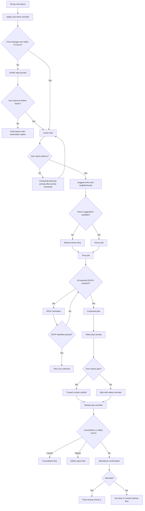

# Chat To Meetup Flow

## Goal

Move a matched group from initial conversation to a confirmed real-world meetup with clear logistics and safety context.

## Flowchart

## Core Rules

- Group chat should always show planner, safety, and leave/report controls.
- Planning prompts should be state-change prompts, not habit pings.
- A plan is not confirmed until required attendees RSVP.
- Users can cancel without harassment; repeated no-shows affect quality standing.
- Private breakouts are not required to confirm a meetup.

---
<!-- doc-version: 1.0 -->
