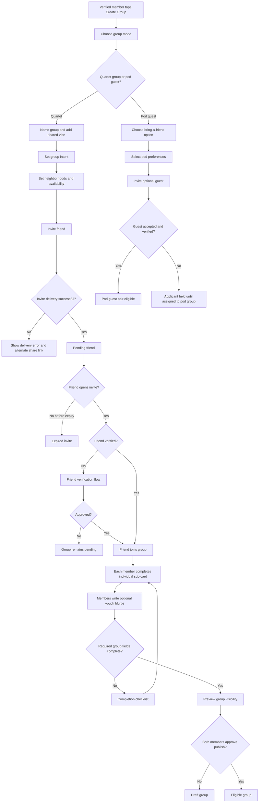

# Group Creation Flow

## Goal

Create a complete, verified, discoverable group without exposing non-consenting invitees or incomplete groups.

## Flowchart

## Core Rules

- In quartet mode, a group is not eligible until both members are verified and approve publishing.
- An invited friend is never publicly visible before joining.
- Group name, shared vibe, intent, neighborhood, availability, and member sub-cards are required.
- Vouch blurbs are optional for launch but strongly encouraged.
- A member can leave a group at any time; the group then becomes ineligible until complete again.

---
<!-- doc-version: 1.0 -->
