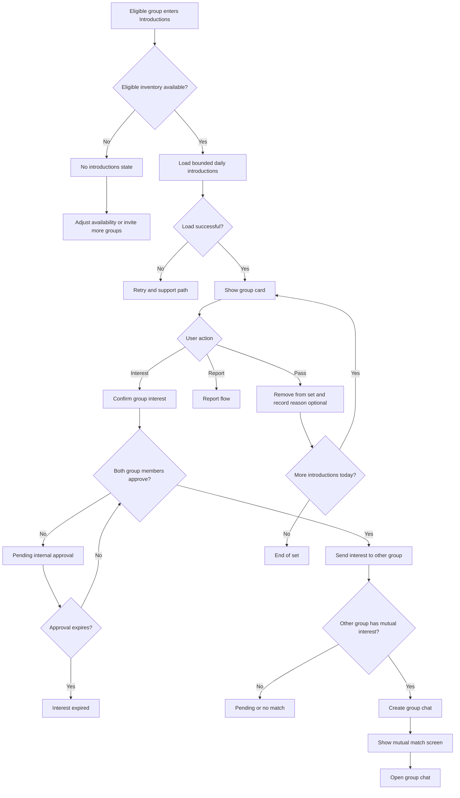

# Matching Flow

## Goal

Present a bounded set of compatible verified groups and unlock group chat only after mutual group-level interest.

## Flowchart

## Matching Rules

- Every displayed group is complete and verified.
- Introductions are finite and refreshed on a predictable schedule.
- Ranking can consider intent, neighborhood, availability, vibe, safety standing, and prior responsiveness.
- Ranking must not suppress baseline visibility to sell paid features.
- Users can understand the visible reasons a group is recommended.
- Groups can opt out of being shown to specific groups or categories where policy allows.

---
<!-- doc-version: 1.0 -->
