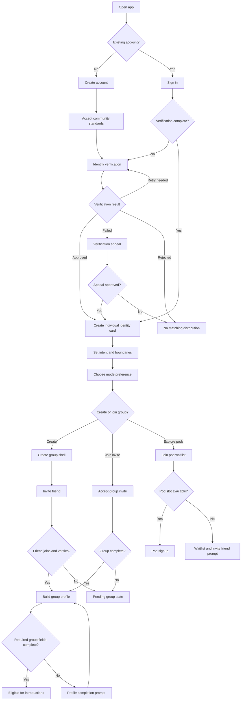

# Onboarding Flow

## Goal

Move a new user from account creation to verified group eligibility without exposing any matching inventory before verification.

## Flowchart

## Error and Edge States

- Verification fails because the document is unreadable: show retry with clear reason.
- Verification provider is unavailable: block distribution and let the user resume later.
- User is under minimum age: reject and provide account closure path.
- Invite is expired, full, or revoked: show neutral error and allow create-group path.
- Friend joins but does not verify: group remains pending.
- User abandons onboarding: resume at last incomplete eligibility step.

---
<!-- doc-version: 1.0 -->
