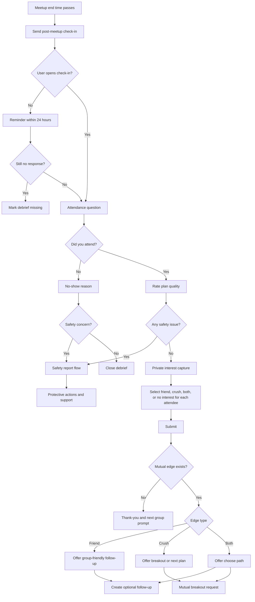

# Post-Meetup Flow

## Goal

Capture attendance, satisfaction, safety feedback, and private romantic or platonic interest after real-world context exists.

## Flowchart

## Core Rules

- Interest is private unless mutual.
- Users can report safety issues without completing interest capture.
- A group can have a successful social outcome without a romantic edge.
- Attendance confirmation contributes to north-star measurement only when corroborated by acceptable signals.
- Debrief data should improve future matching and safety operations without exposing sensitive details.

---
<!-- doc-version: 1.0 -->
