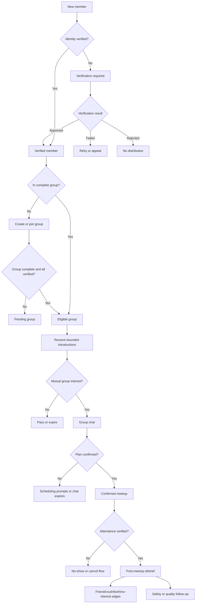

# UX Architecture

## Product Model

[APPNAME] has five primary objects:

| Object | Definition | User-Visible Role |
|---|---|---|
| Member | A verified individual user. | Can join groups, write vouch blurbs, chat, report, and attend. |
| Group | The atomic dating unit, usually two people for quartets. | Receives introductions and owns group-level profile, intent, availability, and plans. |
| Introduction | A bounded opportunity between compatible groups. | Can be accepted, passed, expired, or converted into group chat. |
| Plan | A proposed or confirmed real-world meetup. | Contains venue, time, RSVP state, safety context, and attendance confirmation. |
| Debrief | Private post-meetup capture. | Records friend/crush/both/no-interest, quality, and safety feedback. |

## Navigation Model

- **Home:** current group status, pending actions, next plan, and available introductions.
- **Group:** active group profile, members, vouch blurbs, availability, intent, and visibility controls.
- **Introductions:** bounded list of group opportunities and expired/pending decisions.
- **Chat:** group conversations, planning tools, safety actions, and breakout requests.
- **Plans:** upcoming, confirmed, canceled, and completed meetups.
- **Profile:** individual identity, verification, preferences, privacy, safety, and subscription controls.

## Mode Model

| Mode | Group Size | Matching Logic | Conversation | Meetup Goal |
|---|---|---|---|---|
| Quartet | 2 + 2 | Group-to-group interest and consent | Four-person group chat first | Direct double date |
| Social Pod | 6-8 | System-assembled neighborhood/time/vibe cohort | Logistics-light pre-event context | Group event; post-event interest capture |

## State Model

## Experience Rules

- A user can browse no romantic inventory until verified.
- A user can browse no group inventory until in a complete eligible group.
- Group profiles must show both shared group context and individual sub-cards.
- Group chat is the default after a match.
- Private breakouts require explicit opt-in and cannot be the primary launch surface.
- Every risky surface includes a visible safety action.
- Expiration is allowed for stale introductions and chats, but should be framed as freshness, not punishment.
- Paid features must be clearly labeled and must not reduce free baseline distribution.

---
<!-- doc-version: 1.0 -->
