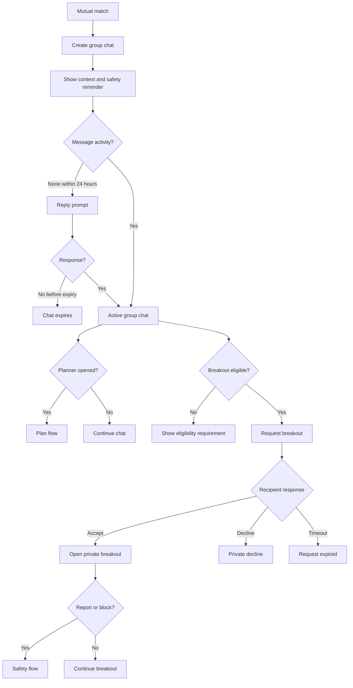

# Feature Spec: Group Chat And Breakouts

## Problem Statement

Group chat must preserve the low-pressure social benefit while still allowing romantic progress. If private messages open too early, the product collapses into solo dating; if they never open, vulnerable interest can stall.

## Research Rationale

- R8: Group presence helps simple actions but can impair vulnerable disclosure.
- R6: Existing quartet products use group chat as the default.
- R9: Larger groups need designed accountability because bystander effects persist.

## User Stories With Acceptance Criteria

### Story 1: Start in group chat

As a matched group, we want a shared chat so everyone enters with context.

**Acceptance criteria**

- Group chat opens automatically after mutual match.
- All matched members can see participant identities and group context.
- Safety, planner, and leave controls are visible.

### Story 2: Use guided prompts

As a group member, I want prompts that make conversation and planning easier.

**Acceptance criteria**

- Prompts are based on visible shared context.
- Prompts never send messages automatically.
- Users can dismiss prompts.

### Story 3: Request a breakout

As a member, I want to request a private breakout only when it is mutual and appropriate.

**Acceptance criteria**

- Breakout eligibility requires minimum group activity or confirmed plan.
- Both participants must opt in.
- Declines are private and do not notify the broader group.

## Detailed User Flow

1. Mutual match creates group chat.
2. Chat displays safety reminder and context.
3. Users exchange messages.
4. Planner prompt appears after activity threshold or time delay.
5. Breakout option becomes eligible after threshold.
6. User requests breakout with a specific participant.
7. Recipient accepts or declines privately.
8. Accepted breakout opens with safety controls and context.

## Mermaid Flow Diagram

## Screen List With All UI States

| Screen | Empty | Loading | Error | Populated |
|---|---|---|---|---|
| Group Chat | No messages and starter prompt | Loading messages | Message send/load failed | Messages, prompts, planner, safety controls |
| Prompt Drawer | No prompt available | Generating suggestions | Prompt unavailable | Contextual icebreakers and planning nudges |
| Breakout Request | Ineligible explanation | Sending request | Request failed or blocked | Pending, accepted, declined, expired |
| Private Breakout | No messages | Loading thread | Message failed or participant blocked | Mutual private thread with safety controls |

## Edge Cases

- A participant leaves group chat: chat status updates and planner reconfirms.
- A message triggers safety classifier: hold, warn, or route to moderation based on severity.
- Breakout requested after safety report: blocked until review.
- Multiple breakout requests happen at once: each remains private and independently consented.
- Group chat expires with a confirmed plan: plan remains active unless canceled.

## Success Metrics

- Match-to-first-message rate.
- First response within 24 hours.
- Group chat to planner open rate.
- Group chat to confirmed meetup rate.
- Breakout request acceptance rate.
- Report rate by chat type.
- User rating of chat pressure.

## Open Questions

- **What threshold should unlock breakouts?** Recommended default: either eight total group messages across at least three participants or a confirmed plan. Research basis: R8 suggests group context should handle comfort-building before vulnerable disclosure moves private.
- **Should AI suggest messages?** Recommended default: suggest themes and prompts, not full ghostwritten replies. Research basis: Hinge-style scaffolding helps, but over-automation can reduce agency.

---
<!-- doc-version: 1.0 -->
