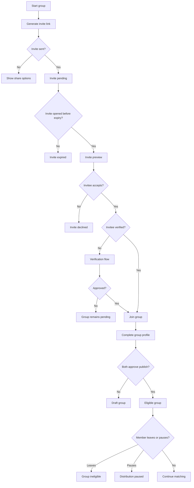

# Feature Spec: Group Formation

## Problem Statement

The product cannot function unless users reliably form complete, verified groups. Group formation must be fast enough to activate users but controlled enough to protect privacy, consent, and eligibility.

## Research Rationale

- R5: Group formats create built-in referral loops because a user must bring others into the product.
- R13: City-level density and community concentration matter more than national reach.
- R14: Social graph exposure can kill group products when privacy is weak.

## User Stories With Acceptance Criteria

### Story 1: Invite a friend

As a verified member, I want to invite one friend to form a dating group.

**Acceptance criteria**

- Invite can be sent through a share link without exposing contacts broadly.
- Invite clearly explains what joining means.
- Invite expires after a defined period and can be revoked.

### Story 2: Join a group

As an invited friend, I want to preview the group request before joining.

**Acceptance criteria**

- Invitee sees inviter, group purpose, and privacy explanation.
- Invitee must verify before the group can publish.
- Invitee must consent before their profile is visible.

### Story 3: Manage group membership

As a group member, I want to leave, replace, or pause a group.

**Acceptance criteria**

- Leaving makes the group ineligible immediately.
- Active chats and plans receive a neutral status update.
- Safety-related exits can hide the leaving member from further contact.

## Detailed User Flow

1. Verified member starts group.
2. Member sends one invite link.
3. Invitee opens link and reviews context.
4. Invitee verifies identity if needed.
5. Invitee consents to join.
6. Both members complete profile fields.
7. Both approve group publication.
8. Group enters eligible state.
9. Either member can pause or leave later.

## Mermaid Flow Diagram

## Screen List With All UI States

| Screen | Empty | Loading | Error | Populated |
|---|---|---|---|---|
| Create Group | Explanation of group-only model | Creating group | Create failed | Draft group shell |
| Invite Friend | No invite generated | Sending invite | Invalid or rate-limited invite | Active invite with revoke option |
| Join Group Invite | Invite details missing | Validating invite | Expired, revoked, full, blocked | Inviter, group preview, consent CTA |
| Group Membership | No active group | Loading members | Member state unavailable | Active, pending, paused, or left members |

## Edge Cases

- Invite link is forwarded to someone else: require inviter approval before joining.
- Invitee is already in another active group: allow switch only after warning about impacts.
- Member leaves with an upcoming plan: plan enters reconfirmation state.
- Inviter is banned before invitee joins: invite is revoked.
- Two users repeatedly create and dissolve groups to avoid reports: trust review.

## Success Metrics

- Invite send rate from group creation.
- Invite acceptance rate.
- Invitee verification completion rate.
- Group completion rate within 24 hours.
- Group dissolution rate in first seven days.
- Average invites required per complete group.

## Open Questions

- **Should users be able to belong to multiple groups?** Recommended default: one active dating group, plus pod eligibility. Research basis: R7 favors legible quartet structure; multiple groups could confuse consent and availability.
- **Should invite links require phone/email match?** Recommended default: no for alpha, but require inviter approval if the recipient identity differs. Research basis: privacy and friction must be balanced against referral growth.

---
<!-- doc-version: 1.0 -->
