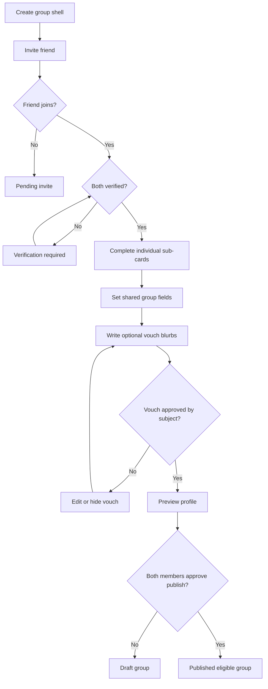

# Feature Spec: Group Profile And Vouching

## Problem Statement

Solo profiles do not communicate group chemistry, social context, or friend trust. A group-only dating app needs a profile that makes the shared unit legible while preserving individual identity and consent.

## Research Rationale

- R5: Friend involvement is already normalized and functions as trust capital.
- R7: Four-person groups preserve romantic legibility when individual sub-identity remains visible.
- R14: Privacy failures harmed earlier group-social products, so participation and invite relationships must be explicit.

## User Stories With Acceptance Criteria

### Story 1: Build a group profile

As a group creator, I want to describe our shared vibe, intent, availability, and neighborhood so other groups can decide efficiently.

**Acceptance criteria**

- Group name, shared vibe, intent, neighborhood range, and availability are required.
- Each member has an individual sub-card with required identity basics.
- The group cannot publish until both members approve.

### Story 2: Add vouch blurbs

As a group member, I want to write a short vouch for my friend so other groups see credible social proof.

**Acceptance criteria**

- Vouch blurbs are clearly attributed to the friend who wrote them.
- The vouched member can approve, hide, or request edits before publication.
- Blurbs are moderated before distribution where automated checks flag risk.

### Story 3: Control visibility

As a member, I want to know exactly what other groups can see.

**Acceptance criteria**

- Profile preview shows the card as other groups see it.
- Non-joined invitees are never visible.
- A member leaving a group removes their sub-card from distribution immediately.

## Detailed User Flow

1. Verified user creates a group shell.
2. User invites a verified or verification-pending friend.
3. Both members complete sub-cards.
4. Members set shared group vibe, intent, neighborhood, and availability.
5. Each member can write and approve vouch blurbs.
6. The group previews the published card.
7. Both members approve publication.
8. Group becomes eligible for introductions.

## Mermaid Flow Diagram

## Screen List With All UI States

| Screen | Empty | Loading | Error | Populated |
|---|---|---|---|---|
| Group Profile Builder | Checklist of missing fields | Saving changes | Required field or moderation error | Group fields, member cards, vouches |
| Individual Sub-Card | Blank required fields | Uploading/saving | Invalid field, image rejected | Photo, pronouns, age, prompts, goals |
| Vouch Blurb | Prompt to vouch for friend | Moderating or saving | Rejected content or save failure | Approved, hidden, or edit-requested vouch |
| Profile Preview | No publishable profile | Rendering preview | Preview unavailable | Published card view with edit controls |

## Edge Cases

- Friend joins but refuses publication: group remains draft.
- Vouch blurb reveals private information: moderation rejects or requires edit.
- Member deletes account: group becomes ineligible.
- Members disagree on intent: group cannot publish until one group-level intent set is approved.
- Group changes location to a non-launch city: group can stay drafted but not receive introductions.

## Success Metrics

- Group profile completion rate.
- Percentage of profiles with at least one approved vouch.
- Profile view-to-interest rate.
- Moderation rejection rate for vouch blurbs.
- Member edit frequency after preview.
- Group publish approval rate.

## Open Questions

- **Should vouch blurbs be required?** Recommended default: optional but strongly prompted. Research basis: R5 supports friend-authored metadata, but requiring it may slow activation.
- **Should groups have playful names?** Recommended default: yes with moderation. Research basis: group identity should communicate vibe, but unclear or sexualized intent hurt Tinder Social-style trust.

---
<!-- doc-version: 1.0 -->
