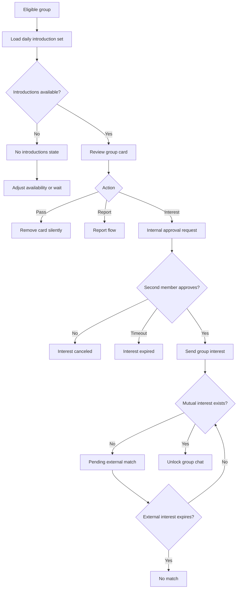

# Feature Spec: Matching And Discovery

## Problem Statement

Infinite individual discovery creates fatigue, decision overload, and validation loops. [APPNAME] needs a bounded group discovery model that prioritizes compatibility, intent, availability, and likelihood of meeting.

## Research Rationale

- R1: Dating burnout is tied to product architecture and emotional exhaustion.
- R4: Intent mismatch destroys trust and wastes effort.
- R6: Quartet demand is validated by current market experiments.
- R12: Hidden ranking and visibility manipulation create trust and regulatory risk.

## User Stories With Acceptance Criteria

### Story 1: Receive bounded introductions

As an eligible group, we want a small set of compatible group introductions.

**Acceptance criteria**

- Daily introduction set is finite.
- Every introduced group is verified and complete.
- Recommendation reasons are shown in plain language.

### Story 2: Express group interest

As a group member, I want my group to express interest only when both of us agree.

**Acceptance criteria**

- Interest requires internal group approval.
- Pending internal approval expires.
- A match opens only after mutual group interest.

### Story 3: Pass safely

As a group, we want to pass without creating awkwardness or retaliation.

**Acceptance criteria**

- Passed groups are not notified.
- Pass reasons are optional.
- Reporting is available separately from passing.

## Detailed User Flow

1. Eligible group enters Introductions.
2. System loads a bounded introduction set.
3. Group reviews card details and recommendation reasons.
4. A member taps interest.
5. Other group member approves or declines internally.
6. If approved, interest is sent.
7. If other group also expressed interest, chat unlocks.
8. If not, the state remains pending or expires.

## Mermaid Flow Diagram

## Screen List With All UI States

| Screen | Empty | Loading | Error | Populated |
|---|---|---|---|---|
| Introductions | No groups available or city waitlist | Loading introductions | Load failed | Bounded group cards |
| Group Card Detail | Not applicable | Loading card detail | Group unavailable | Group vibe, members, vouches, intent, reasons |
| Internal Approval | No pending approval | Sending approval request | Approval failed | Pending, approved, declined, expired |
| Mutual Match | Not applicable | Creating chat | Match expired or group unavailable | Matched group summary and chat CTA |

## Edge Cases

- A group becomes ineligible after being shown: disable interest and explain neutral unavailability.
- One group member reports the other group: remove card and open safety flow.
- Both groups express interest at the same time: create one chat.
- Inventory is too thin: show waitlist, availability expansion, and invite prompts without fake cards.
- Paid groups are included: label paid benefits transparently and do not reduce unpaid distribution.

## Success Metrics

- Eligible group to first introduction rate.
- Median time to first qualified introduction.
- Group card view-to-interest rate.
- Internal approval completion rate.
- Mutual match rate.
- Match-to-meetup conversion rate.
- User trust rating for recommendation clarity.

## Open Questions

- **Should [APPNAME] use hard double-consent within each group before sending interest?** Recommended default: yes. Research basis: group consent protects friend dynamics and avoids one-sided awkwardness.
- **Should introductions refresh daily or on a rolling basis?** Recommended default: daily with urgent "Tonight" exceptions later. Research basis: bounded inventory reduces overload, but nightlife use cases may need time-sensitive supply.

---
<!-- doc-version: 1.0 -->
