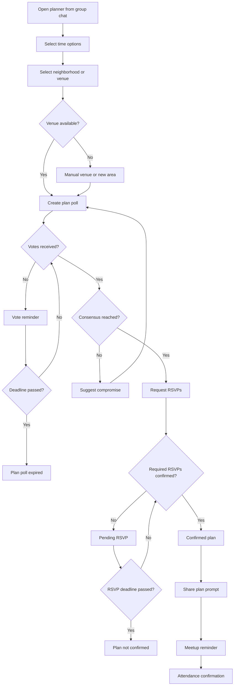

# Feature Spec: Meetup Planning And Venue

## Problem Statement

Most dating app conversations fail before a real meeting because logistics are left to users. In group dating, coordination complexity is higher, so planning must be built into the core product.

## Research Rationale

- R10: Offline dating events are growing because users want lower-pressure real-world formats.
- R2: Users want outcomes, not recurring app participation.
- R6: Tandem and Bumble Plans show venue and logistics can be core differentiators.

## User Stories With Acceptance Criteria

### Story 1: Propose a plan

As a matched group, we want to propose times and venues without leaving chat.

**Acceptance criteria**

- Any participant can open the planner.
- Planner supports time windows, neighborhood, venue type, and optional exact venue.
- Group members can vote or suggest alternatives.

### Story 2: Confirm attendance

As a participant, I want a clear RSVP so I know whether the plan is real.

**Acceptance criteria**

- Plan is confirmed only after required RSVPs.
- RSVP deadline is visible.
- Changes after confirmation trigger reconfirmation when material.

### Story 3: Share plan for safety

As a participant, I want to share plan details with a trusted contact.

**Acceptance criteria**

- Shared plan includes time, venue, group name, participant first names, and support link.
- Users can add or update trusted contacts.
- Sharing is optional but clearly encouraged.

## Detailed User Flow

1. Group chat opens planner.
2. User selects suggested or manual time options.
3. User selects venue type or exact venue.
4. Participants vote.
5. Once time and venue have enough agreement, RSVP request opens.
6. Required participants confirm.
7. Plan is confirmed and added to Plans.
8. Participants receive safety-sharing prompt.
9. Meetup day reminders are sent.
10. Attendance confirmation triggers post-meetup debrief.

## Mermaid Flow Diagram

## Screen List With All UI States

| Screen | Empty | Loading | Error | Populated |
|---|---|---|---|---|
| Plan Poll | No proposed options | Loading suggestions | Suggestion service unavailable | Time and venue options with votes |
| Venue Detail | No venue selected | Loading venue info | Venue unavailable | Venue address, vibe, cost, safety notes |
| Plan Detail | No active plan | Loading plan | Plan unavailable or canceled | RSVP states, venue, time, safety tools |
| Share Plan | No trusted contact | Sending share | Send failed | Shared status and contact list |

## Edge Cases

- Venue becomes unavailable after confirmation: reopen planner with replacement suggestions.
- One participant cancels: plan enters reconfirmation or cancellation depending on group threshold.
- Weather or venue safety issue: notify participants and suggest alternative.
- User changes location: active plan remains unless user cancels.
- Multiple plans proposed in one chat: only one can be primary at a time.

## Success Metrics

- Group chat to planner open rate.
- Planner open to poll creation rate.
- Poll to confirmed plan rate.
- Median time from match to confirmed plan.
- RSVP completion rate.
- Confirmed plan to attended meetup rate.
- Safety share adoption rate.

## Open Questions

- **Should exact venues be required for confirmation?** Recommended default: yes. Research basis: R3 and R10 make safety and logistics central to meetup conversion.
- **Should [APPNAME] book venues directly at launch?** Recommended default: manually curated suggestions first, direct booking later. Research basis: venue logistics matter, but early product risk is group coordination before reservation automation.

---
<!-- doc-version: 1.0 -->
