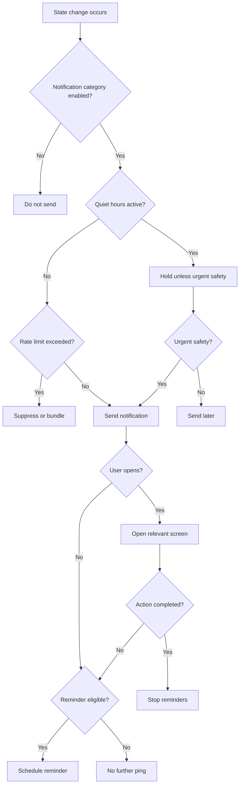

# Feature Spec: Notifications

## Problem Statement

Dating notifications often become habit pings that increase fatigue. [APPNAME] needs notifications that support verification, group completion, planning, safety, and real-world attendance without pushing users into endless engagement.

## Research Rationale

- R1: Burnout is linked to repeated emotional and attention costs.
- R2: Product should optimize for outcomes, not sessions.
- R11: Timely replies and planning nudges can improve date conversion when tied to real state changes.

## User Stories With Acceptance Criteria

### Story 1: Receive state-change alerts

As a user, I want to know when a meaningful group state changes.

**Acceptance criteria**

- Notifications are sent for verification result, invite accepted, group eligible, mutual match, new message, plan vote, RSVP, confirmed plan, safety update, and debrief.
- Notification content is specific and not manipulative.
- Users can configure categories.

### Story 2: Avoid spam

As a user, I want notifications to respect my time.

**Acceptance criteria**

- No generic "come back" pings.
- Rate limits apply by notification category.
- Quiet hours are supported.

### Story 3: Complete time-sensitive actions

As a group member, I want reminders for expiring approvals, RSVPs, and debriefs.

**Acceptance criteria**

- Reminders are sent before meaningful deadlines.
- Reminders stop when the user acts.
- Expired states are communicated neutrally.

## Detailed User Flow

1. User opts into notifications during onboarding or settings.
2. A meaningful state change occurs.
3. System checks user preferences, quiet hours, and rate limits.
4. Notification is sent or held.
5. User opens notification.
6. User lands on the relevant action screen.
7. Action completion suppresses future reminders for that event.

## Mermaid Flow Diagram

## Screen List With All UI States

| Screen | Empty | Loading | Error | Populated |
|---|---|---|---|---|
| Notification Permission | Explanation and controls | Saving preference | Save failed | Enabled, disabled, or later state |
| Notification Settings | Default categories | Loading settings | Settings unavailable | Category toggles and quiet hours |
| Action Landing | No active action | Loading target | Target expired or unavailable | Relevant invite, chat, plan, or debrief |
| Notification Inbox | No recent notifications | Loading history | History unavailable | Recent actionable and informational items |

## Edge Cases

- User opens expired notification: show expired state and next best action.
- Multiple group messages arrive quickly: bundle.
- Safety notification during quiet hours: deliver if urgent.
- User disables all notifications: show in-app action queue on Home.
- Notification contains sensitive dating context on lock screen: use privacy-safe copy by default.

## Success Metrics

- Notification opt-in rate.
- Action completion from notification.
- Reminder-to-action conversion.
- Notification disable rate.
- Complaint or unsubscribe rate.
- Plan RSVP completion improvement.
- Debrief completion improvement.

## Open Questions

- **Should message previews show sender names?** Recommended default: privacy-safe previews without sensitive dating detail. Research basis: R14 highlights privacy risk in social dating.
- **Should [APPNAME] send reactivation notifications?** Recommended default: only if tied to a concrete group, invite, or plan state. Research basis: R1 and R2 argue against generic engagement pings.

---
<!-- doc-version: 1.0 -->
