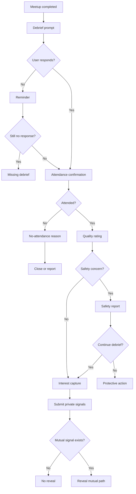

# Feature Spec: Post-Meetup Feedback

## Problem Statement

The product's value is only proven after real-world group meetups. [APPNAME] needs structured debriefs to confirm attendance, capture quality, identify mutual interest, and surface safety issues.

## Research Rationale

- R2: Users want outcomes rather than recurring app participation.
- R7: Larger groups should resolve romantic preference after the event.
- R9: Multi-person interactions require specific safety and accountability capture.

## User Stories With Acceptance Criteria

### Story 1: Confirm attendance

As a participant, I want to confirm whether the meetup happened.

**Acceptance criteria**

- Debrief asks whether the user attended.
- Non-attendance has reason options.
- North-star credit requires corroborated attendance signals.

### Story 2: Express private interest

As a participant, I want to mark each attendee as friend, crush, both, or no interest.

**Acceptance criteria**

- Interest remains private unless mutual.
- Users can skip any person.
- Mutual edges create appropriate next-step prompts.

### Story 3: Report safety or quality issues

As a participant, I want to report problems after the meetup.

**Acceptance criteria**

- Safety report can be submitted before or instead of interest capture.
- Reports can target a group, individual, venue, or plan.
- Severe reports trigger protective actions.

## Detailed User Flow

1. Meetup end time passes.
2. Debrief prompt is sent.
3. User confirms attendance.
4. User rates plan quality.
5. User reports safety issues if any.
6. User privately marks interest for attendees.
7. System compares mutual edges.
8. Follow-up paths open for mutual interest.
9. Quality and safety data update matching and operations.

## Mermaid Flow Diagram

## Screen List With All UI States

| Screen | Empty | Loading | Error | Populated |
|---|---|---|---|---|
| Post-Meetup Check-In | No completed meetup | Loading debrief | Debrief unavailable | Attendance, quality, safety, interest questions |
| Interest Capture | No attendees loaded | Loading attendees | Attendee data unavailable | Friend/crush/both/no-interest controls |
| Mutual Interest Result | No mutual edges | Loading result | Result unavailable | Mutual friend or crush next steps |
| Report From Debrief | No issue selected | Submitting report | Submit failed | Confirmation and protective options |

## Edge Cases

- One group confirms attendance and the other denies: mark as disputed and exclude from confirmed north-star until resolved.
- User reports safety before rating: skip nonessential questions.
- User was not present but receives debrief: collect reason and investigate attendance mismatch if repeated.
- Venue issue affects all participants: route to operations and venue quality review.
- Multiple mutual edges in one pod: show each privately without ranking.

## Success Metrics

- Debrief completion rate.
- Attendance corroboration rate.
- Confirmed meetup rate.
- Mutual edge rate per meetup.
- Post-meetup safety report rate.
- Second-plan creation rate after mutual interest.
- Quality score by venue and group type.

## Open Questions

- **What signals qualify a meetup as verified?** Recommended default: at least two participant confirmations plus location/time plausibility or venue confirmation where available. Research basis: north-star integrity requires stronger evidence than a single self-report.
- **Should users see aggregate group feedback?** Recommended default: no individual or group scores shown to users at launch. Research basis: avoid reputation anxiety and validation loops while using quality data operationally.

---
<!-- doc-version: 1.0 -->
