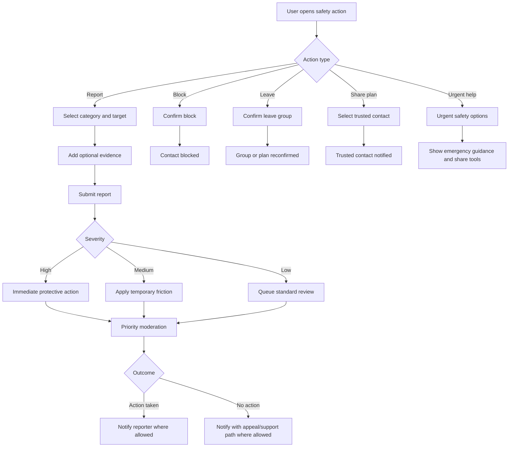

# Feature Spec: Safety Reporting And Escalation

## Problem Statement

Group dating creates more comfort but not automatic safety. Users need visible, fast, and serious safety tools across profiles, chats, plans, live events, and debriefs.

## Research Rationale

- R3: Safety concern is a material adoption barrier.
- R9: Bystander effects mean group size does not guarantee intervention.
- R14: Privacy and safety failures can collapse trust in social dating formats.

## User Stories With Acceptance Criteria

### Story 1: Report from any risky surface

As a user, I want to report a profile, message, group, plan, venue, or post-event issue from where it happens.

**Acceptance criteria**

- Report controls appear on profile, chat, plan, debrief, and safety center screens.
- Report categories include harassment, impersonation, sexual content, threat, discrimination, scam, underage, venue issue, and other.
- User receives confirmation and next steps.

### Story 2: Leave or block safely

As a user, I want to leave a group or block someone without further unwanted contact.

**Acceptance criteria**

- Leave group is always available.
- Blocking prevents future direct or group contact where policy allows.
- Safety exits can hide the user from the reported party.

### Story 3: Escalate urgent issues

As a user in an urgent situation, I want fast access to protective actions.

**Acceptance criteria**

- Urgent flow includes share plan, contact trusted person, platform escalation, and local emergency guidance.
- [APPNAME] does not impersonate emergency services.
- Severe reports trigger priority moderation review.

## Detailed User Flow

1. User taps safety action.
2. User selects report, block, leave, share plan, or urgent help.
3. For reports, user selects category and optional target.
4. User adds evidence if desired.
5. System confirms receipt.
6. Protective action applies based on severity.
7. Moderation triages.
8. User receives outcome where policy permits.

## Mermaid Flow Diagram

## Screen List With All UI States

| Screen | Empty | Loading | Error | Populated |
|---|---|---|---|---|
| Safety Center | Safety action menu | Loading resources | Resources unavailable | Report, block, leave, share, urgent help |
| Report Flow | Category list | Submitting report | Submit failed | Confirmation and next steps |
| Block/Leave Confirmation | Explanation of impact | Applying action | Action failed | Completed state |
| Urgent Help | Safety options | Loading contacts | Contact/share failed | Share plan, trusted contact, emergency guidance |

## Edge Cases

- Reporter and reported user share an upcoming plan: plan is paused or reconfirmed without exposing reporter details.
- Multiple reports target the same group: escalate severity.
- False or abusive reporting pattern: trust review while preserving legitimate safety access.
- Report concerns venue: route to operations and suppress venue if threshold met.
- User loses connectivity during urgent flow: preserve draft and show local emergency guidance if cached.

## Success Metrics

- Report submission completion rate.
- Median response time by severity.
- Repeat report rate against same user or group.
- Safety incident rate per 1,000 confirmed meetups.
- Block/leave success rate.
- User satisfaction with safety response.
- Percentage of severe reports with protective action within target SLA.

## Open Questions

- **Should urgent safety action be visible in the main chat header?** Recommended default: yes. Research basis: R9 shows groups do not automatically intervene; safety must be immediate.
- **Should reports automatically notify all group members?** Recommended default: no. Research basis: protect reporter privacy and avoid retaliation, while applying operational protection.

---
<!-- doc-version: 1.0 -->
