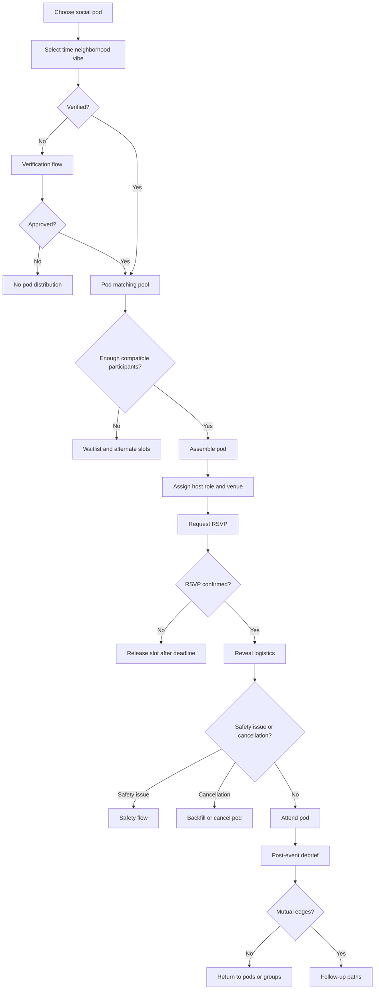

# Feature Spec: Social Pods

## Problem Statement

Quartets are clear and efficient, but some users prefer a larger low-pressure social setting where romance emerges after meeting. Six-to-eight-person pods need different logic from quartet matching.

## Research Rationale

- R6: Bumble Plans validates six-to-eight-person pods as a live market format.
- R7: Larger groups should defer romantic preference until after the event.
- R8: Vulnerable attraction signals can be distorted by group pressure.
- R9: Larger groups require host roles and designed accountability.

## User Stories With Acceptance Criteria

### Story 1: Join a pod

As a verified user or guest pair, I want to join a small-group plan based on time, neighborhood, and vibe.

**Acceptance criteria**

- Pod signup requires verification.
- User selects time windows, neighborhood, intent, and comfort preferences.
- Pod eligibility and expected size are clear before confirmation.

### Story 2: Attend a pod

As a pod participant, I want clear logistics without forced pre-event intimacy.

**Acceptance criteria**

- Pre-event information includes time, venue, expectations, safety tools, and host role.
- Participant profiles are revealed according to privacy rules.
- Chat is limited to logistics unless the pod design explicitly supports pre-event chat.

### Story 3: Capture post-event interest

As a pod participant, I want to privately indicate friend, crush, both, or no interest after meeting.

**Acceptance criteria**

- Interest is private unless mutual.
- Users can skip interest and still submit safety feedback.
- Mutual edges create appropriate follow-up paths.

## Detailed User Flow

1. Verified user chooses social pod mode.
2. User selects neighborhood, time, vibe, and optional bring-a-friend preference.
3. System assembles a six-to-eight-person pod.
4. Participant confirms attendance.
5. Venue and host context are revealed.
6. Participants attend.
7. Post-event debrief captures attendance, quality, safety, and interest.
8. Mutual friend or crush edges unlock follow-up.

## Mermaid Flow Diagram

## Screen List With All UI States

| Screen | Empty | Loading | Error | Populated |
|---|---|---|---|---|
| Social Pod Signup | No upcoming pods | Loading slots | No slots or load failure | Time, neighborhood, vibe, guest options |
| Pod Confirmation | No assembled pod | Matching participants | Pod full, canceled, or unavailable | Pod size, time, venue timing, RSVP |
| Pod Plan Detail | No confirmed pod | Loading details | Venue or host unavailable | Venue, expectations, host, safety tools |
| Pod Debrief | No completed pod | Loading debrief | Submit failed | Attendance, quality, interest, safety |

## Edge Cases

- Pod has fewer than six participants: run only if quality threshold is met and users are informed.
- Pod exceeds eight due to backfill race: cap attendance and refund or rebook extras.
- Host cancels: assign backup host or cancel.
- Participant reports another before event: remove reported participant pending review when risk threshold is met.
- Romantic edge is one-sided: never reveal.

## Success Metrics

- Pod signup completion rate.
- Pod assembly rate.
- RSVP-to-show rate.
- Pod satisfaction score.
- Mutual friend/crush/both edges per attendee.
- Safety incidents per 1,000 pod events.
- Repeat pod attendance.

## Open Questions

- **Should pods be P0 or P1?** Recommended default: P1 controlled pilot. Research basis: R6 validates pods, but R7-R9 show they need distinct event, host, and post-event systems.
- **Should pods allow pre-event chat?** Recommended default: logistics-only. Research basis: R7 says larger groups should optimize for event context first and romance later.

---
<!-- doc-version: 1.0 -->
