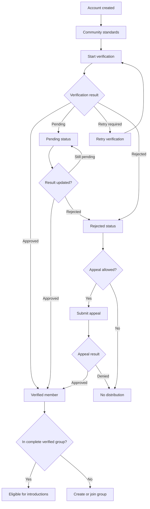

# Feature Spec: Verification And Trust

## Problem Statement

Users will not trust group dating if any participant can enter matching without proving they are real, eligible, and accountable. Group safety failures harm multiple people and spread through friend networks faster than solo app failures.

## Research Rationale

- R3: Safety concern is a material adoption barrier, especially for women.
- R5: Friend involvement adds trust, but does not replace identity assurance.
- R12: Dark-pattern and enforcement risk is rising, so trust claims must be grounded in real controls.

## User Stories With Acceptance Criteria

### Story 1: Verify before distribution

As a new member, I want to verify my identity before joining matching so other groups know I am real.

**Acceptance criteria**

- Given I am unverified, when I try to create, join, or publish a group, then I am routed to verification.
- Given verification is pending, when I view Home, then matching distribution remains locked.
- Given verification is approved, when my group is complete, then my group can become eligible.

### Story 2: Understand verification status

As a member, I want a clear verification status so I know what is blocking me.

**Acceptance criteria**

- Statuses include not started, pending, retry required, approved, rejected, and appeal pending.
- Each blocked status explains what action is available.
- No member sees another member's private verification document or raw verification data.

### Story 3: Handle failed verification

As a legitimate user with a failed check, I want a retry or appeal path.

**Acceptance criteria**

- Retry is available for technical or quality failures.
- Appeal is available for rejected checks where policy allows review.
- Distribution remains blocked until approval.

## Detailed User Flow

1. User creates account.
2. User accepts community standards.
3. User starts verification.
4. Verification returns approved, retry required, rejected, or pending.
5. Approved users can build individual identity and group objects.
6. Pending users can complete non-distribution setup but cannot receive introductions.
7. Rejected users receive appeal or closure guidance.

## Mermaid Flow Diagram

## Screen List With All UI States

| Screen | Empty | Loading | Error | Populated |
|---|---|---|---|---|
| Identity Verification | Explanation and start CTA | Processing check | Failed, expired, provider unavailable, rejected | Approved badge and next action |
| Verification Appeal | Appeal requirements | Uploading appeal | Missing fields or denied appeal | Appeal submitted with review timing |
| Home Lock State | No eligible group because verification missing | Loading eligibility | Eligibility check failed | Clear blocker and verify CTA |
| Group Member Status | No members yet | Loading member statuses | Cannot load member status | Verified, pending, retry, or rejected status per member |

## Edge Cases

- Verification provider outage: block distribution and allow setup to resume later.
- User changes legal name or key identity data: require reverification where policy requires.
- A verified member is later flagged for fraud: pause all groups containing that member.
- One member of a group loses verification standing: group becomes ineligible immediately.
- Underage user detected: close distribution and follow minor-safety policy.
- User tries to use multiple accounts: route to trust review.

## Success Metrics

- Verification start rate from account creation.
- Verification completion rate.
- Median verification time.
- Percentage of distribution-blocked users who resolve within 24 hours.
- Safety reports involving unverified users: target zero.
- Fraud or impersonation reports per 1,000 verified meetups.

## Open Questions

- **Should [APPNAME] require government ID or liveness-only at launch?** Recommended default: government ID plus liveness where lawful and regionally appropriate. Research basis: R3 shows safety concern is central, and mainstream competitors are moving verification deeper into onboarding.
- **Should users be allowed to browse non-romantic safety content before verification?** Recommended default: yes, but no group inventory. Research basis: trust education should not create distribution risk.

---
<!-- doc-version: 1.0 -->
