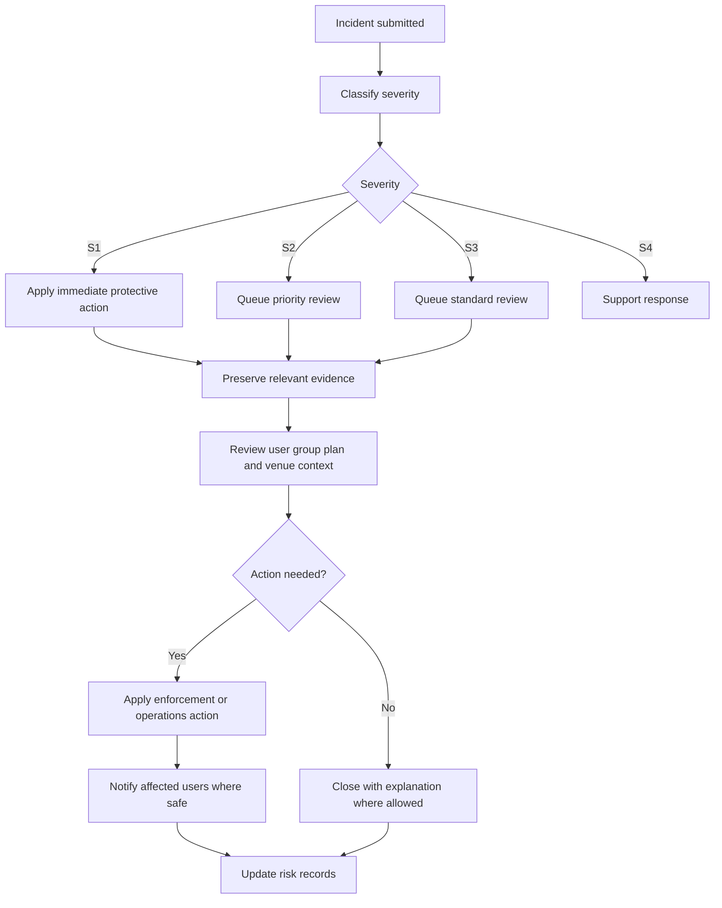

# Incident Response

## Incident Severity

| Severity | Definition | Examples | First Response Target |
|---|---|---|---|
| S1 | Immediate or credible risk of physical harm, sexual harm, underage exploitation, stalking, or severe threat | Threat at confirmed venue, sexual coercion, minor detected | 30 minutes |
| S2 | Serious trust or safety issue without immediate physical risk | Harassment, impersonation, scam, discriminatory abuse | 12 hours |
| S3 | Quality or policy issue with limited immediate risk | No-show pattern, rude behavior, venue complaint | 48 hours |
| S4 | Support or clarification issue | Confusing copy, mistaken report category | 5 business days |

## Response Workflow

## Immediate Protective Actions

- Hide reporter from reported user or group.
- Pause group distribution.
- Disable chat or breakout.
- Cancel or reconfirm plan.
- Suspend reported account pending review.
- Remove unsafe venue from active plans.
- Provide emergency guidance and trusted-contact sharing.

## Evidence Handling

Incident review may consider:

- Report category and narrative.
- Profile, vouch, and group card content.
- Chat messages and moderation flags.
- Plan details, RSVP state, and venue.
- Post-meetup debriefs.
- Prior reports and enforcement history.

Only necessary evidence should be used. Access should be limited to authorized safety reviewers.

## User Communication

Reporter confirmation should include:

- Report received.
- Protective steps applied, if any.
- Expected review timing.
- How to add information.
- Reminder that emergency services should be contacted for immediate danger.

Reported user communication should include:

- Policy area involved.
- Enforcement action.
- Appeal path where allowed.
- No reporter-identifying detail unless legally required or safely appropriate.

## Post-Incident Review

Every S1 and recurring S2 pattern should produce a review note covering:

- What happened.
- Which controls worked.
- Which controls failed.
- Whether product changes are needed.
- Whether venue or partner action is needed.

---
<!-- doc-version: 1.0 -->
