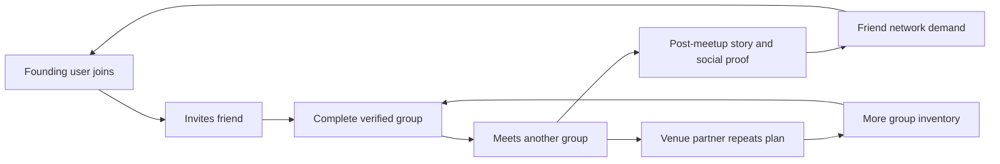

# Go-To-Market Strategy

## GTM Thesis

[APPNAME] should launch city-by-city through dense friend networks, venue partnerships, and creator-led social proof. The research does not support a broad national launch. Group dating depends on local liquidity, trust, and repeatable real-world plans.

## Launch Audience

Primary launch audience:

- 23-38 year-old urban singles.
- Socially active but app-fatigued.
- Comfortable inviting a friend into dating.
- Interested in relationships or serious social discovery.
- Concentrated in neighborhoods with nightlife, events, fitness, graduate programs, creative communities, and young professionals.

## Launch City Criteria

| Criterion | Why It Matters |
|---|---|
| High density of singles | Group matching requires local liquidity. |
| Strong event culture | Offline demand is a research-backed tailwind. |
| Safety-conscious users | Verification-first positioning has stronger pull. |
| Creator and friend-network concentration | Group products grow through invites and stories. |
| Venue supply | Pods and plans need repeatable locations. |
| Mixed social scenes | Supports quartets and pods without over-niching. |

## Positioning

Core line: **Dating is easier with your people.**

Supporting claims:

- Verified groups only.
- No solo swipe feed.
- Fewer introductions, better plans.
- Meet in groups, decide privately.
- Safety tools at every step.

## Acquisition Loops

## Channels

| Channel | Role | Execution |
|---|---|---|
| Founding groups | Seed supply and feedback | Recruit 250-500 curated verified groups before public launch. |
| Creators | Normalize group-first dating | Partner with local creators who show nights out, not dating advice theatrics. |
| Venues | Create real-world plan inventory | Secure recurring low-pressure slots at bars, trivia nights, lounges, comedy rooms, and activity venues. |
| Campus and grad networks | Dense friend graphs | Seed through graduate schools, alumni groups, and campus-adjacent communities. |
| Fitness and hobby communities | Activity-based social trust | Partner with run clubs, climbing gyms, social sports, and classes. |
| Referral | Core activation mechanism | Group creation requires a friend invite, not generic invite credits. |
| PR | Category framing | Pitch as group-only, verification-first response to dating app fatigue. |

## Launch Sequence

1. Build waitlist with city and friend-pair capture.
2. Recruit founding groups manually.
3. Verify and onboard first groups.
4. Run private quartet alpha.
5. Add curated venue nights.
6. Launch social-pod pilot.
7. Open public beta by neighborhood.
8. Expand only after meetup and safety metrics are healthy.

## GTM Metrics

- Waitlist-to-verified-user conversion.
- Verified user-to-complete-group conversion.
- Invite acceptance rate.
- Creator cohort activation.
- Venue plan fill rate.
- Group meetup rate by acquisition channel.
- Safety incident rate by channel.
- Paid conversion after first meetup.

## Open Questions

- **Which launch city first?** Recommended default: choose one dense U.S. metro with strong event culture and safety-conscious app fatigue; New York is a strong candidate if venue operations can support it. Research basis: Bumble Plans launched invite-only in NYC and the reports emphasize density over national reach.
- **Should GTM lead with romance or social plans?** Recommended default: lead with dating, soften with group/social context. Research basis: unclear intent hurt Tinder Social; the product must not become generic friendship networking.

---
<!-- doc-version: 1.0 -->
