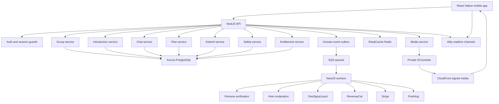
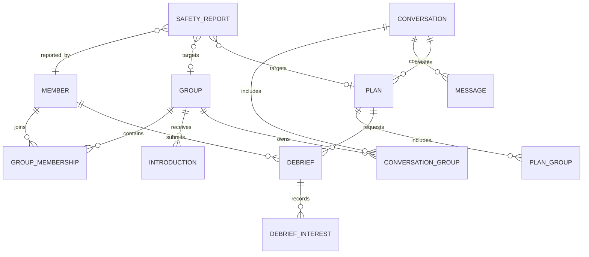
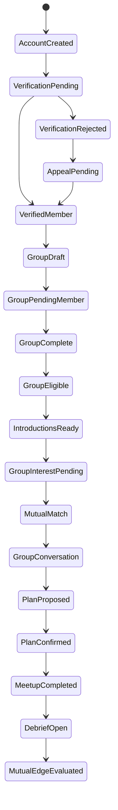
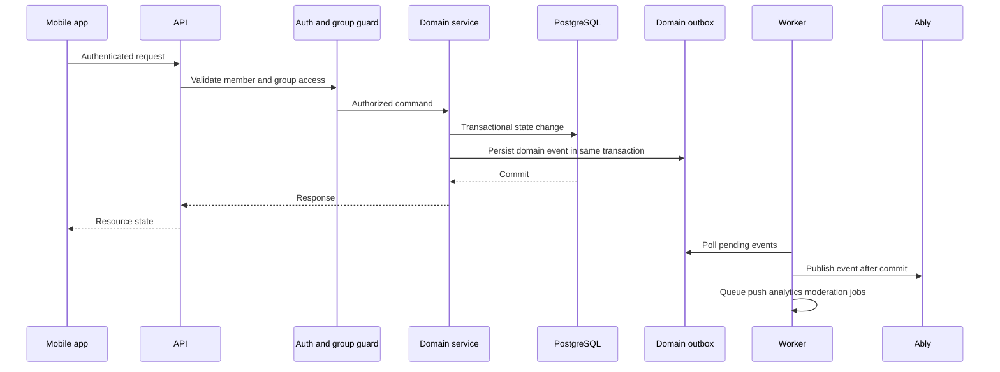

# System Architecture Overview

## System Goal

[APPNAME] is a mobile-first group dating system where verified Groups discover, coordinate, meet, and debrief. The architecture enforces product constraints at service, database, API, realtime, notification, and entitlement boundaries.

The most important boundary is this: Members do not receive dating inventory. Complete verified Groups receive bounded introductions, own conversations, confirm meetups, and provide post-meetup context.

## Architecture Diagram

## Domain Modules

| Module | Owns | Does Not Own |
|---|---|---|
| Member | Auth-linked profile basics, settings, verification state reference, notification preferences | Introductions, dating inventory, conversations, plans |
| Verification | Provider inquiry lifecycle, status mapping, appeal states, verification audit trail | Raw government ID artifacts |
| Group | Group format, membership, eligibility, publish approval, group profile, vouches, availability | Individual dating distribution outside a group |
| Introduction | Daily introduction sets, group-to-group or group-to-plan opportunities, interest approvals, passes, expirations | Infinite feed, paid visibility throttling |
| Conversation | Group chat, breakout thread creation after consent, messages, read receipts, moderation holds | Free-standing member DMs |
| Plan | Polls, venue options, RSVP, confirmation, cancellation, attendance prompts, trusted-contact sharing | Dating preference reveal |
| Debrief | Attendance confirmation, private interest signals, mutual edge reveal, post-meetup quality and safety flags | Public ranking or scoring |
| Safety | Reports, blocks, leaves, urgent actions, consensus blocks, protective actions, moderation cases | Paywalled safety behavior |
| Entitlement | Subscription and purchase state, computed group capabilities, paid plan access, refund state | Distribution suppression for free groups |
| Notification | State-change notification intent, preferences, rate limits, quiet hours, inbox items | Generic engagement campaigns |
| Media | Upload authorization, processing, moderation status, signed delivery, evidence retention class | Verification document storage |

## Core Object Relationships

## State Flow

## Service Boundary Rules

### Group Eligibility

The Group service computes and persists `eligibility_status`. Other services read eligibility but do not override it. If a member loses verification, leaves, is suspended, or withdraws publish approval, the Group service emits `group.eligibility_changed` and downstream systems invalidate introductions, conversation actions, and plan confirmations as required.

### Introduction Generation

The Introduction service only accepts `group_id` inputs. It never takes `member_id` as the distribution unit. It can use member-level attributes as features only through the group's eligible member set and only when those fields are allowed for matching.

### Conversation Ownership

The Chat service persists conversations before publishing realtime events. Group conversations include two or more owning groups through `conversation_groups`. Breakout conversations are child conversations created only after a valid `breakout_request` is accepted by both members. Even then, the breakout retains `parent_conversation_id` and group context for safety and audit.

### Planning

The Plan service treats a plan as confirmed only when required groups and required members meet the RSVP rules for the plan format. Plan state changes are the only source for plan push notifications. A plan can be reconfirmed if group membership changes, a venue becomes unavailable, or a safety action affects any participant.

### Debrief Privacy

The Debrief service stores private interest signals per submitting member and target member. Mutual results are computed by a transaction that reveals only the mutual edge to the two members involved. No endpoint returns one-sided interest or aggregate attractiveness-style scores.

### Safety

The Safety service is a hard dependency for active group and chat surfaces. Reports, blocks, leaves, share-plan actions, and urgent help paths use low-latency API routes. Safety actions can pause group eligibility, disable conversation writes, hide reporters, cancel or reconfirm plans, and create moderation cases.

### Entitlements

The Entitlement service calculates paid capabilities after authentication and group membership checks. It may enable premium planning tools, premium plan purchase access, or expanded daily stack size. It cannot alter the free baseline floor or change ranking weights to reduce non-paying group distribution.

## Request Lifecycle

## Availability and Latency Targets

| Surface | Target | Rationale |
|---|---|---|
| Safety action entry | Under 200 ms API acknowledgement | Every safety action must be one tap from active group or chat surfaces. |
| Message send acknowledgement | Under 500 ms at p95 excluding moderation holds | Chat must feel live while allowing moderation. |
| Realtime event fanout | Under 1 second at p95 after database commit | Plan and chat state must stay consistent across groups. |
| Daily introductions load | Under 900 ms at p95 from cached set | Bounded discovery should not feel like an infinite feed. |
| RSVP and plan confirmation | Under 600 ms at p95 | Multi-party coordination needs immediate feedback. |
| Notification intent creation | Under 2 seconds after state change | Push can lag slightly but must be tied to persisted state. |

## Failure Mode Defaults

| Failure | Default Behavior |
|---|---|
| Verification provider unavailable | Members can finish non-distribution setup; group eligibility remains blocked. |
| Realtime provider unavailable | API writes continue; clients recover through REST replay and event sequence numbers. |
| Moderation provider unavailable | Risky content enters `pending_moderation` hold; low-risk safety-critical text can route to human review. |
| Push provider unavailable | Notification intents stay queued; no synthetic make-up pings are created. |
| Matching job fails | Existing introduction sets remain valid until expiry; no filler groups are shown. |
| Payment provider unavailable | Entitlement state remains last-known-good; purchases show a clear unavailable state. |
| Safety queue delayed | S1 reports bypass standard queue and page on-call through Datadog. |

## Open Questions

| Question | Recommended Default | Technical Basis |
|---|---|---|
| Should [APPNAME] expose a web client for support or desktop planning? | No for consumer launch; build staff consoles as internal web apps only. | Mobile surfaces carry verification, push, IAP, and safety context. A consumer web client increases privacy and auth complexity before product demand exists. |
| Should plan attendance use precise location checks at launch? | No. Use participant confirmations plus coarse time and venue plausibility unless explicit consent exists. | North-star integrity matters, but precise location persistence adds privacy and regulatory complexity. |

---
<!-- doc-version: 1.0 -->
