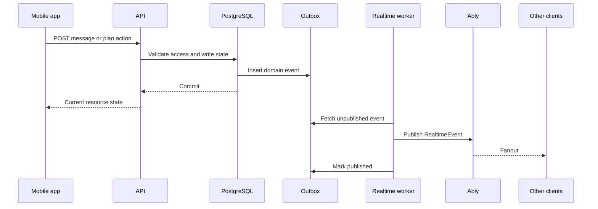

# Real-Time Architecture

## Decision

[APPNAME] uses Ably Realtime Channels for websocket fanout. The API remains the only write authority for durable state. Clients may publish ephemeral typing and presence signals where scoped tokens allow it, but messages, RSVP changes, plan changes, safety actions, breakouts, and debrief events are created through the API and then published after database commit through the domain event outbox.

## Channel Model

| Channel | Subscribers | Published By | Purpose |
|---|---|---|---|
| `member:{memberId}:state` | One authenticated member | Worker | Verification, entitlement, safety case, private debrief, and notification inbox changes. |
| `group:{groupId}:state` | Active group members | Worker | Group eligibility, membership, publish approval, introductions, and plan summary changes. |
| `conversation:{conversationId}:messages` | Conversation participants | Worker, client for typing only | Messages, moderation holds, read receipts, typing, conversation status. |
| `plan:{planId}:state` | Plan participants | Worker | Poll, vote, RSVP, confirmation, cancellation, attendance, and venue changes. |
| `safety:{memberId}:state` | One authenticated member | Worker | Protective action status and safety case updates. |

Channel names use UUIDs only. No profile, dating, venue, or report text appears in channel names.

## Authorization

Realtime tokens are issued by `GET /v1/realtime/token`. The API computes Ably capabilities from current authorization:

| Token Scope | Required Check | Capability |
|---|---|---|
| Member state | Authenticated member matches token subject | Subscribe only. |
| Group state | Active `group_membership` or limited pending-invite state | Subscribe only. |
| Conversation messages | Active `conversation_participant` and `can_write` for typing publish | Subscribe; publish only `conversation.typing` events. |
| Plan state | Active plan participant through `plan_groups` and group membership | Subscribe only. |
| Safety state | Authenticated member matches token subject | Subscribe only. |

Durable writes are never accepted directly from Ably client publish.

## Event Envelope

```typescript
export interface RealtimeEvent<TPayload> {
  eventId: string;
  eventName: string;
  eventVersion: number;
  aggregateType: "member" | "group" | "introduction" | "conversation" | "plan" | "debrief" | "safety" | "purchase";
  aggregateId: string;
  sequenceNumber: number;
  occurredAt: string;
  payload: TPayload;
}
```

Clients deduplicate by `eventId` and recover by calling REST endpoints when `sequenceNumber` skips.

## Delivery Guarantees

| Guarantee | Implementation |
|---|---|
| Persistence before publish | Domain event is inserted into `domain_event_outbox` in the same transaction as the state change. |
| At-least-once fanout | Workers retry unpublished outbox rows and Ably publish failures. |
| Per-aggregate order | `sequence_number` is monotonic per aggregate. Clients apply only newer sequence numbers. |
| Replay | REST endpoints return current state and message history. Realtime is acceleration, not storage. |
| Privacy | Private debrief and safety events publish only to member-scoped channels. |
| Moderation | Held messages emit a status event to the sender only; rejected content is not broadcast to other participants. |

## Event Catalog

| Event | Direction | Payload Schema | Trigger | Guarantee |
|---|---|---|---|---|
| `verification.status_changed` | Server to member | `{ memberId: string; status: VerificationStatus; failureReasonCode: string | null }` | Persona webhook or appeal decision updates verification status. | Persisted outbox, at-least-once, member-private. |
| `group.member_joined` | Server to group | `{ groupId: string; memberId: string; firstName: string; membershipStatus: string }` | Invite accepted and membership activated. | Persisted outbox, at-least-once. |
| `invite.relay_accepted` | Server to group | `{ inviteId: string; groupId: string; acceptedByMemberId: string; acceptedAt: string }` | Invitee accepts, verifies, and joins. | Persisted outbox, at-least-once; push-eligible for group members. |
| `group.member_left` | Server to group | `{ groupId: string; memberId: string; affectedPlanIds: string[]; affectedConversationIds: string[] }` | Member leaves, is removed, or safety exit completes. | Persisted outbox, at-least-once. |
| `group.profile_updated` | Server to group | `{ groupId: string; updatedByMemberId: string; visibilityPreviewHash: string; fieldsChanged: string[] }` | Group member updates setup fields that require a fresh publication preview. | Persisted outbox, at-least-once; metadata-only. |
| `group.publish_approval_changed` | Server to group | `{ groupId: string; memberId: string; approved: boolean; allApproved: boolean }` | Member approves or withdraws group publication. | Persisted outbox, at-least-once. |
| `group.eligibility_changed` | Server to group | `{ groupId: string; status: GroupStatus; eligibilityStatus: string; blockers: string[] }` | Group completion, verification, safety, membership, or moderation state changes. | Persisted outbox, at-least-once. |
| `introduction.set_refreshed` | Server to group | `{ groupId: string; setId: string; count: number; baselineSize: number; entitlementExtraSize: number; liquidityMode: string }` | Daily matching run creates or refreshes set. | Persisted outbox, at-least-once. |
| `introduction.internal_approval_requested` | Server to group | `{ introductionId: string; groupId: string; requesterMemberId: string; expiresAt: string }` | One group member starts interest requiring internal approval. | Persisted outbox, at-least-once. |
| `introduction.status_changed` | Server to group | `{ introductionId: string; groupId: string; status: IntroductionStatus }` | Pass, expiration, removal, interest sent, or match. | Persisted outbox, at-least-once. |
| `introduction.mutual_match_created` | Server to both groups | `{ introductionId: string; conversationId: string; groupIds: string[] }` | Reciprocal group interest is confirmed. | Persisted outbox, at-least-once. |
| `conversation.message_created` | Server to conversation | `{ message: MessageResource }` | Message accepted and committed. | Persisted outbox, at-least-once, ordered by message sequence. |
| `conversation.message_held` | Server to sender member | `{ conversationId: string; clientNonce: string; moderationStatus: ModerationStatus; reasonCode: string | null }` | Message enters moderation hold. | Persisted outbox, sender-private. |
| `conversation.read_receipt_updated` | Server to conversation | `{ conversationId: string; memberId: string; lastReadMessageId: string }` | Participant updates read receipt. | Persisted outbox, at-least-once. |
| `conversation.typing` | Client to conversation | `{ conversationId: string; memberId: string; isTyping: boolean; expiresAt: string }` | Client sends ephemeral typing state. | Best-effort, not persisted. |
| `conversation.status_changed` | Server to conversation | `{ conversationId: string; status: ConversationStatus; reasonCode: string | null }` | Expiry, safety action, moderation restriction, or closure. | Persisted outbox, at-least-once. |
| `breakout.requested` | Server to recipient member | `{ requestId: string; parentConversationId: string; requesterMemberId: string; expiresAt: string }` | Eligible member requests breakout. | Persisted outbox, recipient-private. |
| `breakout.responded` | Server to requester and recipient | `{ requestId: string; status: "accepted" | "declined" | "expired"; conversationId: string | null }` | Recipient accepts, declines, or request expires. | Persisted outbox, member-private. |
| `breakout.opened` | Server to breakout conversation | `{ conversationId: string; parentConversationId: string; participantMemberIds: string[] }` | Accepted request creates child conversation. | Persisted outbox, at-least-once. |
| `plan.fast_track_proposed` | Server to conversation | `{ proposalId: string; conversationId: string; sourceGroupId: string; groupIds: string[]; timeOptionCount: number; venueOptionCount: number }` | Fast Track creates an editable proposal. | Persisted outbox, at-least-once; push-eligible when planning action is needed. |
| `plan.fast_track_accepted` | Server to plan and conversation | `{ proposalId: string; planId: string; conversationId: string; groupIds: string[]; rsvpDeadlineAt: string }` | A proposal creates an RSVP-requested Plan. | Persisted outbox, at-least-once; push-eligible for RSVP action. |
| `plan.poll_created` | Server to plan and conversation | `{ planId: string; conversationId: string | null; optionIds: string[] }` | Plan poll is created. | Persisted outbox, at-least-once. |
| `plan.vote_changed` | Server to plan | `{ planId: string; optionId: string; memberId: string; groupId: string; voteValue: string }` | Participant votes or changes vote. | Persisted outbox, at-least-once. |
| `plan.rsvp_changed` | Server to plan | `{ planId: string; memberId: string; groupId: string; status: string; allRequiredReceived: boolean }` | RSVP is created or changed. | Persisted outbox, at-least-once. |
| `plan.confirmed` | Server to plan and member state | `{ planId: string; startsAt: string; venueName: string; groupIds: string[] }` | Plan meets confirmation rule. | Persisted outbox, at-least-once; push-eligible. |
| `plan.reconfirmation_required` | Server to plan | `{ planId: string; reasonCode: string; affectedGroupIds: string[] }` | Membership, venue, safety, or cancellation state invalidates confirmation. | Persisted outbox, at-least-once. |
| `plan.canceled` | Server to plan | `{ planId: string; reasonCode: string; canceledByMemberId: string | null }` | Plan is canceled by participant, safety, venue, or system. | Persisted outbox, at-least-once; push-eligible. |
| `plan.attendance_requested` | Server to member state | `{ planId: string; memberId: string; dueAt: string }` | Plan end time passes. | Persisted outbox, member-private; push-eligible. |
| `debrief.requested` | Server to member state | `{ planId: string; memberId: string; debriefId: string | null }` | Attendance prompt opens debrief. | Persisted outbox, member-private; push-eligible. |
| `debrief.submitted` | Server to member state | `{ debriefId: string; planId: string; submittedAt: string }` | Member submits debrief. | Persisted outbox, member-private. |
| `debrief.learning_consent_changed` | Server to member state | `{ consentId: string; debriefId: string; planId: string; groupId: string; memberId: string; status: "granted" | "declined" | "revoked"; decidedAt: string }` | Member grants, declines, or revokes recommendation-learning consent. | Persisted outbox, member-private, not push-eligible. |
| `debrief.mutual_edge_revealed` | Server to two member channels | `{ mutualEdgeId: string; planId: string; otherMemberId: string; edgeType: "friend" | "crush" | "both" }` | Mutual private interest exists. | Persisted outbox, member-private only. |
| `safety.report_received` | Server to reporter member | `{ reportId: string; caseId: string; severity: SafetySeverity; protectiveActions: string[] }` | Report intake transaction commits. | Persisted outbox, member-private; push-eligible only for meaningful updates. |
| `safety.protective_action_applied` | Server to affected member or group | `{ actionId: string; actionType: string; targetType: string; targetId: string }` | Safety action applies. | Persisted outbox, scoped to affected parties. |
| `safety.case_resolved` | Server to reporter member | `{ caseId: string; outcomeCategory: string }` | Moderator closes case and reporter can be notified. | Persisted outbox, member-private; push-eligible. |
| `action_queue.item_created` | Server to member state | `{ itemId: string; memberId: string; groupId: string | null; sourceEventId: string; targetType: string; targetId: string; actionKind: string; deadlineAt: string | null }` | A persisted source event creates a Momentum Hub action. | Persisted outbox, member-private; push follows source event eligibility. |
| `action_queue.item_dismissed` | Server to member state | `{ itemId: string; memberId: string; dismissedAt: string }` | Member dismisses a policy-dismissible action item. | Persisted outbox, member-private, not push-eligible. |
| `entitlement.changed` | Server to member and active group | `{ memberId: string; groupId: string | null; entitlements: EntitlementResource[] }` | RevenueCat or Stripe webhook changes entitlement. | Persisted outbox, at-least-once. |
| `notification.inbox_item_created` | Server to member | `{ notificationId: string; category: NotificationCategory; targetPath: string }` | Notification intent creates inbox item. | Persisted outbox, member-private. |

## Realtime Write Flow



## Client Recovery

1. Client stores latest `sequenceNumber` per aggregate.
2. On reconnect, client resubscribes and calls REST for active group, conversation, plan, and inbox state.
3. If a realtime event has an old or duplicate `eventId`, client ignores it.
4. If a realtime event sequence skips, client fetches the current resource before applying later events.
5. If Ably is unavailable, mobile keeps API writes available and shows a degraded realtime state.

## Safety and Privacy Rules

1. Report, block, leave, and urgent-action events do not reveal reporter identity to reported parties unless policy explicitly allows it.
2. One-sided debrief interest is never emitted through realtime.
3. Message moderation holds are visible to the sender, not the whole conversation.
4. Breakout declines are private to the requester and recipient, not the broader group.
5. State-change notifications are created from the same outbox events that power realtime, but push eligibility is decided separately by the Notification Service.

## Open Questions

| Question | Recommended Default | Technical Basis |
|---|---|---|
| Should message delivery receipts be realtime in alpha? | No; start with read receipts and send acknowledgement. | Delivery receipts add noise and privacy edge cases without improving meetup conversion. |
| Should typing indicators exist in social-pod logistics chats? | No; enable only for quartet group chats and accepted breakouts. | Pods should stay logistics-light and avoid pre-event intimacy pressure. |

---
<!-- doc-version: 1.0 -->
