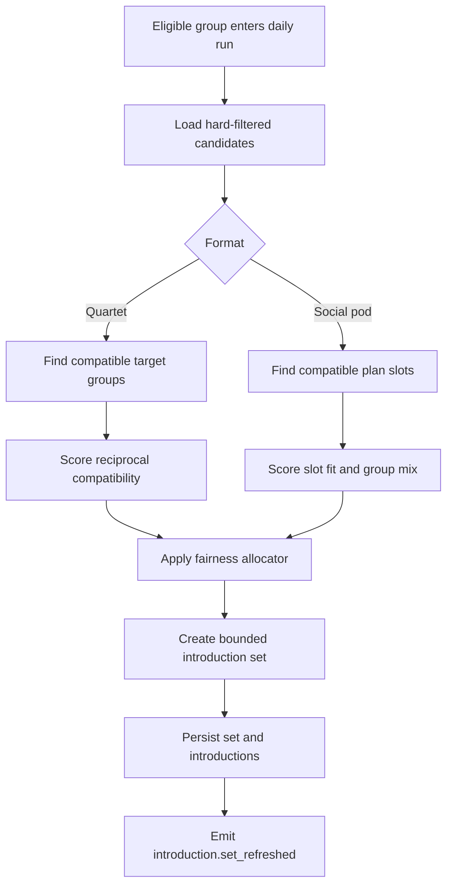

# Matching Engine Design

## Objective

The matching engine creates bounded, explainable, group-owned introductions. It does not create individual discovery inventory, does not use paid throttling, and does not show filler profiles when supply is thin.

The engine supports two formats:

1. Quartet: compatible complete Groups are introduced to each other.
2. Social Pod: complete social-pod Groups are assigned to a plan slot or waitlisted for a compatible plan.

## Core Inputs

| Input | Source | Use |
|---|---|---|
| Group format | `groups.format` | Separates quartet and social-pod logic. |
| Eligibility status | `groups.eligibility_status` | Hard gate; only eligible Groups enter matching. |
| City and neighborhoods | `groups.city_id`, `groups.neighborhood_ids` | Candidate retrieval and launch-density controls. |
| Availability | `groups.availability_windows` | Time overlap and plan likelihood. |
| Intent | `groups.intent` | Compatibility filter and explanation reason. |
| Group profile moderation | `group_profiles.moderation_status` | Blocks unsafe or unapproved profiles. |
| Safety standing | safety actions, blocks, reports | Excludes blocked or restricted groups and lowers risk exposure. |
| Plan behavior | RSVP, no-show, attendance, debrief completion | Quality and reliability scoring. |
| Entitlements | `entitlement_grants` | Additive stack size only; never free-baseline suppression. |

## Hard Filters

A Group is excluded when any hard filter is true:

1. Group is not `eligible`.
2. Any active member is not verification-approved.
3. Profile is missing required fields or publication approval.
4. Profile or media is rejected or held for required moderation.
5. Source and candidate groups are blocked in either direction.
6. Active safety action pauses distribution for any involved member or group.
7. City is not active for the requested format.
8. Quartet candidate is not exactly two active verified members.
9. Social-pod candidate is not a complete one-member or two-member social-pod Group.
10. Candidate has already been shown in the current freshness window unless explicit rematch policy allows it.

## Candidate Retrieval



## Scoring Model

The first production scoring model is deterministic and auditable. A learned ranker can replace score weights only after the same feature and explanation contract is preserved.

```typescript
export interface GroupMatchFeatures {
  sharedCity: boolean;
  neighborhoodOverlapScore: number;
  availabilityOverlapScore: number;
  intentCompatibilityScore: number;
  profileCompletenessScore: number;
  responseReliabilityScore: number;
  planAttendanceScore: number;
  safetyRiskPenalty: number;
  recentExposurePenalty: number;
  reciprocalInterestPrior: number;
}

export interface MatchScore {
  score: number;
  reasonCodes: Array<
    | "shared_availability"
    | "nearby_neighborhoods"
    | "compatible_intent"
    | "similar_plan_preference"
    | "complementary_group_vibe"
    | "strong_attendance_history"
  >;
}
```

Default weighting:

| Feature | Weight | Rationale |
|---|---:|---|
| Availability overlap | 0.25 | Meeting is the north star. |
| Neighborhood overlap | 0.20 | Low-friction logistics improve confirmed plans. |
| Intent compatibility | 0.20 | Reduces mismatch and wasted emotional effort. |
| Response reliability | 0.10 | Helps conversations become plans. |
| Plan attendance | 0.10 | Rewards real-world follow-through without public scoring. |
| Profile completeness | 0.05 | Improves trust and decision quality. |
| Reciprocal interest prior | 0.05 | Uses prior group-level signals only. |
| Safety risk penalty | negative | Protects users and venues. |
| Recent exposure penalty | negative | Avoids repeated stale cards. |

Paid status is not a scoring feature.

## Daily Set Size

| Group State | Default Set |
|---|---|
| Free eligible quartet Group | 3 to 5 introductions per daily run, subject to qualified inventory. |
| Group with `expanded_stack_size` entitlement | Free baseline plus explicit extra count from entitlement metadata. |
| Thin-city mode | Up to available qualified inventory; no filler cards. |
| Safety-limited Group | No introductions while restriction is active. |

The engine stores `baseline_size` and `entitlement_extra_size` separately in `introduction_sets`.

## Quartet Flow

1. Source Group enters daily run.
2. Engine retrieves eligible quartet target Groups in the same city.
3. Hard filters remove blocked, unsafe, recently exposed, or incompatible candidates.
4. Score produces rank and reason codes.
5. Fairness allocator balances exposure so a small number of highly active Groups do not absorb all introductions.
6. API returns a bounded set.
7. Interest requires internal group approval.
8. Mutual group interest creates one group conversation.

## Social-Pod Flow

1. Social-pod Group submits time, neighborhood, vibe, and bring-friend preferences.
2. Engine retrieves compatible plan slots or creates waitlist demand for operations.
3. Engine scores slot fit by time, neighborhood, format capacity, host availability, venue safety, and group mix.
4. Assignment creates or updates a social-pod Plan with `plan_groups`.
5. RSVP confirmation, not member browsing, controls final attendance.
6. Post-event Debrief handles friend, crush, both, or no-interest outcomes privately.

## Cold Start: Fewer Than 50 Eligible Groups In A City

When a city has fewer than 50 eligible Groups for the requested format, the engine enters `thin_city` liquidity mode. The goal is to preserve trust and bounded discovery while avoiding fake inventory.

### Thin-City Rules

1. Do not show incomplete Groups.
2. Do not show unverified Members.
3. Do not loosen safety or moderation filters.
4. Do not sell paid visibility as a workaround.
5. Do not duplicate the same candidate repeatedly to make the stack look full.
6. Show an honest no-introductions state when qualified inventory is unavailable.

### Thin-City Retrieval Strategy

| Step | Action | Constraint |
|---|---|---|
| 1 | Expand within user-approved neighborhood range. | Never expand beyond group consent. |
| 2 | Expand within user-approved availability windows for the next 14 days. | Never invent availability. |
| 3 | Include compatible Groups from adjacent launch neighborhoods. | Only if both Groups' settings allow the area. |
| 4 | Prefer Groups with high plan likelihood and recent activity. | Paid status is ignored. |
| 5 | Route social-pod demand to waitlist or scheduled venue slots. | No public participant reveal before assignment rules pass. |
| 6 | Emit operations metrics for seeding. | Growth team sees aggregate gaps, not private member data. |

### Thin-City User Experience Contract

The API returns:

```typescript
export interface ThinCityIntroductionState {
  liquidityMode: "thin_city";
  introductions: IntroductionResource[];
  honestReason:
    | "no_verified_groups_available"
    | "no_groups_match_availability"
    | "no_groups_match_neighborhood"
    | "safety_or_privacy_filters_removed_inventory";
  suggestedActions: Array<"edit_availability" | "edit_neighborhoods" | "invite_groups" | "join_social_pod_waitlist">;
}
```

This is a technical contract for honest inventory handling. It does not create product pressure or fake scarcity.

## Fairness Allocator

The allocator prevents repeated exposure concentration:

```typescript
export interface AllocationInputs {
  sourceGroupId: string;
  candidateGroupIds: string[];
  dailyBaselineSize: number;
  entitlementExtraSize: number;
  exposureBudgetByCandidate: Record<string, number>;
  blockedPairKeys: string[];
}

export interface AllocationResult {
  selectedCandidateIds: string[];
  baselineCount: number;
  entitlementExtraCount: number;
}
```

Rules:

1. Always fill baseline slots before entitlement extra slots.
2. Entitlement extra slots may add candidates only after the free baseline is preserved.
3. Exposure budgets are per candidate Group and reset by format and freshness window.
4. A candidate cannot be shown to both members individually because Members never receive introductions.
5. The allocator logs skipped candidates with reason codes for audit.

## Explanation Contract

Group cards may show:

- Shared availability.
- Nearby neighborhoods.
- Compatible relationship intent.
- Similar plan preference.
- Complementary group vibe.
- Strong attendance and responsiveness history.

Group cards must not show:

- Attractiveness score.
- Comparative desirability rank.
- Paid priority.
- One-sided debrief interest.
- Safety risk scores.
- Sensitive trait inference.

## Batch and Online Jobs

| Job | Trigger | Output |
|---|---|---|
| `daily-quartet-introduction-run` | EventBridge daily per city timezone | `introduction_sets`, `introductions`, `introduction.set_refreshed`. |
| `social-pod-assignment-run` | Hourly and when venue slots are created | Plan assignments or waitlist states. |
| `eligibility-recompute` | Group, verification, moderation, safety, membership changes | Updated `groups.eligibility_status`. |
| `exposure-budget-recompute` | Daily after introduction run | Candidate exposure budgets. |
| `thin-city-supply-report` | Daily in alpha and beta | Aggregate supply gaps by neighborhood, time window, and format. |

## Data Protection

Matching can use allowed group and member fields only through the Group's eligible member set. It cannot use raw verification artifacts, private report narratives, one-sided debrief interest, exact location traces, payment status, or sensitive inferred traits.

## Open Questions

| Question | Recommended Default | Technical Basis |
|---|---|---|
| Should a learned ranker replace deterministic scoring before public beta? | No. Keep deterministic scoring until enough verified meetup outcomes exist and fairness/safety audits can be run. | Early data will be sparse and biased by launch seeding. Deterministic ranking is easier to explain and debug. |
| Should paid expanded stack size be enabled in private alpha? | No. Keep entitlements implemented but disabled until free liquidity and meetup conversion are proven. | The architecture supports additive stack size, but early matching metrics need an unskewed baseline. |
| Should social-pod matching use one-member Groups? | Yes for technical modeling. | It preserves the hard constraint that Groups, not loose Members, receive plan opportunities and confirmations. |

---
<!-- doc-version: 1.0 -->
