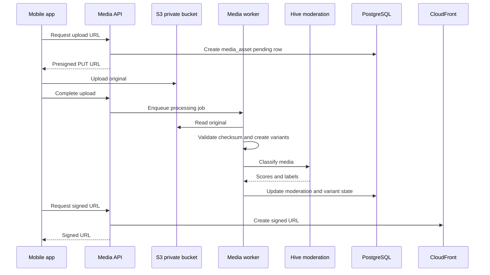

# Media Pipeline

## Decision

[APPNAME] stores media in private S3 buckets, processes media through ECS workers, distributes approved variants through CloudFront signed URLs, and routes every user-generated media object through moderation according to purpose.

Raw government ID and liveness artifacts are not stored in [APPNAME] media buckets. Those remain inside Persona.

## Media Classes

| Class | Examples | Visibility | Moderation | Retention |
|---|---|---|---|---|
| Profile media | Member sub-card photos, group cover images | Visible only when group is published and viewer is eligible to see the group | Required before distribution | Deleted after account or group deletion policy window. |
| Message media | Chat attachments | Visible only to conversation participants | Required before broadcast unless low-risk policy allows sender-only pending state | Retained with conversation policy. |
| Venue media | Venue and partner plan images | Visible to plan participants or browsing users | Required before publication | Retained while venue active. |
| Report evidence | Safety report screenshots, photos, or recordings | Safety reviewers and reporter confirmation only | Stored as evidence, classified but not auto-shared | Safety retention class. |

## Upload Flow



## Storage Layout

| Bucket | Purpose | Access |
|---|---|---|
| `[appname]-media-original-{env}` | Original non-verification uploads | Private, S3 block public access, KMS encrypted. |
| `[appname]-media-variants-{env}` | Approved transformed variants | Private origin for CloudFront signed URLs. |
| `[appname]-safety-evidence-{env}` | Report evidence and preserved review media | Private, stricter IAM, longer retention, no CDN by default. |
| `[appname]-moderation-quarantine-{env}` | Rejected or held media needing review | Private, staff-only access. |

## Processing Contract

```typescript
export interface MediaProcessingJob {
  assetId: string;
  purpose: "profile" | "message" | "venue" | "report_evidence";
  ownerMemberId: string | null;
  ownerGroupId: string | null;
  bucket: string;
  objectKey: string;
  contentType: string;
  byteSize: number;
  checksumSha256: string;
}

export interface MediaProcessingResult {
  assetId: string;
  moderationStatus: ModerationStatus;
  variants: Array<{ name: "thumb" | "profile" | "original"; objectKey: string; width: number | null; height: number | null }>;
  classifierLabels: string[];
  rejectionReasonCode: string | null;
}
```

## Validation Rules

| Rule | Value |
|---|---|
| Allowed image types | `image/jpeg`, `image/png`, `image/webp`, `image/heic` after platform support validation. |
| Allowed video types | Disabled for launch except safety evidence. |
| Max profile image size | 15 MB original. |
| Max message image size | 15 MB original. |
| Max report evidence size | 100 MB per asset, review-only. |
| Checksum | SHA-256 required before signed upload and verified on complete. |
| Public access | Denied at bucket and object policy level. |

## Moderation Rules

| Purpose | Approved State | Held State | Rejected State |
|---|---|---|---|
| Profile | Can appear in published group profile after group approval. | Group remains ineligible if required media is held. | Media hidden; user can replace or appeal where policy allows. |
| Message | Broadcast after approval. | Sender sees pending or held state; others do not receive content. | Sender sees rejection copy; moderation case may open. |
| Venue | Can appear in venue and plan surfaces. | Hidden from users until operations review. | Venue media removed. |
| Report evidence | Stored and linked to safety case. | Reviewer sees classifier risk. | Evidence is not discarded automatically; illegal or unsafe handling follows policy. |

## Signed URL Rules

1. API checks viewer authorization before issuing any signed URL.
2. Profile media requires the viewer to have valid access to the Group card, conversation, or plan surface.
3. Message media requires conversation participation.
4. Safety evidence signed URLs require staff authorization or reporter access to their own report confirmation.
5. URLs expire in 5 minutes for safety evidence and 30 minutes for approved profile or venue media.
6. Revocation is handled by deleting variants or invalidating CloudFront paths for severe safety cases.

## Privacy and Safety Constraints

- Non-joined invitees never have media returned through any API.
- Deleted members are removed from public media surfaces promptly while safety and payment retention rules still apply.
- Report evidence is never attached to reported-user notifications by default.
- Profile media can be used for moderation and fraud review, but not for attractiveness scoring.
- Media classifier labels are internal only.

## Open Questions

| Question | Recommended Default | Technical Basis |
|---|---|---|
| Should message images be allowed in private alpha? | No; enable profile and report evidence first, then message images after moderation throughput is proven. | Message media creates safety and review load before it improves the core meetup loop. |
| Should CloudFront signed cookies replace signed URLs? | No for mobile launch. Use per-asset signed URLs. | Signed URLs are simpler, auditable, and scoped to individual media access checks. |

---
<!-- doc-version: 1.0 -->
