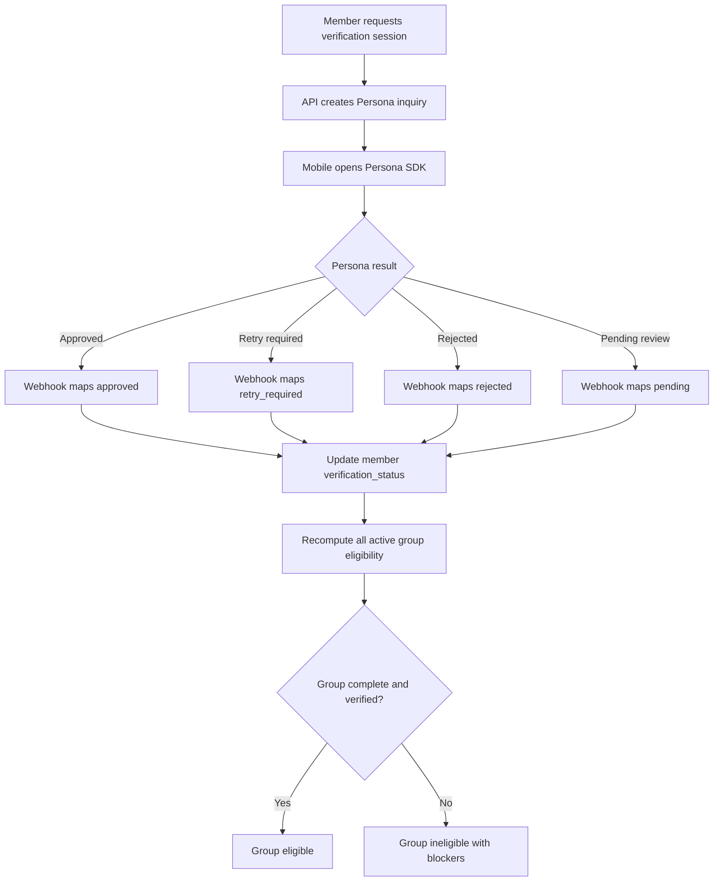

# Verification Integration

## Decision

[APPNAME] integrates Persona government-ID plus liveness verification through mobile SDK inquiries created by the API. Verification approval is required before a Member can complete a distributed Group. The Group service consumes verification status changes and immediately recomputes group eligibility.

## Trust Boundary

| Data | Stored By Persona | Stored By [APPNAME] |
|---|---|---|
| Government ID image | yes | no |
| Liveness capture | yes | no |
| Document extracted fields | yes | limited derived status only |
| Inquiry ID | yes | yes |
| Verification status | yes | yes |
| Failure reason code | yes | yes, mapped and redacted |
| Risk flags | yes | limited internal flags |
| Appeal metadata | maybe | yes |

## Flow



## API and Webhook Rules

| Rule | Requirement |
|---|---|
| Session creation | Authenticated Member only; rate-limited; blocked for banned members. |
| Provider signature | Required for every Persona webhook; verified against the exact raw request body before normalization. |
| Idempotency | Provider inquiry ID and webhook event ID prevent duplicate state transitions. |
| Status mapping | Provider statuses map to internal `VerificationStatus` only through an explicit adapter. |
| Raw data | API never requests or stores raw ID images or liveness media. |
| Group recompute | Every approved, rejected, retry, or expiry transition emits `verification.status_changed` and `group.eligibility_changed` where affected. |

Current implementation: `apps/api/src/fastify-app.ts` creates the Fastify API shell and mounts `/healthz` plus the Persona webhook route with injected runtime ports. `apps/api/src/runtime-app.ts` composes that shell from a resolved `PERSONA_WEBHOOK_SECRET`, runtime clock/id generators, and a Postgres query client, then wires `createPersonaWebhookPostgresPersistence` into the Persona webhook route. `apps/api/src/production-app.ts` reads `DATABASE_URL`, creates a node-postgres pool-backed query client through `apps/api/src/node-postgres-query-client.ts`, provides UUIDv7 runtime ids, and closes the pool with the Fastify app. `apps/api/src/server.ts` is the package startup entrypoint: it reads `HOST` and `PORT`, starts the production app, and registers one-shot `SIGTERM`/`SIGINT` shutdown handlers. `apps/api/src/persona-webhook-fastify-route.ts` registers the `/v1/webhooks/persona` Fastify route in an encapsulated scope that captures `application/json` as raw bytes and binds the configured webhook secret through `createPersonaWebhookDependencies`. `apps/api/src/persona-webhook-ingress.ts` exposes a framework-neutral HTTP ingress helper that extracts exactly one nonblank `Persona-Signature` header value across case variants and passes the exact raw request body to `apps/api/src/verification-route.ts`. The raw-request Persona webhook handler verifies the framework-captured `rawRequestBody` before parsing JSON or normalizing the provider payload. `apps/api/src/persona-webhook-postgres-persistence.ts` supplies DB-backed ports that reserve `provider_webhook_events`, load `verification_cases` by Persona inquiry id, update `verification_cases` and `members`, insert `domain_event_outbox`, and mark the provider event processed transactionally. `apps/api/src/persona-webhook-dependencies.ts` binds the configured Persona webhook secret to the raw-body signature verifier and keeps persistence ports injectable. `apps/api/src/persona-adapter.ts` is the explicit Persona webhook adapter. It verifies the `Persona-Signature` HMAC over `timestamp.raw_request_body` with a bounded timestamp tolerance, accepts any matching `v1` candidate when Persona sends multiple signatures during secret rotation, normalizes provider webhook payloads into `VerificationProviderEvent`, maps provider status names to the internal status vocabulary, and returns only event id, inquiry id, occurrence time, mapped status, reason code, and risk tags. Raw government ID fields, document photo URLs, selfie/liveness fields, and full provider payloads do not cross into domain services.

## Status Mapping

| Persona State | Internal State | User Impact |
|---|---|---|
| Inquiry created but incomplete | `pending` | Member can continue setup; distribution blocked. |
| Inquiry approved | `approved` | Member can participate in eligible Groups. |
| Inquiry needs retry | `retry_required` | Distribution blocked; retry allowed. |
| Inquiry under manual review | `pending` | Distribution blocked; status explains review. |
| Inquiry declined for policy | `rejected` | Distribution blocked; appeal if allowed. |
| Appeal submitted | `appeal_pending` | Distribution blocked until decision. |

## Eligibility Side Effects

| Verification Change | Required Side Effect |
|---|---|
| `not_started` to `pending` | Group blockers include `verification_pending`. |
| `pending` to `approved` | Recompute any Groups containing the Member. |
| `approved` to `rejected` | Make Groups containing the Member ineligible, expire active introductions, reconfirm active plans. |
| `approved` to `retry_required` | Same as rejected until resolved. |
| `rejected` to `appeal_pending` | Keep blocked; update Home and verification screens. |
| `appeal_pending` to `approved` | Recompute Groups and emit state change. |

## Fraud Controls

1. Duplicate inquiry detection by provider identity signals.
2. Rate limits on verification session creation.
3. Device fingerprint risk signal stored in audit log only as redacted metadata.
4. Underage detection closes distribution and starts minor-safety flow.
5. Suspicious verification reversal pauses all Groups containing the Member.
6. Staff review can suspend Member without changing provider status.

## TypeScript Adapter Contract

```typescript
export interface VerificationProviderEvent {
  provider: "persona";
  eventId: string;
  inquiryId: string;
  occurredAt: string;
  rawStatus: string;
  reasonCode?: string;
  riskTags: string[];
}

export interface PersonaWebhookSignatureInput {
  rawBody: string | Buffer;
  signatureHeader: string;
  secret: string;
  now?: () => number;
  toleranceSeconds?: number;
}

export interface VerificationStateTransition {
  provider: "persona";
  providerEventId: string;
  providerInquiryId: string;
  memberId: string;
  previousStatus: VerificationStatus;
  nextStatus: VerificationStatus;
  failureReasonCode: string | null;
  riskFlags: string[];
  emitGroupEligibilityRecompute: boolean;
}
```

## Operational Metrics

| Metric | Owner |
|---|---|
| Verification start rate | Product and growth. |
| Verification approval rate | Product and trust. |
| Median verification completion time | Trust and engineering. |
| Retry-required rate by device/platform | Engineering. |
| Rejected-to-appeal approval rate | Trust. |
| Groups blocked by verification state | Product and matching. |

## Open Questions

| Question | Recommended Default | Technical Basis |
|---|---|---|
| Should verification expire after a fixed period? | No fixed expiry for alpha; reserve `expires_at` for risk-triggered reverification. | Expiry adds operational friction before fraud patterns are known. |
| Should manual trust reviewers be able to override provider approval? | Yes, only to restrict or require reverification, with audit log. | Provider approval is necessary but not sufficient when platform-specific safety evidence exists. |

---
<!-- doc-version: 1.0 -->
