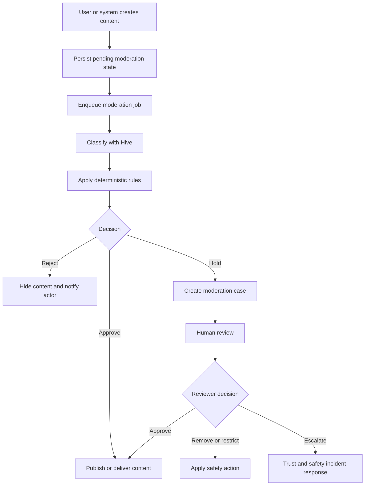

# Moderation Pipeline

## Decision

[APPNAME] uses a hybrid moderation pipeline: automated classification through Hive, deterministic platform rules, and human review for ambiguous or high-impact cases. Moderation protects group profiles, vouch blurbs, messages, media, venues, report evidence, and post-meetup safety feedback.

Safety tools are never gated by moderation availability. If classification is degraded, high-risk content is held and safety reports still create cases.

## Pipeline



## Moderated Surfaces

| Surface | Source | Default Automated Action | Human Review Trigger |
|---|---|---|---|
| Group name | `groups.name` | Approve, reject, or hold before eligibility. | Sexualized, hateful, scam, doxxing, or ambiguous identity claims. |
| Shared vibe and prompts | `group_profiles` | Approve, reject, or hold before eligibility. | Harassment, coercion, protected-class exclusion, unsafe venue claims. |
| Vouch blurb | `vouch_blurbs.body` | Approve, reject, or hold before display. | Private information, sexual pressure, targeted insults. |
| Profile media | `media_assets` | Approve, reject, or hold before distribution. | Nudity, minors, impersonation signals, violence, hate symbols. |
| Chat message | `messages` | Send, hold sender-only, reject, or create safety case. | Threat, coercion, hate, scam, repeated harassment. |
| Message media | `media_assets` | Hold until approved for launch. | Any unsafe classification or context report. |
| Venue | `venues` | Operations review on creation or safety threshold. | Repeated venue incidents or unsafe location reports. |
| Report evidence | `safety_reports` and `media_assets` | Preserve and classify. | S1/S2 severity or illegal content handling. |
| Debrief safety feedback | `debriefs` and `safety_reports` | Route to severity triage. | Any safety concern or repeated pattern. |

## Severity Routing

| Severity | Trigger Examples | Automated Protective Action | SLA |
|---|---|---|---|
| S1 | Threat, stalking, sexual coercion, underage, immediate venue danger | Hide reporter, disable contact, pause group or plan, page on-call | 30 minutes |
| S2 | Harassment, impersonation, scam, discrimination | Restrict content, priority review, possible contact block | 12 hours |
| S3 | No-show pattern, rude behavior, venue complaint | Standard review, quality flag, possible venue review | 48 hours |
| S4 | Support clarification or low-risk report | Support queue | 5 business days |

## Classifier Contract

```typescript
export interface ModerationInput {
  sourceType: "profile" | "vouch" | "message" | "media" | "report" | "venue";
  sourceId: string;
  actorMemberId: string | null;
  groupId: string | null;
  text?: string;
  mediaAssetId?: string;
  conversationId?: string;
  planId?: string;
}

export interface ModerationDecision {
  sourceType: ModerationInput["sourceType"];
  sourceId: string;
  status: ModerationStatus;
  severity: SafetySeverity | null;
  labels: string[];
  createCase: boolean;
  protectiveActions: Array<"hide_reporter" | "pause_group" | "disable_chat" | "cancel_plan" | "suspend_member">;
}
```

## Message Moderation States

| State | Sender Experience | Recipient Experience |
|---|---|---|
| Approved | Message appears sent. | Message appears in conversation. |
| Pending | Message shows pending state. | No content shown yet. |
| Held for review | Sender sees safety copy and next step. | No content shown. |
| Rejected | Sender sees rejection copy. | No content shown. |

## Report and Block Integration

1. Reports always create `safety_reports`.
2. Severity classifier sets initial S1-S4 route.
3. S1 reports apply protective actions before full review.
4. Consensus block votes create a `blocks` row when threshold is met.
5. Blocks update candidate filtering, conversation write access, and plan reconfirmation.
6. Safety actions emit realtime events and notification intents only when user-facing state changes.

## Human Review Console Requirements

| Requirement | Detail |
|---|---|
| Context bundle | Reviewer sees relevant profile, message, plan, venue, report, prior enforcement, and group context. |
| Least privilege | Reviewers see only cases assigned or available to their queue. |
| Redaction | Reporter identity is hidden unless needed for review. |
| Decision logging | Every decision creates `audit_logs` and optional `safety_actions`. |
| Appeal support | Identity and enforcement appeals link to original case and decision. |
| Metrics | SLA, decision distribution, repeat reports, and false positive review. |

## Open Questions

| Question | Recommended Default | Technical Basis |
|---|---|---|
| Should low-confidence unsafe chat be delivered with warning? | No. Hold sender-only until reviewed or classified safe. | Dating safety risk is higher than momentary chat latency. |
| Should group profile moderation be fully pre-publication in alpha? | Yes. | Small launch volume makes pre-publication review feasible and protects trust. |

---
<!-- doc-version: 1.0 -->
