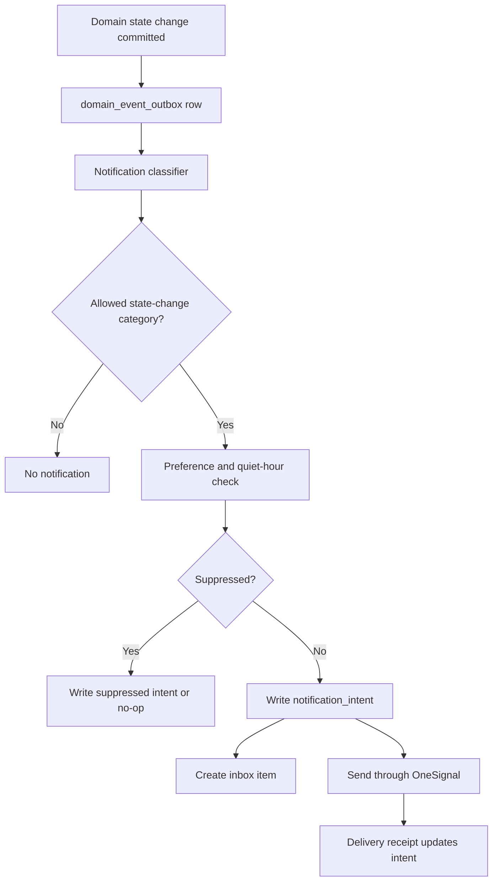

# Push Notification Service

## Decision

Push notifications are state-change-only. The Notification Service consumes persisted domain events, decides whether the state change is notification-worthy, applies preferences and quiet hours, writes a `notification_intent`, and sends through OneSignal.

No component may create a generic re-engagement push, marketing nudge, or scarcity ping.

## Architecture



## Allowed Categories

| Category | Allowed Triggers | Not Allowed |
|---|---|---|
| Verification | Approved, retry required, rejected, appeal resolved | "Finish because people are waiting" generic pressure. |
| Group | Invite accepted, group eligible, member left, publish approval requested | "Invite more friends to boost odds." |
| Introduction | New daily set, internal approval request, mutual match, introduction expiring if already pending action | "More groups are nearby" without a concrete set. |
| Chat | New message, moderation hold, chat expiring with active state | "Say something before they lose interest." |
| Plan | Poll created, vote changed requiring action, RSVP requested, plan confirmed, plan canceled, reconfirmation required, meetup reminder | Generic weekend activity prompts. |
| Safety | Report received, protective action applied, case resolved, urgent plan-share result | Promotional safety copy. |
| Debrief | Debrief opened, debrief deadline reminder, mutual edge revealed | "How was your night?" without a completed plan. |
| Payment | Purchase completed, renewal state, refund state, entitlement changed | Upgrade prompts unrelated to user action. |

## Notification Intent Contract

```typescript
export interface NotificationDecisionInput {
  sourceEventId: string;
  eventName: string;
  aggregateType: string;
  aggregateId: string;
  memberId: string;
  groupId: string | null;
  occurredAt: string;
  payload: Record<string, unknown>;
}

export interface NotificationDecision {
  shouldNotify: boolean;
  category: NotificationCategory | null;
  templateKey: string | null;
  targetPath: string | null;
  dedupeKey: string | null;
  sendAfter: string | null;
  privacyLevel: "private" | "contextual" | "full";
}
```

## Templates

| Template Key | Category | Privacy-Safe Copy Direction |
|---|---|---|
| `verification_approved` | Verification | "Verification approved. Your group can continue." |
| `group_invite_accepted` | Group | "Your friend joined your group." |
| `group_eligible` | Group | "Your group is ready for introductions." |
| `intro_set_ready` | Introduction | "Your group has new introductions." |
| `intro_internal_approval` | Introduction | "Your group needs your approval." |
| `mutual_match_created` | Introduction | "Group match. Open chat." |
| `chat_message_new` | Chat | Privacy-safe preview by default. |
| `plan_rsvp_requested` | Plan | "RSVP needed for your plan." |
| `plan_confirmed` | Plan | "Plan confirmed." |
| `plan_reconfirmation_required` | Plan | "Your plan needs reconfirmation." |
| `debrief_requested` | Debrief | "Post-meetup check-in is ready." |
| `mutual_edge_revealed` | Debrief | "Mutual interest." |
| `safety_case_updated` | Safety | "Safety update available." |
| `entitlement_changed` | Payment | "Your plan changed." |

## Rate Limits

| Scope | Limit |
|---|---|
| New chat messages | Bundle after 3 messages in 5 minutes per conversation. |
| Plan vote updates | Bundle per plan every 15 minutes unless RSVP deadline is within 2 hours. |
| Introduction approval reminders | One reminder before expiry. |
| Debrief reminders | One reminder within 24 hours if not submitted. |
| Safety updates | No marketing limit; urgent safety can bypass quiet hours. |
| Payment updates | Transactional only. |

## Quiet Hours

1. Member quiet hours are stored in local time.
2. Non-urgent notifications are delayed until quiet hours end.
3. Urgent safety updates bypass quiet hours.
4. Plan reminders may bypass quiet hours only if the plan starts within the member-configured urgent window.
5. Delayed notifications are canceled if the user completes the action before `send_after`.

## State-Change Enforcement

`notification_intents.source_event_id` is required and references `domain_event_outbox.id`. This prevents ad hoc push creation. Any internal tool that wants to notify users must create a real state change first.

Disallowed examples:

- "Come back to [APPNAME]."
- "Groups near you are active."
- "You are missing out."
- "Upgrade to be seen."
- "Someone might like you."

## Failure Handling

| Failure | Behavior |
|---|---|
| OneSignal outage | Keep intents queued and retry with backoff. |
| Device token invalid | Mark token invalid, do not retry that token. |
| User disabled category | Suppress and log preference decision. |
| Action completed before send | Cancel pending intent. |
| Duplicate event | Dedupe by `dedupe_key`. |

## Open Questions

| Question | Recommended Default | Technical Basis |
|---|---|---|
| Should lockscreen previews include sender first name? | No by default. Allow opt-in. | Social dating context is sensitive and can expose participation. |
| Should plan reminders use SMS for trusted reliability? | No for launch. Use push and in-app inbox first. | SMS adds consent, cost, and privacy complexity. |

---
<!-- doc-version: 1.0 -->
