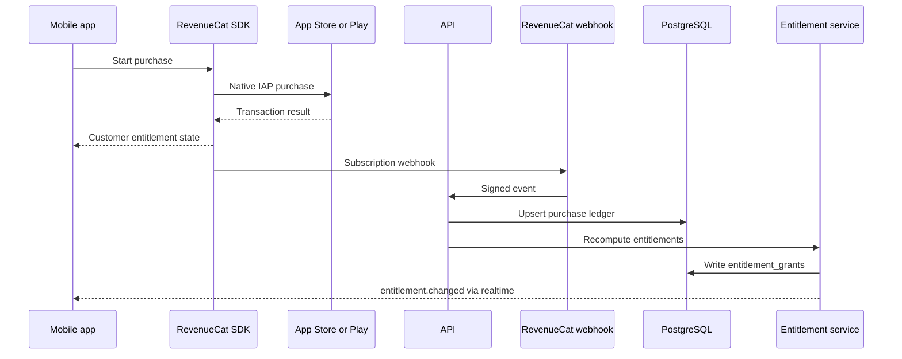
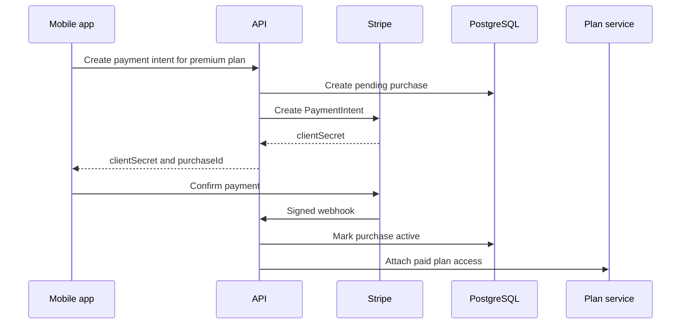

# Subscription And Entitlement Service

## Decision

[APPNAME] uses RevenueCat for App Store and Google Play subscriptions and entitlement synchronization. Stripe handles real-world event, venue, or premium plan payments where platform policy permits. The internal Entitlement Service computes member and active-group capabilities from provider webhooks and purchase state.

Paid state is additive. It cannot remove safety access, verification access, reporting, blocking, baseline group distribution, or post-meetup privacy.

## Entitlement Model

| Entitlement | Scope | Grants | Cannot Do |
|---|---|---|---|
| `premium_coordination` | Active group | Advanced scheduling tools, templates, partner venue previews, richer availability controls | Change ranking weight or suppress free groups. |
| `premium_plan_access` | Member or plan | Access to paid venue-led plans or hosted social pods | Bypass verification, safety, or RSVP rules. |
| `expanded_stack_size` | Active group | Adds explicit extra daily introduction slots above free baseline | Lower free baseline, create fake inventory, or override quality filters. |
| `founding_host_tools` | Member or group | Host role tools, recurring plan setup, quality dashboard | Expose private debrief signals or safety scores. |

## Provider Flow



## Stripe Event Payment Flow



## Computed Group Entitlements

Group entitlements are derived from active member entitlements and group context:

```typescript
export interface ComputedGroupEntitlements {
  groupId: string;
  computedAt: string;
  entitlements: Array<{
    code: EntitlementCode;
    sourceMemberId: string | null;
    startsAt: string;
    endsAt: string | null;
    metadata: Record<string, unknown>;
  }>;
  distributionBaselineProtected: true;
}
```

Rules:

1. If any active group member has `premium_coordination`, the active Group can use premium coordination tools while that member remains active and entitled.
2. If any active group member has `expanded_stack_size`, the Group may receive extra slots above the stored free baseline.
3. If a paying member leaves a Group, active-group entitlements are recomputed immediately.
4. Refunds and chargebacks revoke future entitlement use but do not remove safety history or reporting access.
5. Entitlement changes emit `entitlement.changed` and can create payment notifications only when user-facing state changes.

## Purchase Ledger Rules

| Rule | Requirement |
|---|---|
| Provider event idempotency | `provider_purchase_id` is unique. |
| Store authority | RevenueCat webhook is the authority for subscription state. |
| Stripe authority | Stripe webhook is the authority for PaymentIntent and refund state. |
| Local cache | API can return last-known entitlement state, marked by `updated_at`. |
| Consumer disclosures | Offer endpoints include price, renewal, cancellation, and refund facts from provider catalog metadata. |
| Safety withdrawal | Safety-related withdrawal from paid event routes to support refund policy and never blocks report submission. |

## Matching Guardrail

The Matching Engine receives only:

```typescript
export interface MatchingEntitlementInput {
  groupId: string;
  freeBaselineSize: number;
  extraStackSize: number;
}
```

It never receives purchaser identity, revenue amount, subscription tier name, or priority rank. This prevents paid ranking and protects the free distribution floor.

## Error and Reconciliation Jobs

| Job | Trigger | Action |
|---|---|---|
| `revenuecat-reconciliation` | Daily | Fetch active subscribers and compare to local purchase ledger. |
| `stripe-reconciliation` | Daily | Compare PaymentIntent, refund, and dispute state. |
| `entitlement-expiry` | Hourly | Revoke grants past `ends_at`. |
| `group-entitlement-recompute` | Membership, purchase, refund, or subscription state change | Recompute active group capabilities. |
| `consumer-disclosure-audit` | Release and catalog change | Verify offer copy has price, renewal, cancellation, and refund terms. |

## Open Questions

| Question | Recommended Default | Technical Basis |
|---|---|---|
| Should one member's subscription benefit the whole active Group? | Yes for coordination tools and expanded stack size while that member remains active. | The Group is the product unit; member-purchased entitlements should produce group-level utility without changing distribution ranking. |
| Should social-pod event payments be in-app or web checkout? | Use in-app only where required; use Stripe for real-world venue payments where platform policy permits. | Physical event economics and refund workflows fit Stripe better, but platform rules must be respected. |

---
<!-- doc-version: 1.0 -->
