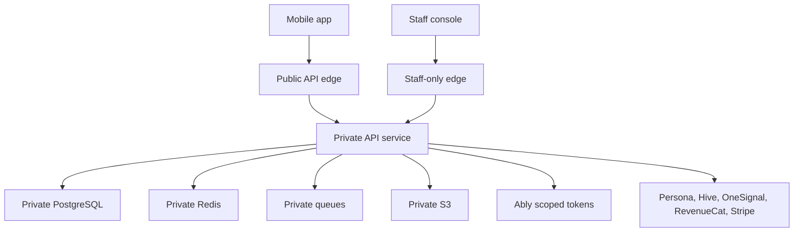

# Security Model

## Security Position

[APPNAME] handles identity verification, private group participation, real-time chat, meetup logistics, safety reports, post-meetup interest, and payments. Security controls must protect physical safety, dating privacy, and payment integrity, not just account access.

## Trust Zones



| Zone | Access Rule |
|---|---|
| Mobile app | Public internet; no secrets; authenticated with member JWT. |
| Public API edge | TLS only; WAF, rate limits, request IDs, auth enforcement. |
| Private services | VPC private subnets; security groups restrict east-west traffic. |
| Database and Redis | No public access; KMS encryption; least-privilege service roles. |
| Staff console | Staff SSO, device trust, MFA, IP restrictions where practical, full audit. |
| Providers | Signed webhooks, scoped API keys, provider-specific idempotency. |

## Authentication

| Actor | Mechanism | Notes |
|---|---|---|
| Member | External auth subject mapped to `members.auth_subject`; API JWT validation | Auth proves account control, not verification or group eligibility. |
| Staff | Staff SSO JWT plus elevated role claims | Staff actions always create `audit_logs`. |
| Provider | Webhook signature and timestamp tolerance | Provider events are idempotent and never trusted without validation. |
| Realtime client | API-issued Ably token | Token capabilities are scoped to member, group, conversation, and plan access. |

## Authorization Model

Authorization is attribute-based and enforced in API guards before service methods execute.

```typescript
export interface AccessContext {
  memberId: string;
  memberStatus: MemberStatus;
  verificationStatus: VerificationStatus;
  activeGroupIds: string[];
  staffRoles: string[];
}

export interface GroupAccessDecision {
  allowed: boolean;
  reason:
    | "active_member"
    | "plan_participant"
    | "conversation_participant"
    | "mutual_edge_party"
    | "staff_case_access"
    | "denied";
}
```

## Authorization Rules

| Resource | Required Access |
|---|---|
| Member profile | Owner or authorized staff. |
| Group profile draft | Active group member. |
| Published group card | Requesting member's complete eligible Group has an active Introduction or conversation with target Group. |
| Introduction | Recipient Group member only. |
| Conversation | Active `conversation_participant`; writes require `can_write = true`. |
| Breakout request | Requester and recipient only until accepted; parent group chat remains context. |
| Plan | Active group member in `plan_groups` or authorized staff. |
| Debrief | Submitting member only; mutual edge visible only to the two involved Members. |
| Safety report | Reporter and authorized safety staff; reported user gets only policy-safe outcome details. |
| Payment | Purchaser, active group capability checks, support staff. |
| Media | Purpose-specific access check before signed URL. |

## Data Protection

| Data Type | Protection |
|---|---|
| Passwords | Not stored by [APPNAME] if using managed auth. |
| Government ID and liveness | Persona only; [APPNAME] stores status and provider IDs. |
| Member PII | Encrypted at rest; restricted API serialization. |
| Chat | Encrypted at rest; access through conversation participants and safety review. |
| Debrief interest | Private rows; no aggregate public scoring; mutual reveal only. |
| Safety reports | Restricted staff access; reporter identity protected by default. |
| Payment data | Sensitive card data stored by Stripe or app stores, not [APPNAME]. |
| Push content | Privacy-safe lockscreen copy by default. |

## Key Security Invariants

1. Verification approval is required for matching distribution.
2. Group completeness is required for introductions.
3. No endpoint returns discovery inventory by `member_id`.
4. Realtime tokens never grant durable write access.
5. Breakout conversations cannot be created without accepted consent.
6. One-sided debrief interest cannot be read by the target member, group, staff without safety need, analytics, or matching output.
7. Notification intents must reference a domain event.
8. Safety actions do not require payment state.
9. Paid status cannot influence authorization to free baseline distribution.
10. Staff access is audited and role-scoped.

## Staff Access Audit Requirements

Restricted staff access is staff-scoped and must create an `audit_logs` draft before safety, debrief, verification, or moderation data is returned. Audit actions use `staff.<resource>.<action>`, target the restricted resource, and include role, reason code, resource type, and case id when the access is case-scoped.

Safety reports, debriefs, and moderation cases are limited to `safety_reviewer` and `trust_admin` roles. Debrief access requires `safety_review` reason and a safety case id. Staff audit metadata must not copy raw report narratives, one-sided debrief interest, raw provider documents, compatibility scores, or reliability scores.

## Threat Model

| Threat | Control |
|---|---|
| Fake or underage account enters matching | Persona ID plus liveness; group eligibility recompute; underage closure policy. |
| User tries to browse individuals without group | API has no member-discovery endpoint; introduction set requires eligible `group_id`. |
| Group member publishes friend without consent | `group_memberships.publish_approved_at` and profile preview hash required. |
| Private breakout harassment | Breakout consent gate, parent context, report/block controls, moderation. |
| Debrief leak exposes one-sided attraction | Private storage, mutual-edge transaction, strict read guards. |
| Reporter retaliation | Hide reporter actions, suppress identifying report details, protective actions. |
| Paid tier manipulates visibility | Entitlement boundary passes only additive stack size, not ranking priority. |
| Push reveals sensitive dating context | Lock-screen privacy templates and category controls. |
| Webhook replay | Signature validation, timestamp tolerance, provider event idempotency. |
| Staff misuse | Least privilege, MFA, audit logs, case-scoped access, periodic access review. |

## Rate Limiting

| Surface | Limit Strategy |
|---|---|
| Verification session creation | Per member, device, and IP hash. |
| Group invite creation | Per group and per member. |
| Message send | Per conversation and per member; safety overrides can disable writes. |
| Breakout request | Per requester-recipient pair and parent conversation. |
| Safety report | Light rate limit to prevent abuse; never block urgent report path entirely. |
| Media upload | Per member, purpose, byte volume, and moderation status. |
| Payment intent creation | Per member and product. |

## Secrets and Keys

- AWS Secrets Manager stores provider API keys.
- KMS keys are separated by environment and data class.
- GitHub Actions uses OIDC and short-lived AWS credentials.
- Mobile app contains no provider secrets.
- Webhook signing secrets rotate through dual-read windows.
- Database credentials rotate automatically where supported.

## Retention and Deletion

| Data | Deletion Behavior |
|---|---|
| Public profile data | Removed from public surfaces promptly after group dissolution or account deletion. |
| Chat | Retained according to safety/legal policy; deleted content leaves audit shell. |
| Debrief interest | Retained privately for member history, safety, and matching only according to policy. |
| Safety evidence | Retained under safety retention even after account deletion when required. |
| Payment records | Retained for legal, refund, and tax requirements. |
| Audit logs | Append-only retention by environment and compliance policy. |

## Open Questions

| Question | Recommended Default | Technical Basis |
|---|---|---|
| Should chat be end-to-end encrypted? | No for launch; use encryption in transit and at rest with restricted review access. | Moderation, safety reports, and incident response require platform review. |
| Should staff see debrief interest during safety cases? | Only if directly relevant to a safety case and access is audited. | Private debrief data is sensitive; safety review may require context in narrow cases. |

---
<!-- doc-version: 1.0 -->
