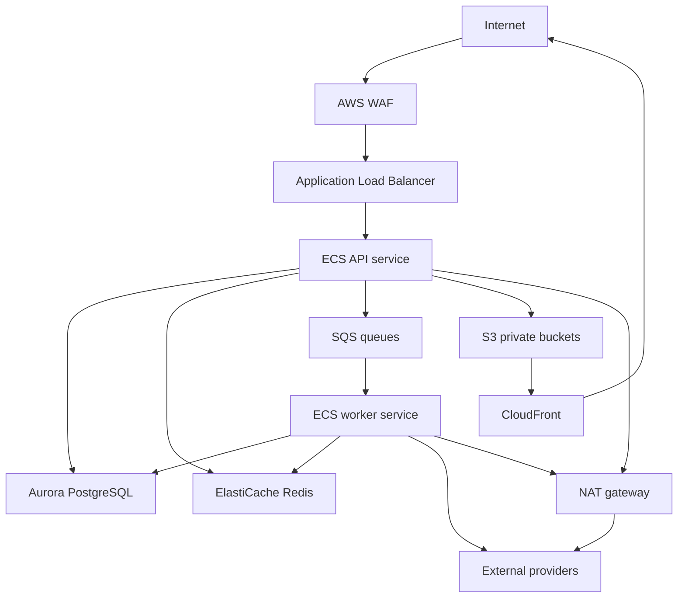

# Infrastructure And Environments

## Decision

[APPNAME] runs production infrastructure on AWS with environment-separated accounts, Terraform-managed resources, ECS Fargate services, Aurora PostgreSQL, ElastiCache Redis, SQS, EventBridge, S3, CloudFront, KMS, Secrets Manager, Datadog, and Sentry.

## Environment Topology

| Environment | Purpose | Data | Access |
|---|---|---|---|
| Local | Developer feature work | Local Postgres and Redis; mocked providers by default | Developer machine only. |
| Preview | Pull request validation | Ephemeral or shared sanitized data | Temporary API URL, no production providers. |
| Staging | Release candidate validation | Sanitized seed data and provider sandboxes | Internal team and test devices. |
| Production | Live users | Production data | Restricted deploy and break-glass access. |

## AWS Account Layout

| Account | Contents |
|---|---|
| `appname-shared` | Terraform state, CI OIDC role roots, artifact buckets, shared DNS. |
| `appname-nonprod` | Preview and staging infrastructure. |
| `appname-prod` | Production VPC, ECS, database, queues, buckets, monitoring integrations. |

## Production Architecture



## Core Resources

| Resource | Configuration |
|---|---|
| VPC | Three availability zones, public subnets for ALB/NAT, private subnets for ECS/RDS/Redis. |
| ECS API | Fargate, autoscaling on CPU, memory, request count, and latency. |
| ECS workers | Separate services per queue priority: realtime, moderation, notification, matching, payments. |
| Aurora PostgreSQL | Multi-AZ, automated backups, PITR, deletion protection in production, PostGIS enabled. |
| ElastiCache Redis | Multi-AZ replication group; TLS; auth token; no public access. |
| SQS | Separate standard queues by domain plus FIFO queues for per-aggregate ordered workflows. |
| EventBridge Scheduler | Deadlines for introductions, RSVP, chat expiry, plan reminders, and debrief prompts. |
| S3 | Private buckets, block public access, KMS encryption, lifecycle rules by retention class. |
| CloudFront | Signed URL media distribution with origin access control. |
| KMS | Separate keys for database, S3 standard media, safety evidence, and secrets. |
| Secrets Manager | Provider credentials, database credentials, webhook secrets. |

## Queue Layout

| Queue | Type | Purpose |
|---|---|---|
| `matching-daily` | Standard | Daily introduction generation and thin-city reports. |
| `eligibility-recompute` | FIFO | Ordered group eligibility recomputation by `group_id`. |
| `realtime-publish` | FIFO | Ordered per-aggregate Ably publishing. |
| `moderation-classify` | Standard | Hive classification jobs. |
| `moderation-priority` | FIFO | S1 and S2 case routing. |
| `notification-intents` | FIFO | State-change notification creation by member. |
| `push-delivery` | Standard | OneSignal delivery attempts. |
| `payments-webhooks` | FIFO | RevenueCat and Stripe event processing. |
| `media-processing` | Standard | S3 media validation and variant generation. |

## Configuration

Environment variables use this shape:

```typescript
export interface RuntimeConfig {
  environment: "local" | "preview" | "staging" | "production";
  databaseUrl: string;
  redisUrl: string;
  publicApiBaseUrl: string;
  ablyApiKeySecretName: string;
  personaApiKeySecretName: string;
  personaWebhookSecretName: string;
  hiveApiKeySecretName: string;
  oneSignalApiKeySecretName: string;
  revenueCatWebhookSecretName: string;
  stripeWebhookSecretName: string;
  mediaBucketName: string;
  safetyEvidenceBucketName: string;
}
```

Secrets are referenced by name in app config and resolved at runtime through AWS IAM. The API production app consumes `DATABASE_URL` to create its node-postgres pool and consumes the resolved Persona webhook secret as `PERSONA_WEBHOOK_SECRET` when composing the Fastify runtime.

## Network Rules

1. RDS and Redis accept traffic only from ECS security groups.
2. ECS tasks use private subnets.
3. Provider egress exits through NAT with egress logging.
4. Staff moderation console uses separate routing, SSO, and stricter WAF rules.
5. S3 buckets deny public access and require TLS.
6. CloudFront is the only media distribution path.

## Backup and Recovery

| Component | Recovery Strategy |
|---|---|
| PostgreSQL | PITR, daily snapshots, quarterly restore drills. |
| S3 media | Versioning for safety buckets, lifecycle retention, cross-account backup for production. |
| Redis | Rebuildable cache; no source-of-truth data. |
| SQS | Redrive policies and dead-letter queues. |
| Secrets | Versioned secrets with rotation windows. |
| Terraform state | Versioned encrypted backend in shared account. |

## Environment Promotion

1. Feature branches deploy to preview where applicable.
2. Main branch deploys API and workers to staging.
3. Database migrations run in staging with seeded data.
4. E2E smoke tests validate onboarding, group creation, introduction, chat, plan, debrief, and safety paths.
5. Production deploy requires protected approval.
6. Migrations run before app rollout only when backward compatible; breaking migrations use expand-migrate-contract.

## Open Questions

| Question | Recommended Default | Technical Basis |
|---|---|---|
| Should preview environments create full Aurora clusters? | No. Use shared non-production database schemas or lightweight instances for PRs. | Full clusters are expensive and slow; staging covers production-like database validation. |
| Should production use ECS blue/green or rolling deploys first? | Rolling deploys with health checks first; add blue/green before large public beta. | Simpler operations are sufficient while API changes are backward compatible and migrations are controlled. |

---
<!-- doc-version: 1.0 -->
