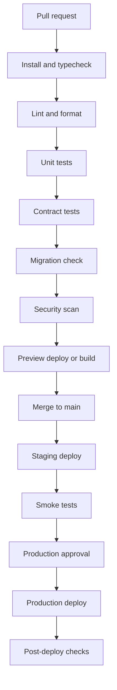

# CI/CD Pipeline

## Decision

[APPNAME] uses GitHub Actions for CI/CD, EAS Build and Submit for mobile releases, Terraform for infrastructure, Drizzle migrations for database changes, and protected production approvals. Every release path must validate group-first invariants, safety access, state-change notifications, and entitlement guardrails.

## Pipeline Overview

## Required Workflows

| Workflow | Trigger | Required Checks |
|---|---|---|
| `ci-api` | Pull request and main | TypeScript typecheck, lint, unit tests, API contract generation, OpenAPI diff. |
| `ci-mobile` | Pull request and main | TypeScript typecheck, lint, component tests, navigation smoke, native dependency validation. |
| `ci-workers` | Pull request and main | Worker unit tests, queue idempotency tests, outbox publishing tests. |
| `ci-db` | Pull request and main | Drizzle migration generation check, migration apply against empty DB, migration apply against seeded DB. |
| `ci-security` | Pull request and main | Dependency audit, secret scan, static analysis, infrastructure policy checks. |
| `deploy-staging` | Main | Build images, apply staging migrations, deploy API/workers, run smoke tests. |
| `deploy-production` | Manual protected approval | Apply production migrations, deploy API/workers, monitor SLOs, rollback if needed. |
| `mobile-release` | Release tag | EAS Build, EAS Submit, provider environment validation, release notes check. |
| `docs-validate` | Pull request and main | Architecture doc footer check, unfinished-work scan, required doc update trigger validation. |

## Test Gates

| Gate | Minimum Coverage |
|---|---|
| Group eligibility | Unit and integration tests for verification, membership, publish approval, moderation, safety restriction. |
| Matching | Deterministic scoring tests, paid guardrail tests, thin-city tests, no-member-recipient tests. |
| API authorization | Tests for group access, conversation participant access, plan participant access, mutual edge privacy. |
| Realtime | Outbox ordering, duplicate handling, replay behavior, scoped token capabilities. |
| Push | State-change-only source event requirement, quiet hours, dedupe, category suppression. |
| Safety | One-tap report route, consensus block threshold, protective actions, reporter privacy. |
| Payments | RevenueCat webhook idempotency, Stripe webhook idempotency, entitlement recompute, refund revocation. |
| Debrief | One-sided privacy, mutual reveal, skipped/safety-first submission. |

## Local Gate Commands

| Command | Required scope |
|---|---|
| `pnpm typecheck` | TypeScript compile checks across mobile, API, workers, domain, contracts, database, and shared testing packages. |
| `pnpm lint` | ESLint checks across every TypeScript workspace package. |
| `pnpm test:unit` | Package-local unit suites for domain invariants, route handlers, workers, contracts, schema guards, and mobile view models. |
| `pnpm test:contract` | API contract and route invariant suites in `packages/api-contracts`. |
| `pnpm test:integration` | API route integration tests and worker outbox integration tests. |
| `pnpm test:migration` | Database schema and initial migration guardrails in `packages/db`. |
| `pnpm test:e2e` | P0 smoke path from Launchpad eligibility through group chat, Plan, RSVP, debrief consent, action queue, and notification source-event enforcement. |
| `pnpm test` | Full workspace test sweep used as the broad regression gate. |

## Migration Strategy

Use expand-migrate-contract:

1. Expand schema with backward-compatible nullable fields or new tables.
2. Deploy API that writes both old and new shapes where needed.
3. Backfill with idempotent worker.
4. Switch reads to new shape.
5. Contract old fields only after production metrics confirm no old readers.

Rules:

- Production destructive migrations require explicit approval and rollback notes.
- Migrations touching safety, payment, verification, or debrief privacy require staff review.
- Matching ranking schema changes require a distribution-floor guardrail test.
- Notification schema changes require a state-change-only test.

## Release Artifacts

| Artifact | Required Metadata |
|---|---|
| API image | Git SHA, migration version, OpenAPI version, build timestamp. |
| Worker image | Git SHA, queue contract version, build timestamp. |
| Mobile build | Git SHA, app version, runtime version, environment, native SDK versions. |
| Terraform plan | Workspace, account, changed resources, approval record. |
| OpenAPI output | Version, diff summary, breaking-change flag. |

## Rollback

| Component | Rollback Path |
|---|---|
| API | Redeploy previous image if migration compatibility allows. |
| Workers | Pause affected queues, deploy previous image, replay DLQ after fix. |
| Mobile | Stop rollout in app stores; submit hotfix; use remote config only for non-critical UI flags. |
| Database | Prefer forward fix; restore only for catastrophic data loss. |
| Terraform | Revert code and apply plan; never manually mutate production outside incident procedure. |
| Matching | Disable new run config and reuse previous daily set generation version. |
| Push | Disable template or category at Notification Service, not OneSignal marketing tools. |

## Documentation Update Triggers

A pull request must update architecture docs when it changes:

- Stack decision or provider.
- Database schema.
- API endpoint, request, response, or error code.
- Realtime event name, payload, channel, or guarantee.
- Matching input, scoring, allocation, or paid guardrail.
- Verification, moderation, media, push, payment, or entitlement integration.
- Security authorization rule.
- Infrastructure topology or environment behavior.
- CI/CD gate or release process.

## Open Questions

| Question | Recommended Default | Technical Basis |
|---|---|---|
| Should generated OpenAPI be committed? | Yes. Commit generated OpenAPI and compare diffs in CI. | Mobile clients and future agents need stable contract review. |
| Should production deploys be fully automatic from main? | No. Use protected manual approval until on-call, SLOs, and rollback drills are mature. | Safety, verification, payments, and dating privacy justify controlled release gates. |

---
<!-- doc-version: 1.0 -->
