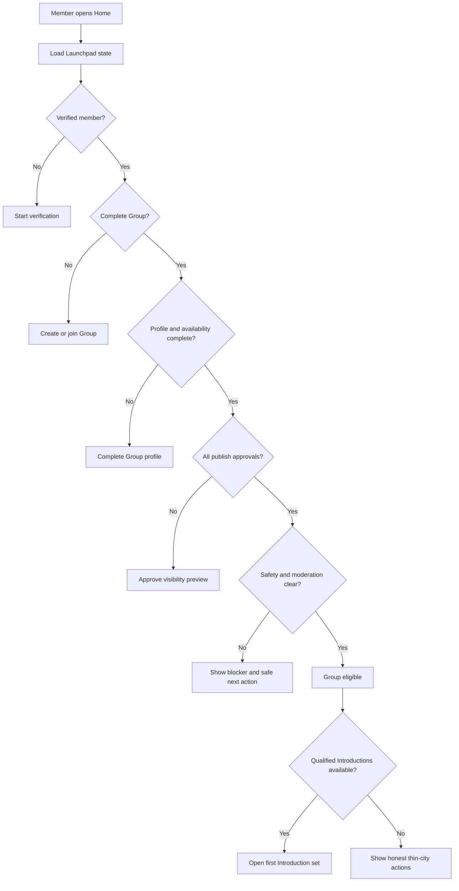
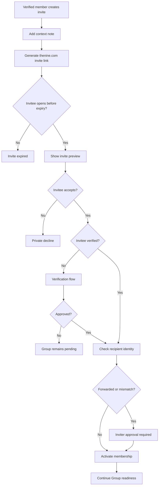
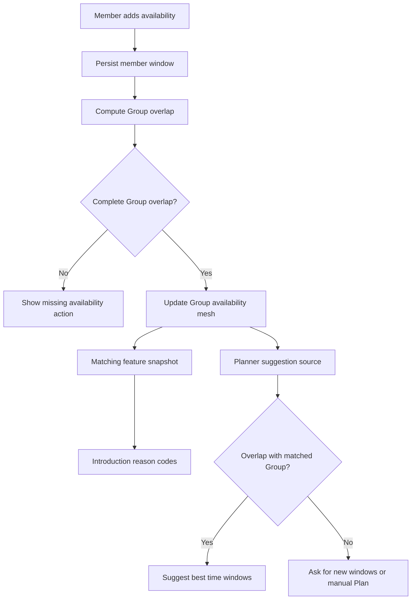
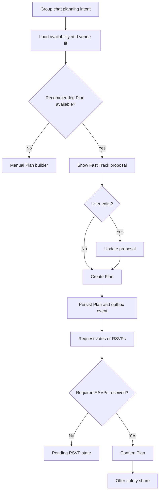
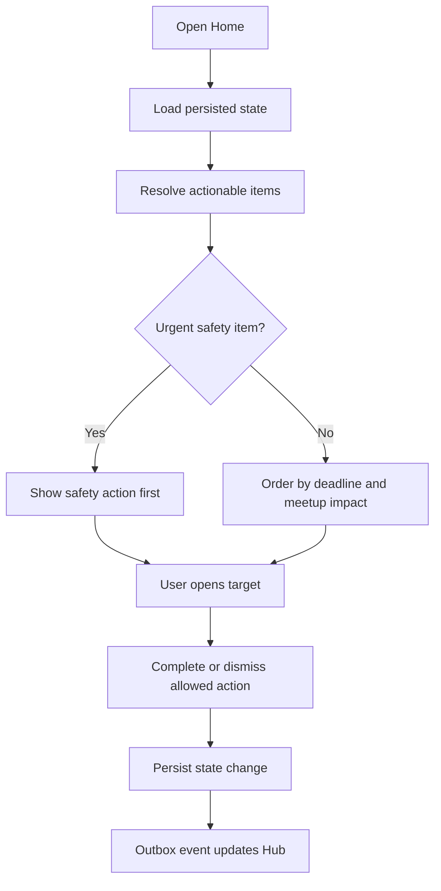
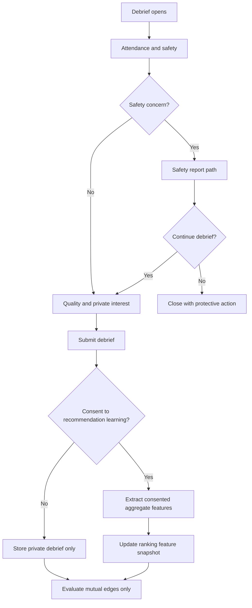

# P0 Feature Specs

## 1. First Introduction Launchpad

### Problem Statement

The Nine currently asks users to complete several high-friction steps before first value: verification, group creation, invite, profile fields, vouches, availability, publish approval, and Introduction readiness. The risk is that users understand the product concept but abandon before their Group can receive a qualified Introduction.

### Research Rationale

R1, R3, R5, R11, and R13 support reducing emotional and coordination load before first value. Verification must remain a hard gate, but The Nine should make the path feel like a clear group readiness sequence rather than an administrative checklist.

### User Stories With Acceptance Criteria

**Story 1: Complete the shortest safe path to first Introduction**

As a verified member, I want one clear group-owned path to eligibility so I can understand what is left before my Group can meet other verified Groups.

Acceptance criteria:

- Given I am verified but not in a complete Group, Home shows the next required action and the expected remaining steps.
- Given my Group is missing availability, profile approval, or a verified member, the Launchpad shows the exact blocker and one primary action.
- Given my Group becomes eligible, the Launchpad transitions to first Introduction readiness and never shows member-level dating inventory.
- Given a safety, moderation, or verification blocker exists, the Launchpad explains the blocker without exposing private provider or report data.

**Story 2: Reduce profile friction without lowering intent quality**

As a Group member, I want smart defaults and progressive prompts so my Group can publish without guessing what matters.

Acceptance criteria:

- Required fields are grouped by purpose: trust, vibe, logistics, visibility approval.
- Users can save drafts after each section.
- Prompt suggestions are optional and never publish without user action.
- The visibility preview must be approved by all active Group members before eligibility.

### Detailed User Flow

1. Member opens The Nine after account creation or verification approval.
2. Launchpad loads current member, Group, verification, profile, vouch, availability, and publish approval state.
3. System selects exactly one primary next action and up to two secondary actions.
4. Member completes the action.
5. Group state recomputes and persists before any notification or realtime update.
6. When all required steps are complete, the Group enters eligible state.
7. Launchpad shows first Introduction readiness and explains when the bounded set will refresh.
8. If no qualified inventory exists, Launchpad shows honest thin-city actions: edit availability, edit neighborhoods, invite another Group, or join pod waitlist.

### Mermaid Diagram

### Screen List With All UI States

| Screen | Empty | Loading | Error | Populated | Safety state |
|---|---|---|---|---|---|
| Launchpad Home | No account or no active Group path | Loading eligibility and blockers | Cannot load state; retry and support path | One primary next action, blockers, progress, first-value explanation | Safety Center button in header |
| Readiness Checklist | No checklist because Group eligible | Saving section progress | Field validation, moderation hold, verification blocker | Trust, vibe, logistics, visibility sections | Report issue with profile or invite |
| Visibility Preview | No publishable profile | Rendering card | Preview unavailable or stale hash | Exact card shown to other Groups | Report preview problem and leave Group |
| First Introduction Ready | No inventory state | Loading Introduction set | Set unavailable | Eligible state, refresh timing, available Introductions | Report a Group from card detail |

### Edge Cases

- Verification is pending: allow profile drafting but keep distribution locked.
- Invited friend joins but fails verification: show replacement and wait options without public visibility.
- Profile moderation holds content: Group remains ineligible and sees edit or appeal path.
- User belongs to a paused Group: Launchpad shows resume or leave, not create duplicate dating inventory.
- City is in waitlist mode: Launchpad collects group readiness and city supply signals without showing fake cards.
- Group member withdraws publish approval: Group exits eligibility immediately and Launchpad shows reapproval.

### Success Metrics

- Account-created-to-verification-start rate.
- Verification-approved-to-complete-Group rate within 24 hours.
- Complete-Group-to-published-Group rate.
- Median time from verification approval to first qualified Introduction.
- Launchpad action completion rate by blocker type.
- First Introduction open rate from Launchpad.
- Safety or moderation blocker resolution time.

### Open Questions

- Should the Launchpad show an estimated time to first Introduction? Recommended default: only after enough city-level data exists; before that, show next refresh and honest inventory status.
- Should vouch completion be required in the Launchpad? Recommended default: no for alpha; strongly prompt vouches but do not block eligibility.

## 2. Warm Group Invite Relay

### Problem Statement

Group formation depends on inviting the right friend, but a cold share link can feel vague, risky, or socially awkward. The current invite concept protects privacy but does not fully help the inviter explain why the friend should join or help the invitee understand consent, visibility, and effort before committing.

### Research Rationale

R5, R13, and R14 make the invite loop central to PLG, but privacy failures can destroy trust. The invite must sell the real product value while avoiding broad contact sync, hidden social graph exposure, or pressure language.

### User Stories With Acceptance Criteria

**Story 1: Send a high-context invitation**

As a Group creator, I want to send an invite that explains why I picked this friend and what joining means.

Acceptance criteria:

- Invite is a shareable `thenine.com` link with no broad contact upload.
- Inviter can add a short note that is visible only to the invitee.
- Invite explains verification, Group visibility, effort required, and publish consent.
- Invite can be revoked and expires automatically.

**Story 2: Accept with control**

As an invitee, I want to preview the Group request before joining so I can consent without being exposed.

Acceptance criteria:

- Invitee sees inviter first name, Group format, city, privacy explanation, and required next steps.
- Invitee identity is not visible to others until acceptance and verification.
- If the recipient differs from the expected person, inviter approval is required before activation.
- Declining is private and does not create a notification that pressures the invitee.

### Detailed User Flow

1. Verified member chooses Create Group or Invite Friend.
2. The Nine asks the inviter to select Quartet or social-pod guest pair context.
3. Inviter writes optional note and selects expiration.
4. API creates invite token and share URL at `https://thenine.com/invite/{token}`.
5. Invitee opens link and sees preview, privacy terms, and effort summary.
6. Invitee signs in or creates account, verifies if needed, and accepts.
7. If identity mismatch or forwarded invite is detected, inviter receives an approval request.
8. Group membership activates only after acceptance, verification, and required approvals.
9. Attribution records source channel and resulting Group completion for growth analysis.

### Mermaid Diagram

### Screen List With All UI States

| Screen | Empty | Loading | Error | Populated | Safety state |
|---|---|---|---|---|---|
| Invite Builder | No active Group shell | Creating invite | Rate limit, invalid Group, verification required | Note, expiry, preview, share URL | Revoke invite and report abuse |
| Invite Preview | Missing or revoked token | Validating invite | Expired, full, revoked, blocked | Inviter, format, city, privacy terms, accept/decline | Report invite |
| Forwarded Invite Approval | No pending approval | Applying approval | Approval failed or invite expired | Recipient details allowed by policy, approve/deny | Block recipient or revoke link |
| Pending Friend State | No pending invite | Refreshing status | Cannot load invite status | Pending, opened, accepted, verified, expired | Revoke and leave Group |

### Edge Cases

- Invite link is posted publicly: rate-limit joins, require inviter approval, allow revoke all.
- Invitee is underage or rejected by verification: do not expose identity; keep Group pending.
- Inviter is suspended before acceptance: revoke invite.
- Invitee is already in an active dating Group: show impact and require leave/switch confirmation.
- Inviter and invitee are in different launch cities: allow draft but block eligibility until city alignment.
- Safety report is filed from invite preview: create safety case without joining.

### Success Metrics

- Invite creation rate per verified member.
- Invite open rate by channel.
- Invite accept rate.
- Invitee verification start and approval rates.
- Invite-to-complete-Group conversion.
- Forwarded invite approval rate.
- Revoke, report, and decline rates.
- K-factor from completed Groups created through invite relay.

### Open Questions

- Should the inviter choose a specific expected recipient identifier? Recommended default: optional phone or email hash for alpha cohorts where privacy review approves it.
- Should The Nine suggest who to invite? Recommended default: no broad contact suggestions at launch; provide criteria copy instead of contact graph mining.

## 3. Group Availability Mesh

### Problem Statement

The current product stores Group availability but treats it primarily as a matching and planning field. Scheduling is one of the largest drop-off points between match and meetup. The Nine needs a deeper group-level availability model that powers ranking, plan suggestions, Tonight Tables, reminders tied to actual deadlines, and frictionless RSVP.

### Research Rationale

R2, R10, and R11 support treating logistics as the route to real-world value. R8 also supports using group surfaces for simple coordination while keeping vulnerable preference data private.

### User Stories With Acceptance Criteria

**Story 1: Build Group availability from members**

As a Group member, I want my availability to combine with my friend's into clear Group windows.

Acceptance criteria:

- Members enter weekly windows and date-specific exceptions.
- The Group sees overlap windows and missing member states.
- Availability changes require persistence before matching, realtime, push, or analytics.
- Exact personal calendar content is not imported or stored in P0.

**Story 2: Use availability everywhere it reduces friction**

As a matched Group, I want The Nine to suggest times that are already likely to work.

Acceptance criteria:

- Introductions can show shared availability reason codes.
- Planner suggestions start with overlap between both Groups.
- RSVP deadlines are derived from Plan start time and participant status.
- Availability-based prompts are state-change prompts, not generic habit messages.

### Detailed User Flow

1. Each member enters weekly and date-specific availability.
2. Group service computes overlap windows and readiness blockers.
3. Matching engine receives only Group-level availability features.
4. Introduction cards show allowed reasons such as shared Saturday availability.
5. Group chat planner opens with candidate windows that fit both Groups.
6. If no overlap exists, The Nine asks Groups to add windows or choose a manual Plan.
7. Availability changes recompute active Plan confidence and may trigger reconfirmation.
8. Metrics track which availability patterns convert to verified meetups.

### Mermaid Diagram

### Screen List With All UI States

| Screen | Empty | Loading | Error | Populated | Safety state |
|---|---|---|---|---|---|
| Availability Setup | No windows added | Saving windows | Invalid timezone, overlap compute failed | Weekly windows, exceptions, Group overlap | Safety Center from Group settings |
| Group Overlap Preview | Friend has not added availability | Computing overlap | Cannot compute overlap | Best shared windows and missing areas | Leave Group |
| Introduction Availability Reason | No shared window reason | Loading reasons | Reason unavailable | Shared availability reason and editable preferences | Report Group from card |
| Planner Time Suggestions | No overlap | Loading suggestions | Suggestion unavailable | Ranked time windows, manual add | Plan safety action |

### Edge Cases

- Members use different timezones: store UTC and display in city or member timezone.
- Member edits availability after Plan confirmation: material conflicts trigger reconfirmation.
- Availability includes late-night windows: apply safety and venue suitability review.
- Thin-city mode has no overlap: do not loosen safety or verification filters.
- A member leaves Group: availability mesh invalidates immediately.
- User wants calendar import: defer to P2 narrow-consent import, not P0.

### Success Metrics

- Availability completion rate.
- Percentage of complete Groups with at least three viable windows in next 14 days.
- Introduction reason impact on interest rate.
- Planner suggestion acceptance rate.
- Match-to-plan time for Groups with strong availability overlap.
- Plan confirmation rate by availability overlap decile.
- Reconfirmation rate after availability edits.

### Open Questions

- What minimum availability is required for eligibility? Recommended default: at least three two-hour windows across the next 14 days for quartet mode, configurable by city.
- Should availability be visible on group cards? Recommended default: show broad overlap categories only, not exact personal schedule details.

## 4. Plan Fast Track

### Problem Statement

Matched Groups can still stall because the current planner requires users to decide time, area, venue, poll, and RSVP as separate actions. The Nine needs a compressed path from "this chat has momentum" to a confirmed Plan.

### Research Rationale

R2, R10, and R11 support moving from chat to real-world plan quickly. Group dating adds coordination overhead, so the product must remove steps without hiding consent, RSVP, safety sharing, or venue context.

### User Stories With Acceptance Criteria

**Story 1: Create a Plan from the best overlap**

As a Group chat participant, I want to propose a realistic Plan without manually assembling every detail.

Acceptance criteria:

- Fast Track proposes time, neighborhood, venue type, RSVP deadline, and safety context from existing state.
- Any participant can edit before sending.
- Plan is persisted before realtime, push, analytics, or provider effects.
- Manual Plan creation remains available.

**Story 2: Confirm with quorum**

As a participant, I want a clear RSVP path so everyone knows whether the meetup is real.

Acceptance criteria:

- Required RSVP rule is shown before confirmation.
- Plan confirms only after required RSVPs.
- Missing RSVP state creates notification intents only from persisted Plan events.
- Safety share is offered after confirmation and never paywalled.

### Detailed User Flow

1. Group chat reaches planning threshold or user taps Start a Plan.
2. Plan Fast Track loads Group Availability Mesh, venue catalog, neighborhood fit, and prior Plan constraints.
3. System presents one recommended Plan plus editable alternatives.
4. User edits or accepts and creates Plan poll or direct RSVP request.
5. Participants vote or RSVP.
6. If consensus is reached, Plan moves to confirmed.
7. Confirmation creates state-change notifications and in-app inbox items.
8. Safety share prompt appears in Plan detail.
9. Material changes trigger reconfirmation.

### Mermaid Diagram

### Screen List With All UI States

| Screen | Empty | Loading | Error | Populated | Safety state |
|---|---|---|---|---|---|
| Fast Track Proposal | No viable proposal | Loading availability and venue fit | Suggestion unavailable | Recommended time, venue, RSVP rule, edit controls | Report or leave chat |
| Plan Poll | No options | Creating poll | Poll creation failed | Time and venue options with votes | Safety action in header |
| RSVP Sheet | No RSVP requested | Submitting RSVP | RSVP closed or failed | Member RSVP states, deadline, quorum | Share plan and report |
| Confirmed Plan | No confirmed Plan | Loading Plan | Venue unavailable, reconfirmation required | Time, venue, participants, safety share | One-tap urgent help |

### Edge Cases

- Venue becomes unavailable before confirmation: show replacement suggestions.
- Participant cancels after confirmation: apply reconfirmation rule.
- Group safety action occurs: Plan pauses, cancels, or reconfirms based on severity.
- One Group has no shared availability: support manual proposal but show lower confidence.
- Multiple Plan attempts exist: mark one primary Plan per conversation.
- Paid venue template is selected: disclose cost, refund rules, and that matching distribution is unaffected.

### Success Metrics

- Chat-to-planner open rate.
- Fast Track proposal acceptance rate.
- Proposal-to-RSVP request rate.
- RSVP completion rate.
- Plan confirmation rate.
- Median match-to-confirmed-Plan time.
- Confirmed Plan-to-attended meetup rate.
- Safety share adoption after Fast Track confirmation.

### Open Questions

- Should Fast Track allow direct RSVP without a poll? Recommended default: yes when both Groups have clear overlap and venue fit; otherwise use poll.
- How many alternatives should be shown? Recommended default: one recommendation plus two alternatives to avoid decision overload.

## 5. Meetup Momentum Hub

### Problem Statement

The Nine needs daily reasons to open, but generic engagement loops would violate the product principles. The current Home model can show next action, but it does not define a full state-change action hub that keeps Groups moving between Introduction, chat, Plan, meetup, and Debrief.

### Research Rationale

R1 and R2 reject attention-driven re-engagement. R11 supports timely action prompts when tied to real outcomes. The Notification architecture requires persisted state changes, so the Hub should be the in-app mirror of meaningful domain state.

### User Stories With Acceptance Criteria

**Story 1: See real pending actions**

As a Group member, I want Home to show what needs action now so my Group can reach a real meetup.

Acceptance criteria:

- Hub includes only persisted state changes or current blockers.
- Actions include verification, invite, publish approval, Introduction approval, chat reply, Plan vote, RSVP, safety update, attendance, debrief, and mutual result.
- Completed actions disappear or move to history.
- No generic "come back" or "people are active" prompts appear.

**Story 2: Complete deadlines without spam**

As a busy member, I want reminders for actual deadlines without feeling manipulated.

Acceptance criteria:

- Deadlines show source state: approval expiry, RSVP deadline, Plan start, debrief due.
- Push notification intents reference domain events and dedupe keys.
- Quiet hours and category preferences are respected except urgent safety.
- In-app Hub remains useful when push is disabled.

### Detailed User Flow

1. Member opens Home.
2. Hub loads active Group, conversations, Plans, notifications, safety cases, and debriefs.
3. Domain-specific action resolver orders actions by risk, deadline, and north-star impact.
4. User selects an action and lands on the exact screen.
5. Action completion persists state and writes outbox event.
6. Hub updates via realtime or REST replay.
7. If push is disabled, in-app action queue still shows deadlines.
8. Safety updates always appear at top with protective action context.

### Mermaid Diagram

### Screen List With All UI States

| Screen | Empty | Loading | Error | Populated | Safety state |
|---|---|---|---|---|---|
| Momentum Hub | No active actions; show next refresh and Plan history | Loading actions | Cannot load actions; retry | Prioritized action cards with deadlines | Safety action always visible |
| Action Card | No action | Resolving target | Target expired or unavailable | CTA, deadline, state reason, secondary option | Report action problem |
| Action Landing | No active target | Loading target | Access denied or stale state | Exact Group, Introduction, Plan, Debrief, or Safety screen | Contextual safety entry |
| Completed Action History | No completed actions | Loading history | History unavailable | Recent state changes and outcomes | Safety Center link |

### Edge Cases

- User is in multiple contexts: show active dating Group first and pod Plans separately.
- Push disabled: Hub still surfaces deadlines and inbox items.
- Target expired before open: show expired state and next best action.
- Safety case exists: prioritize over growth or planning actions.
- Group becomes ineligible: suppress Introduction and Plan actions that no longer apply.
- Duplicate domain events arrive: dedupe by event ID and aggregate sequence.

### Success Metrics

- Weekly activated Groups with at least one Hub action completion.
- Action open-to-completion rate by action type.
- RSVP and debrief completion lift from Hub.
- Push disabled users' action completion rate.
- Median time to clear critical blockers.
- Notification opt-out rate after Hub launch.
- Group meetup rate per weekly activated Group.

### Open Questions

- Should users be able to dismiss deadline actions? Recommended default: only dismiss informational actions; required RSVP, safety, and debrief actions stay until resolved or expired.
- Should Hub actions be personalized by member or shared by Group? Recommended default: member-specific view with Group context, because members authenticate and act.

## 6. Debrief Learning Consent

### Problem Statement

Debrief data is the strongest signal for improving recommendations because it reflects real-world outcomes. It is also sensitive. The current docs allow private debrief data to improve matching directionally, but The Nine needs explicit consent and governance before using post-meetup preference data in ranking.

### Research Rationale

R2, R7, R8, R12, and R14 support outcome learning, private attraction capture, and transparent algorithmic controls. Users should trust that debrief honesty helps future fit without creating public desirability scores or leaking one-sided interest.

### User Stories With Acceptance Criteria

**Story 1: Consent to recommendation learning**

As a member, I want to decide whether my private post-meetup feedback can improve future recommendations.

Acceptance criteria:

- Debrief separates required attendance/safety capture from optional recommendation learning consent.
- Consent is explicit, revocable, and explained in plain language.
- One-sided interest is never displayed or used for ranking without explicit consent.
- Safety processing remains independent of recommendation consent.

**Story 2: Use debrief outcomes safely**

As a returning Group, we want future Introductions to reflect what went well without exposing private feedback.

Acceptance criteria:

- Ranking can use consented aggregate patterns such as Plan fit, availability fit, group-vibe fit, and mutual-edge outcomes.
- Ranking cannot expose or display compatibility scores, attractiveness labels, or one-sided interest.
- Members can view and edit high-level preference controls derived from consented feedback in a future P2 surface.
- Retention and deletion rules apply to debrief-derived features.

### Detailed User Flow

1. Plan end time passes and debrief opens.
2. User confirms attendance and can report safety before any optional learning step.
3. User submits quality and private interest signals.
4. Consent prompt asks whether to use this debrief to improve future recommendations.
5. If accepted, feature extraction stores consented aggregate signals linked to member and Group context.
6. If declined, debrief remains available for attendance, mutual-edge reveal, safety, and private history only.
7. User can revoke future use in privacy settings.
8. Matching engine reads only approved feature snapshots, never raw one-sided debrief rows.

### Mermaid Diagram

### Screen List With All UI States

| Screen | Empty | Loading | Error | Populated | Safety state |
|---|---|---|---|---|---|
| Debrief Check-In | No completed Plan | Loading debrief | Debrief unavailable | Attendance, quality, safety, interest | Report before continuing |
| Learning Consent | No eligible debrief signals | Saving consent | Consent save failed | Plain-language use, allow/decline | Privacy and safety links |
| Privacy Settings | No learning preferences | Loading preferences | Cannot load or revoke | Consent status, revoke future use | Safety Center link |
| Mutual Result | No mutual edges | Evaluating result | Result unavailable | Mutual friend/crush/both paths | Report or block |

### Edge Cases

- User reports safety: safety handling runs even if learning consent is declined.
- One member consents and another does not: use only the consenting member's eligible signals and only in aggregate-safe form.
- User revokes consent: stop future use and mark derived features inactive; do not delete safety or attendance records needed for policy.
- Debrief is disputed: do not use for ranking until resolved.
- Mutual edge exists but learning consent declined: reveal mutual edge because it is part of debrief function, not ranking.
- Staff access: raw debrief interest remains inaccessible except narrow audited safety need.

### Success Metrics

- Debrief completion rate.
- Learning consent opt-in rate.
- Consent revocation rate.
- Ranking lift among consented cohorts.
- Repeat meetup rate after consented learning.
- User trust rating for debrief privacy.
- Safety report completion when learning consent is declined.

### Open Questions

- Should consent be asked every debrief or set once? Recommended default: ask on first eligible debrief and show per-debrief confirmation with settings control.
- How long should debrief-derived ranking features persist? Recommended default: 12 months or until consent revocation, subject to legal and privacy review.

---
<!-- doc-version: 1.0 -->
