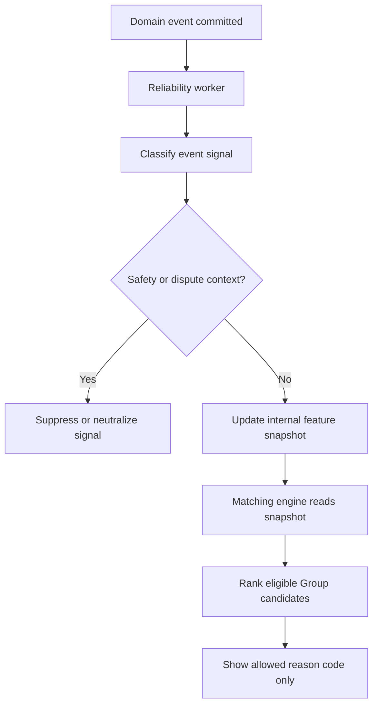
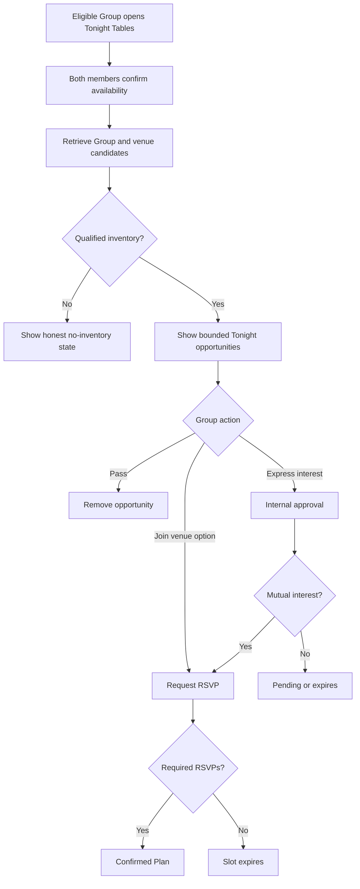
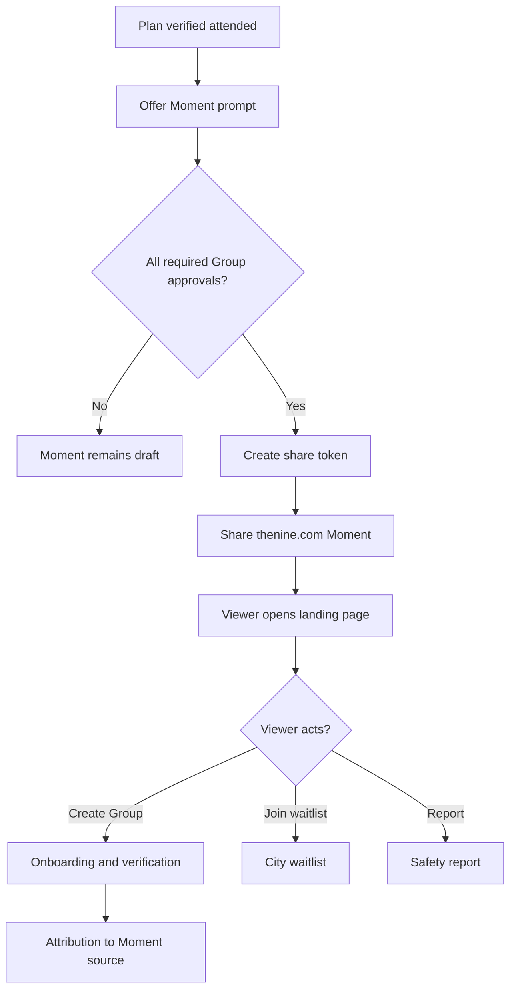
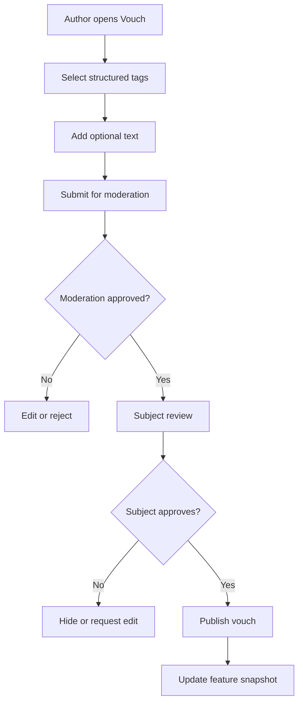
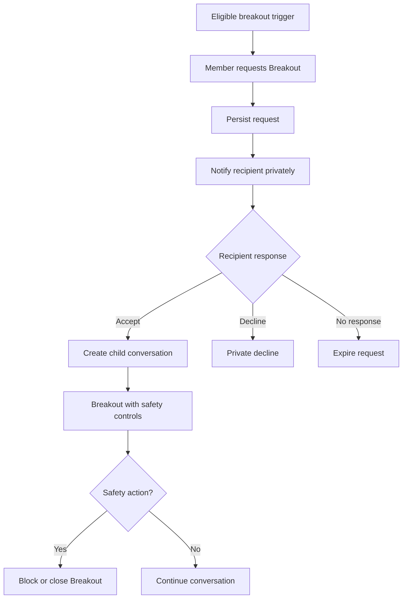
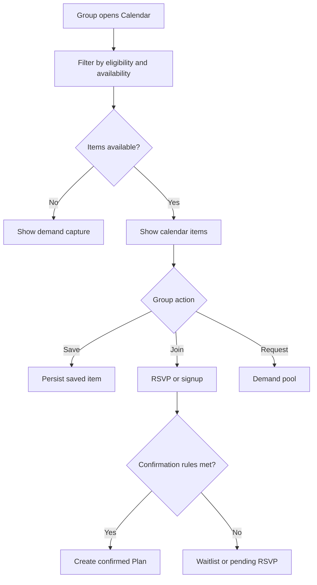
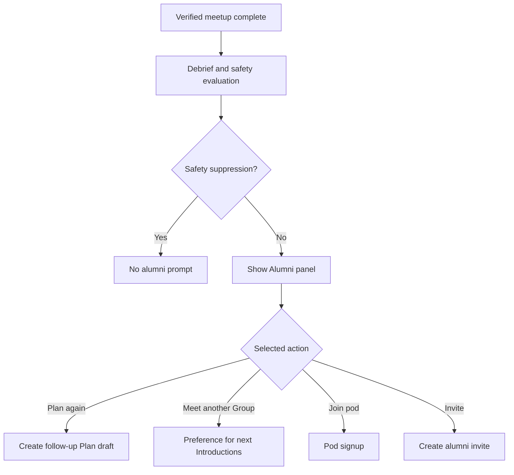
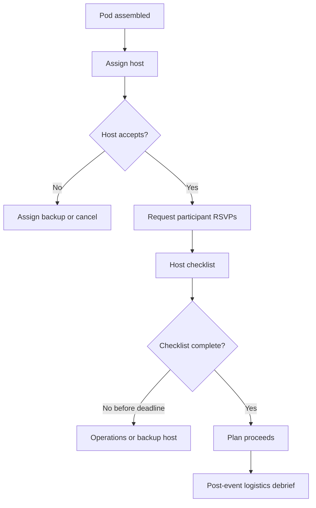
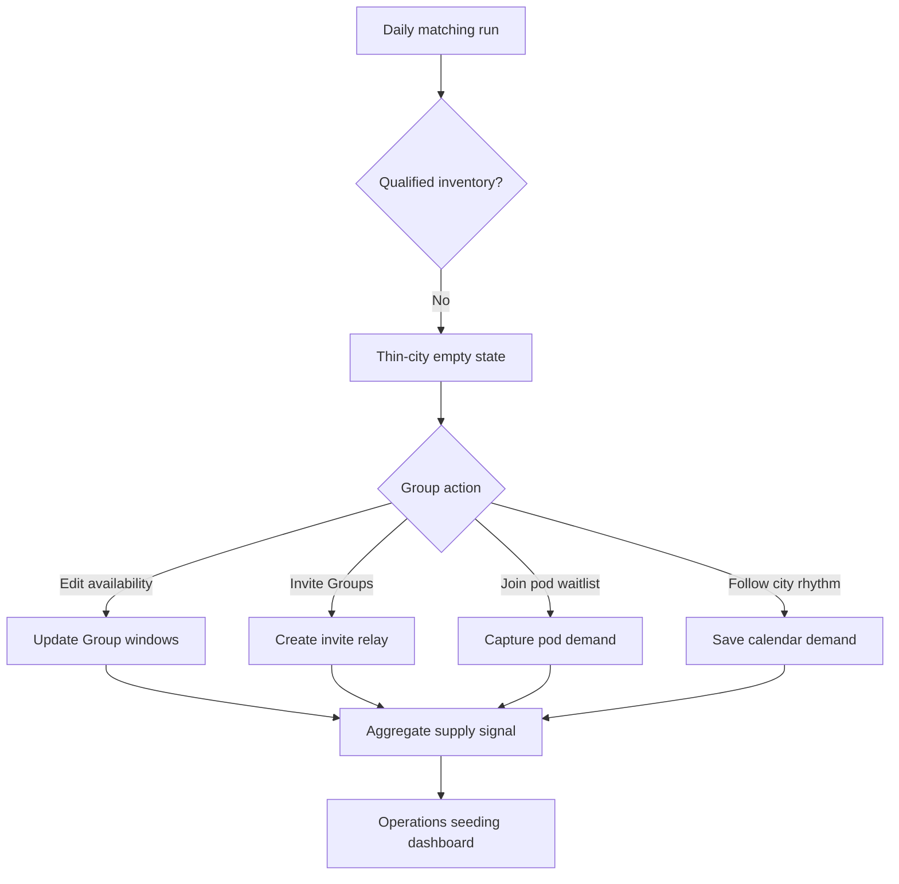
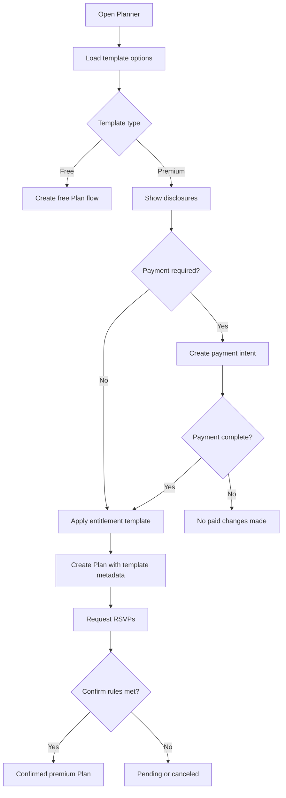

# P1 Feature Specs

## 7. Internal Group Reliability Ledger

### Problem Statement

The Nine can match compatible Groups that still fail to reply, plan, RSVP, or attend. The current matching model includes response reliability and attendance, but it needs a defined internal ledger that turns behavioral follow-through into ranking features without public reputation labels.

### Research Rationale

R2, R9, R10, and R11 support optimizing for real-world follow-through and accountability. Reliability should improve meetup quality without creating public shame, desirability scores, or pay-to-rank dynamics.

### User Stories With Acceptance Criteria

**Story 1: Use follow-through to improve matching**

As a Group using The Nine, we want introductions that are more likely to become real Plans.

Acceptance criteria:

- Ledger uses only persisted domain events: messages, planner opens, votes, RSVPs, cancellations, attendance, debrief completion, reports, and safety actions.
- Ledger is group-scoped and member-informed; dating inventory is never member-scoped.
- Scores are internal only and never displayed as numbers, badges, tiers, or labels.
- Paid state is not an input.

**Story 2: Avoid punishing legitimate changes**

As a participant, I want cancellations and safety exits handled fairly.

Acceptance criteria:

- On-time cancellations are treated differently from no-shows.
- Safety-related exits do not reduce reliability for the reporter.
- Provider outages and venue cancellations are excluded from negative scoring.
- Users can see policy explanations for no-show restrictions without seeing a score.

### Detailed User Flow

1. Domain events persist for chat, planning, RSVP, attendance, debrief, and safety.
2. Reliability worker consumes events idempotently and updates feature snapshots.
3. Matching engine reads feature snapshots during ranking.
4. Safety or dispute events suppress or neutralize affected signals.
5. Ledger contributes to reason codes only through allowed categories such as strong attendance history.
6. Trust and safety can audit ledger inputs for appeals and incident review.

### Mermaid Diagram

### Screen List With All UI States

| Screen | Empty | Loading | Error | Populated | Safety state |
|---|---|---|---|---|---|
| Introduction Card | No reliability reason | Loading reasons | Reason unavailable | Allowed reason such as strong attendance history | Report Group |
| Plan Cancellation | No active Plan | Applying cancellation | Cancellation failed | Reason capture and impact explanation | Safety-related cancellation path |
| No-Show Review | No review needed | Loading policy | Review unavailable | Neutral explanation and support route | Report or dispute |
| Staff Audit View | No ledger entries | Loading audit | Access denied | Event inputs, suppressions, decisions | Staff-only audited access |

### Edge Cases

- Group member leaves after a no-show: retain event context for historical Group but do not apply to new Group without member-level policy review.
- Repeated safety reports: reliability and safety risk remain separate; safety filters can hard-exclude.
- RSVP missed due to notification suppression: use in-app state and deadline records, not push delivery alone.
- Plan canceled by venue: exclude from negative reliability.
- Thin-city mode: do not over-weight reliability when data is sparse.

### Success Metrics

- Match-to-first-message rate.
- Match-to-Plan rate.
- Plan confirmation rate.
- Confirmed Plan-to-attended meetup rate.
- No-show rate.
- Safety-related cancellation fairness review rate.
- Ranking lift in verified meetup rate for reliability-weighted cohorts.

### Open Questions

- How much history should the ledger use? Recommended default: 180 days with stronger weight on last 60 days.
- Should members see any reliability feedback? Recommended default: only action-level explanations such as "Please cancel earlier next time," never scores.

## 8. Tonight Tables

### Problem Statement

The Nine should create daily and weekend reasons to open that are tied to real-world availability, not artificial engagement. Users with a free evening need a path to high-intent group opportunities without bypassing verification, Group ownership, or bounded inventory.

### Research Rationale

R2, R10, R11, and R13 support city-rhythm features that convert availability into Plans. The feature must avoid generic "nearby active" pings and use only explicit Group availability state.

### User Stories With Acceptance Criteria

**Story 1: Mark a Group available tonight**

As a complete verified Group, we want to say we are available tonight and see compatible real-world opportunities.

Acceptance criteria:

- Only eligible Groups can enter Tonight Tables.
- Both active Group members must confirm the tonight window.
- Opportunities are bounded and tied to venue, time, or compatible Group availability.
- No solo member appears as dating inventory.

**Story 2: Move quickly to a Plan**

As a matched Group, we want tonight opportunities to become Plans without a long chat.

Acceptance criteria:

- Tonight Tables prefer direct Plan Fast Track or limited pre-Plan chat.
- Venue and safety context are shown before RSVP.
- RSVP deadline is short, explicit, and state-change-notification eligible.
- No filler opportunities are shown when inventory is unavailable.

### Detailed User Flow

1. Group opens Tonight Tables from Home or Plans.
2. Both members confirm a time window and neighborhoods for tonight or weekend.
3. Matching engine filters eligible Groups and venue slots by overlap.
4. The Nine shows a bounded set of Tonight opportunities.
5. Group expresses interest or joins a venue-led option.
6. Mutual interest or slot assignment creates a Plan or Plan poll.
7. Required RSVPs confirm the Plan.
8. Attendance and debrief feed back into matching only under privacy rules.

### Mermaid Diagram

### Screen List With All UI States

| Screen | Empty | Loading | Error | Populated | Safety state |
|---|---|---|---|---|---|
| Tonight Entry | Group not eligible or no shared window | Checking eligibility | Cannot load availability | Confirm tonight window and neighborhoods | Safety Center |
| Tonight Opportunities | No qualified inventory | Loading opportunities | Load failed | Bounded Groups or venue options | Report opportunity |
| Tonight Plan Preview | No selected option | Loading venue and RSVP | Venue unavailable | Time, venue, participant rules, RSVP deadline | Share plan and report |
| Tonight Expired | No active state | Resolving expiry | Expiry state unavailable | Neutral expired copy and next refresh | Safety Center |

### Edge Cases

- One member confirms and one does not: Group remains unavailable tonight.
- Venue slot fills during RSVP: show expired and alternatives.
- Group becomes ineligible after entering Tonight Tables: remove opportunities.
- Safety action affects participant: cancel or reconfirm Plan.
- Thin-city inventory is sparse: invite and availability actions only, no fake cards.

### Success Metrics

- Eligible Groups entering Tonight Tables.
- Tonight availability confirmation rate.
- Tonight opportunity-to-interest rate.
- Tonight Plan confirmation rate.
- Tonight confirmed Plan-to-attended rate.
- No-show rate for Tonight Plans.
- Notification opt-out after Tonight launch.

### Open Questions

- Should Tonight Tables refresh hourly? Recommended default: refresh on explicit availability changes and scheduled city windows, not continuous feed behavior.
- Should Tonight Tables be free? Recommended default: core Tonight matching is free; premium venue packages can be paid with clear disclosures.

## 9. Shareable Meetup Moment

### Problem Statement

The strongest PLG loop should come after a verified real-world meetup, but sharing must not reveal private interest, safety information, invite relationships, or non-consenting attendees. The Nine needs a post-meetup social proof asset that drives friend demand without becoming a public dating scoreboard.

### Research Rationale

R5, R10, R13, and R14 support group-native viral loops after real-world value. Privacy failures in prior group products mean sharing must be opt-in, aggregate, and consent-aware.

### User Stories With Acceptance Criteria

**Story 1: Create a safe meetup share card**

As a Group, we want to share that we had a good night without exposing private dating outcomes.

Acceptance criteria:

- Moment card is available only after a verified completed Plan.
- Card includes non-sensitive details: city, venue type or approved venue name, date, group-safe caption, and The Nine branding.
- Attendee names, photos, mutual edges, debrief ratings, and safety outcomes are excluded unless separately consented and approved.
- Share URL uses `thenine.com/moments/{token}` with expiry and revocation.

**Story 2: Convert social proof into group formation**

As someone seeing a Moment, I want to join or create a Group without seeing private attendee data.

Acceptance criteria:

- Moment landing page explains group-only dating and verification.
- CTA is Create a Group or Join waitlist, not browse attendees.
- Attribution tracks source token and channel.
- Safety report is available from the landing page.

### Detailed User Flow

1. Plan becomes verified attended.
2. Debrief closes or remains safely skippable.
3. Group receives optional Moment prompt.
4. Each active member approves share card content.
5. The Nine creates signed Moment token.
6. Group shares card externally.
7. Viewer opens `thenine.com/moments/{token}`.
8. Viewer can create account, verify, and start a Group.
9. Attribution connects Moment to downstream verified Groups without exposing private attendee data.

### Mermaid Diagram

### Screen List With All UI States

| Screen | Empty | Loading | Error | Populated | Safety state |
|---|---|---|---|---|---|
| Moment Prompt | No verified meetup | Loading eligible Plan | Moment unavailable | Draft card and approve/share controls | Report Plan |
| Moment Approval | No draft | Saving approval | Approval failed | Member approvals and preview | Revoke share |
| Public Moment Landing | Token missing | Loading token | Expired, revoked, not found | Group-safe story and create Group CTA | Report Moment |
| Attribution Dashboard | No attributed users | Loading attribution | Access restricted | Counts by source and cohort | Staff-only safety review |

### Edge Cases

- One member declines approval: no share token is created.
- A safety report exists for the Plan: suppress Moment until reviewed.
- Venue does not allow public mention: use venue category only.
- Token is reshared after revocation: landing shows neutral unavailable state.
- Viewer tries to identify participants: no participant endpoint exists.

### Success Metrics

- Verified meetup-to-Moment prompt rate.
- Moment approval rate.
- Moment share rate.
- Moment landing conversion to account creation.
- Moment source to verified Group conversion.
- Safety reports from Moment landing.
- K-factor after first verified meetup.

### Open Questions

- Should Moment cards include photos? Recommended default: no user photos at launch; allow venue or generated brand card only.
- Should Groups get rewards for Moment-driven referrals? Recommended default: non-monetary founder recognition or premium plan credits only after fraud controls are ready.

## 10. Vouch Signal Upgrade

### Problem Statement

Vouch blurbs add trust, but free text alone is hard to use for matching and can create moderation load. The Nine needs structured vouch sentiment that improves cold-start ranking and recommendation reasons while keeping the vouch personal, consented, and non-score-like.

### Research Rationale

R5, R7, R11, and R14 support friend-authored context, prompt scaffolding, and privacy controls. Vouch signals should describe social behavior, not attractiveness or popularity.

### User Stories With Acceptance Criteria

**Story 1: Capture structured vouch context**

As a Group member, I want to vouch for my friend in a way that helps other Groups understand them.

Acceptance criteria:

- Vouch prompts offer structured categories: warm host, planner, playful, thoughtful, adventurous, calm, conversation starter, good listener.
- Vouch body remains optional free text with moderation.
- Subject approves structured tags and text before publication.
- Prohibited categories include attractiveness, sexual desirability, income, protected traits, and rank language.

**Story 2: Use vouch signals in ranking safely**

As The Nine, we want cold-start compatibility inputs that are transparent and ethical.

Acceptance criteria:

- Matching can use approved structured vouch tags as group-vibe and compatibility features.
- Group cards can show plain reason categories such as complementary group vibe.
- Raw vouch text is not fed into opaque attractiveness scoring.
- Users can hide or edit vouches.

### Detailed User Flow

1. Member opens Vouch flow from Group profile or Launchpad.
2. The Nine presents structured prompt categories and optional text.
3. Author submits vouch.
4. Moderation checks text and disallowed tags.
5. Subject reviews and approves, hides, or requests edit.
6. Approved tags update Group profile and matching feature snapshot.
7. Introduction cards may use allowed reason codes derived from tags.

### Mermaid Diagram

### Screen List With All UI States

| Screen | Empty | Loading | Error | Populated | Safety state |
|---|---|---|---|---|---|
| Vouch Builder | No vouch started | Saving vouch | Moderation or validation error | Tags, optional text, preview | Report abuse |
| Subject Approval | No pending vouch | Loading vouch | Approval failed | Approve, hide, edit request | Block or leave Group |
| Profile Vouches | No approved vouches | Loading vouches | Vouch unavailable | Approved vouches and tags | Report vouch |
| Matching Reason | No vouch reason | Loading reasons | Reason unavailable | Complementary group vibe reason | Report Group |

### Edge Cases

- Vouch reveals private information: moderation rejects or holds.
- Subject approves tags but not text: allow tags-only vouch.
- Author leaves Group: keep approved vouch only if subject consent remains and policy allows.
- Tag patterns become biased: remove tags from ranking pending fairness review.
- User tries to vouch for themselves: disallow.

### Success Metrics

- Percentage of Groups with at least one approved vouch.
- Vouch tag completion rate.
- Vouch moderation hold rate.
- Vouch approval rate.
- Introduction interest lift for Groups with approved vouch tags.
- Cold-start recommendation quality lift.
- Vouch hide or report rate.

### Open Questions

- Should tags be visible on cards? Recommended default: show vouch text and selected concepts naturally, not as score chips.
- Should non-Group friends be able to vouch? Recommended default: not P1; start with active Group members to keep consent and context simple.

## 11. Breakout Bridge

### Problem Statement

Breakouts are necessary for romantic progress but risky if they open too early or feel like solo DMs. The existing breakout threshold is sound, but The Nine needs a more natural bridge from group context, confirmed Plans, and mutual debrief edges into consented private threads.

### Research Rationale

R7 and R8 support private interest after social context. R9 and R14 require accountability and privacy. Breakout Bridge should increase follow-through without making private DMs the primary product surface.

### User Stories With Acceptance Criteria

**Story 1: Request at the right moment**

As a member, I want breakout requests to feel appropriate and consented.

Acceptance criteria:

- Breakout request entry appears after confirmed Plan, minimum balanced chat activity, or mutual debrief edge.
- Request includes context reason and expires.
- Recipient can accept or decline privately.
- Broader Group is not notified of decline.

**Story 2: Keep safety and Group context**

As a breakout participant, I want private conversation with safety context intact.

Acceptance criteria:

- Breakout is a child conversation linked to parent Group chat.
- Report, block, close, and return-to-Group controls are one tap.
- Breakout access ends if safety action blocks it.
- Breakout does not create member-owned dating inventory.

### Detailed User Flow

1. Eligible trigger occurs: confirmed Plan, balanced chat threshold, or mutual edge.
2. Member taps Request Breakout from contextual surface.
3. The Nine explains why the request is eligible and what recipient sees.
4. Request is persisted with expiration and recipient member.
5. Recipient receives member-private state-change notification if enabled.
6. Recipient accepts or declines.
7. Accepted request creates child conversation with parent context.
8. Declined or expired request closes privately.

### Mermaid Diagram

### Screen List With All UI States

| Screen | Empty | Loading | Error | Populated | Safety state |
|---|---|---|---|---|---|
| Breakout Entry | Not eligible | Checking eligibility | Eligibility unavailable | Eligible reasons and request CTA | Report context |
| Breakout Request | No request | Sending request | Request blocked or rate limited | Pending request and expiry | Cancel request |
| Breakout Response | No pending requests | Loading request | Request expired | Accept, decline, context | Block requester |
| Breakout Thread | No messages | Loading thread | Thread closed | Messages, parent context, close | Report and urgent help |

### Edge Cases

- Recipient is no longer in active Group: request expires.
- Parent conversation is safety write-limited: block new requests.
- Multiple requests target same recipient: rate-limit by requester-recipient pair.
- Mutual edge is friend-only: default CTA is group-friendly follow-up, not romantic breakout.
- Decline happens: requester sees neutral unavailable state only.

### Success Metrics

- Eligible trigger-to-request rate.
- Request acceptance rate by trigger type.
- Breakout-to-next-Plan rate.
- Breakout report rate.
- Breakout close/block rate.
- User pressure rating after request.
- Mutual edge follow-through rate.

### Open Questions

- Should confirmed Plan alone unlock Breakouts before attendance? Recommended default: yes, but request copy should preserve consent and Group context.
- Should friend mutual edges allow Breakouts? Recommended default: yes only if framed as follow-up, not romantic escalation.

## 12. City Rhythm Calendar

### Problem Statement

The Nine needs repeatable real-world rhythms that support DAU and retention without generic engagement loops. City Rhythm Calendar turns venue windows, partner Plans, host-led pods, and neighborhood activity into concrete group-owned opportunities.

### Research Rationale

R10 and R13 support city-by-city density and venue operations. R2 requires real-world outcomes as the value driver. R12 requires transparent paid and free treatment.

### User Stories With Acceptance Criteria

**Story 1: See upcoming group-safe opportunities**

As an eligible Group, we want to see calendar windows that match our availability and city.

Acceptance criteria:

- Calendar items are Plans, pod slots, venue windows, or hosted opportunities, not generic events.
- Items require Group eligibility for signup or interest.
- Free and paid items are labeled clearly.
- Safety and venue context are visible before RSVP.

**Story 2: Convert calendar demand into Plans**

As The Nine operations team, we want demand signals by time and neighborhood to improve supply.

Acceptance criteria:

- Saves, RSVPs, waitlists, and declines create aggregate supply signals.
- No raw private debrief interest is exposed to operations.
- Venue suppression and safety status remove items immediately.
- Calendar notifications are state-change-only: saved item changes, RSVP requested, Plan confirmed, Plan canceled.

### Detailed User Flow

1. Group opens Calendar from Home or Plans.
2. Calendar loads eligible city items filtered by Group availability, format, and safety.
3. Group saves, joins, or requests an item.
4. If item is a pod or partner Plan, RSVP flow opens.
5. If item needs matching, the Group enters a demand pool.
6. Plan confirms when participant and RSVP rules pass.
7. Operations sees aggregate demand and fill-rate dashboards.

### Mermaid Diagram

### Screen List With All UI States

| Screen | Empty | Loading | Error | Populated | Safety state |
|---|---|---|---|---|---|
| City Calendar | No eligible items | Loading items | Calendar unavailable | Date, venue, pod, hosted item list | Safety Center |
| Calendar Item Detail | Item unavailable | Loading detail | Item full, canceled, suppressed | Time, venue, format, cost, safety | Report venue/item |
| Waitlist Demand | No waitlist | Joining waitlist | Waitlist failed | Demand status and alternatives | Leave waitlist |
| Operations Demand View | No demand | Loading aggregates | Access denied | Time, neighborhood, format demand | Staff-only safety filters |

### Edge Cases

- Item turns paid after save: require explicit paid consent and disclosures.
- Venue safety status changes: suppress item and notify affected Groups.
- Group no longer eligible: keep read-only saved state but block RSVP.
- Demand pool lacks supply: show honest no-match state.
- City timezone changes or daylight saving: store UTC and display city-local time.

### Success Metrics

- Calendar open rate among weekly activated Groups.
- Save-to-RSVP rate.
- Calendar item fill rate.
- Calendar item confirmed Plan rate.
- Attendance rate for calendar-origin Plans.
- Venue incident rate by item.
- Paid item conversion after first meetup.

### Open Questions

- Should Calendar be visible before Group completion? Recommended default: preview only; signup and RSVP require complete verified Group.
- Should operations manually approve all Calendar items? Recommended default: yes in alpha and beta.

## 13. Group Alumni Loops

### Problem Statement

After a meetup, users may have a positive social outcome without romance. The current flow offers next steps for mutual edges, but it does not fully define how Groups come back, plan again, or invite adjacent friends after a good night.

### Research Rationale

R2, R5, R7, and R10 support retaining users through real-world outcomes, including friend outcomes. Group Alumni Loops turn completed meetups into future Group and Plan supply while keeping debrief interest private.

### User Stories With Acceptance Criteria

**Story 1: Continue after a good meetup**

As a Group, we want clear next steps after a meetup whether or not romance happened.

Acceptance criteria:

- After debrief, Groups can choose Plan again, meet another Group, join a pod, or invite a new Group.
- Mutual friend edges default to group-friendly follow-up.
- Mutual crush edges offer Breakout or next Plan.
- No one-sided interest is revealed.

**Story 2: Grow through trusted friends**

As a Group member, I want to invite another friend or Group after a good experience without exposing the original meetup.

Acceptance criteria:

- Alumni invite uses `thenine.com` and does not reveal attendee identity or interest.
- Referral attribution is tied to the completed Plan and sharing Group.
- New users must verify and form complete Groups before distribution.
- Safety reports on the source Plan suppress alumni prompts.

### Detailed User Flow

1. Plan is verified and debrief submitted or safely skipped.
2. The Nine evaluates mutual edges and quality/safety eligibility.
3. Alumni panel shows allowed follow-up actions.
4. Group selects follow-up Plan, new Introduction preference, pod signup, or invite.
5. System creates the relevant draft Plan, waitlist, or invite.
6. Follow-up actions persist and emit state-change events.
7. Metrics attribute repeat activity to source meetup without exposing private details.

### Mermaid Diagram

### Screen List With All UI States

| Screen | Empty | Loading | Error | Populated | Safety state |
|---|---|---|---|---|---|
| Alumni Panel | No eligible completed meetup | Loading outcomes | Outcomes unavailable | Plan again, meet another Group, pod, invite | Report meetup |
| Follow-Up Plan Draft | No draft | Creating draft | Draft failed | Time/venue suggestions and invite | Safety tools |
| Alumni Invite | No invite | Generating link | Invite failed | Share link and privacy copy | Revoke/report |
| Alumni History | No history | Loading history | History unavailable | Past Plans and allowed next actions | Safety Center |

### Edge Cases

- Debrief missing: show limited follow-up after attendance confidence only.
- One Group had low quality but no safety issue: suppress Plan-again prompt, allow meet another Group.
- A member leaves source Group: source history remains, but new Group actions require current active Group consent.
- Multiple mutual edges exist: show private member-level next steps only to involved members.
- Report filed after alumni prompt: revoke active alumni invite if needed.

### Success Metrics

- Completed meetup-to-next-action rate.
- Second Plan creation rate.
- Alumni invite share rate.
- Alumni invite-to-verified-Group conversion.
- Repeat meetup rate within 30 days.
- Friend-edge follow-up rate.
- Safety suppression accuracy review.

### Open Questions

- Should Alumni panel appear before all members submit debrief? Recommended default: only after each member either submits, skips, or debrief window closes.
- Should alumni invites include venue name? Recommended default: only if venue is approved for public mention.

## 14. Host Accountability Kit

### Problem Statement

Groups reduce pressure but do not automatically create accountability. Social pods and venue-led Plans especially need assigned roles so someone moves the Plan forward and safety expectations are clear.

### Research Rationale

R9 identifies bystander effect in groups. R10 supports hosted offline formats. Safety docs require event roles for pods, and monetization docs identify host tools as a future value surface.

### User Stories With Acceptance Criteria

**Story 1: Assign accountable hosts**

As a social pod participant, I want to know who is responsible for basic event flow and escalation.

Acceptance criteria:

- Every social pod has a host member or host Group before confirmation.
- Host accepts expectations before attendee RSVP is finalized.
- Host role is visible to participants.
- Host failure can trigger backup host, cancellation, or operations review.

**Story 2: Give hosts practical tools**

As a host, I want a checklist that helps the Plan happen safely.

Acceptance criteria:

- Checklist includes venue confirmation, attendee RSVP status, arrival guidance, safety escalation, and post-event debrief prompt.
- Host cannot access private debrief interest.
- Host tools are additive and never replace platform safety.
- Host actions persist as Plan events.

### Detailed User Flow

1. Pod or hosted Plan is assembled.
2. System assigns host based on role, founding host status, or operations selection.
3. Host reviews and accepts expectations.
4. Participants see host context before RSVP.
5. Host completes checklist before event.
6. If host cancels or misses deadline, backup host or operations action triggers.
7. After event, host receives logistics debrief only, not private interest.

### Mermaid Diagram

### Screen List With All UI States

| Screen | Empty | Loading | Error | Populated | Safety state |
|---|---|---|---|---|---|
| Host Assignment | No host needed | Assigning host | No eligible host | Host role and accept CTA | Report role issue |
| Host Checklist | No active hosted Plan | Loading checklist | Save failed | Venue, RSVP, arrival, safety, debrief tasks | Urgent help |
| Participant Host Context | Host unavailable | Loading host | Host canceled | Host first name, expectations, support | Report host |
| Operations Host Review | No host issues | Loading queue | Access denied | Missed host tasks and backup controls | Staff safety tools |

### Edge Cases

- Host cancels near start time: backup host or Plan cancellation.
- Host is reported before event: remove host pending review.
- Host tries to see private debrief: authorization denies.
- Venue changes after host checklist: checklist resets relevant tasks.
- Paid founding host tools expire: existing confirmed Plan keeps necessary safety controls.

### Success Metrics

- Hosted Plan confirmation rate.
- Host acceptance rate.
- Checklist completion rate.
- Pod RSVP-to-show rate.
- Host-related report rate.
- Backup host intervention rate.
- Post-event satisfaction for hosted Plans.

### Open Questions

- Should all quartet Plans have hosts? Recommended default: no formal host, but allow coordinator role in premium templates.
- Should hosts receive benefits? Recommended default: founder host recognition and tools first; paid rewards only after fraud review.

## 15. Thin-City Supply Builder

### Problem Statement

Thin-city mode currently promises honest no-inventory states. The Nine also needs to convert no-inventory disappointment into useful supply creation: invite friend-pairs, collect availability demand, identify venue needs, and prioritize neighborhood seeding without showing filler profiles.

### Research Rationale

R13 supports density-led city launches. R12 and product principles prohibit fake scarcity, hidden throttling, and filler inventory. Thin-city demand capture should be transparent and operationally useful.

### User Stories With Acceptance Criteria

**Story 1: Give honest next actions**

As an eligible Group with no Introductions, we want to know what we can do without being misled.

Acceptance criteria:

- Empty state explains no strong verified Group introductions are available.
- Suggested actions are edit availability, edit neighborhoods, invite Groups, join pod waitlist, or follow city rhythm.
- Paid upgrade is not presented as a solution to no inventory.
- No incomplete or unverified Groups are shown.

**Story 2: Help operations seed supply**

As The Nine operations team, we want aggregate demand by neighborhood, time, and format.

Acceptance criteria:

- Demand signals are aggregated by city, neighborhood, time window, and format.
- Signals exclude private debrief interest and raw report narratives.
- Invite and waitlist links attribute supply source.
- Safety and privacy review gates export access.

### Detailed User Flow

1. Matching run returns thin-city or no qualified inventory.
2. Empty state displays reason and allowed next actions.
3. Group edits availability, expands approved neighborhoods, joins pod waitlist, or creates an invite campaign.
4. Demand event persists with aggregate-safe fields.
5. Operations dashboard updates supply gaps.
6. When enough eligible supply exists, daily run creates qualified Introduction sets.
7. Group receives state-change notification only when a real Introduction set is created.

### Mermaid Diagram

### Screen List With All UI States

| Screen | Empty | Loading | Error | Populated | Safety state |
|---|---|---|---|---|---|
| No Introductions | No qualified Groups | Checking inventory | Matching unavailable | Honest reason and actions | Safety Center |
| Supply Invite | No invite | Creating link | Invite failed | Group-safe invite copy and link | Revoke/report |
| Pod Waitlist | No pod demand | Joining waitlist | Waitlist failed | Time, neighborhood, vibe demand | Leave waitlist |
| Operations Supply Dashboard | No demand | Loading aggregates | Access denied | Demand by time, neighborhood, format | Staff-only safety filters |

### Edge Cases

- Inventory exists but safety filters remove all candidates: show privacy/safety filter reason without detail.
- Group repeatedly expands then contracts neighborhoods to fish for inventory: no penalty, but no individual candidate reveal.
- Paid Group has no inventory: show same honest state; extra stack size cannot create fake cards.
- City paused by safety or operations: suppress matching and show paused state.
- Demand signal could identify tiny cohorts: aggregate thresholds required before operations export.

### Success Metrics

- No-inventory-to-action rate.
- Availability edit completion from empty state.
- Invite relay creation from empty state.
- Waitlist signup from empty state.
- Supply gap closure time by neighborhood.
- Introduction set creation after supply actions.
- User trust rating for no-inventory copy.

### Open Questions

- What aggregation threshold protects privacy? Recommended default: do not expose operations segments with fewer than 10 Groups or 20 members.
- Should no-inventory Groups get priority later? Recommended default: only by fairness allocator and freshness, not paid or complaint priority.

## 16. Premium Plan Templates

### Problem Statement

The Nine should monetize execution after first value, not visibility. Premium Plan Templates can package better coordination, partner venue details, cancellation terms, and host support while preserving core free planning and distribution.

### Research Rationale

R2, R10, and R12 support paying for real-world execution with clear consumer protection. Monetization docs identify premium coordination and premium plans as low-trust-risk paid surfaces.

### User Stories With Acceptance Criteria

**Story 1: Use a premium template transparently**

As a Group, we want optional Plan templates that save coordination time.

Acceptance criteria:

- Template shows included value, price if any, venue, refund/cancellation terms, and what remains free.
- Free Plan creation remains available.
- Selecting a premium template does not change matching rank or suppress free distribution.
- Payment, if required, follows provider and consumer-protection rules.

**Story 2: Apply template benefits to a Plan**

As a participant, I want a paid Plan to be concrete and reliable.

Acceptance criteria:

- Template can include venue package, reservation window, RSVP deadline, host support, or structured activity.
- Plan confirms only after required RSVPs and payment state where applicable.
- Safety exit and reporting remain free and can trigger refund review.
- Refund, cancellation, and venue change events are persisted.

### Detailed User Flow

1. Group opens Planner or City Rhythm Calendar.
2. Template options load based on city, venue, availability, and entitlement state.
3. User selects free or premium template.
4. Premium detail screen shows disclosures and payment requirements.
5. If payment is needed, purchase flow creates PaymentIntent or IAP state.
6. Plan is created or updated with template metadata.
7. RSVPs and payment completion confirm Plan.
8. Venue or safety changes trigger refund, credit, reconfirmation, or cancellation flow.

### Mermaid Diagram

### Screen List With All UI States

| Screen | Empty | Loading | Error | Populated | Safety state |
|---|---|---|---|---|---|
| Template Picker | No templates | Loading templates | Template service unavailable | Free and premium options | Safety Center |
| Premium Template Detail | Template unavailable | Loading detail | Offer expired | Included value, price, refund, cancellation, exclusions | Report offer |
| Payment Confirmation | No payment required | Processing payment | Payment failed; no changes made | Purchase status and Plan next step | Support and safety withdrawal |
| Premium Plan Detail | No premium Plan | Loading Plan | Venue/payment issue | Template benefits, RSVP, venue, terms | One-tap report/share/urgent help |

### Edge Cases

- Payment succeeds but RSVP fails: keep purchase pending or offer refund/credit per policy.
- Venue cancels: offer refund, credit, or rebooking.
- User reports safety after paying: safety workflow runs immediately and refund review starts.
- Entitled member leaves Group: existing paid Plan remains governed by purchase and safety terms; future template use recomputes.
- Paid template inventory is full: show unavailable state, not fake scarcity.

### Success Metrics

- Template picker open rate.
- Premium detail-to-purchase rate.
- Premium Plan confirmation rate.
- Premium confirmed Plan-to-attended rate.
- Refund and cancellation rate.
- Safety withdrawal rate.
- Paid feature impact on free Group meetup conversion: guardrail no negative statistically meaningful impact.

### Open Questions

- Should Premium Plan Templates launch before subscriptions? Recommended default: yes, per-Plan pricing is clearer before repeat subscription value is proven.
- Should premium templates include extra Introductions? Recommended default: no; keep templates focused on planning and venue execution.

---
<!-- doc-version: 1.0 -->
