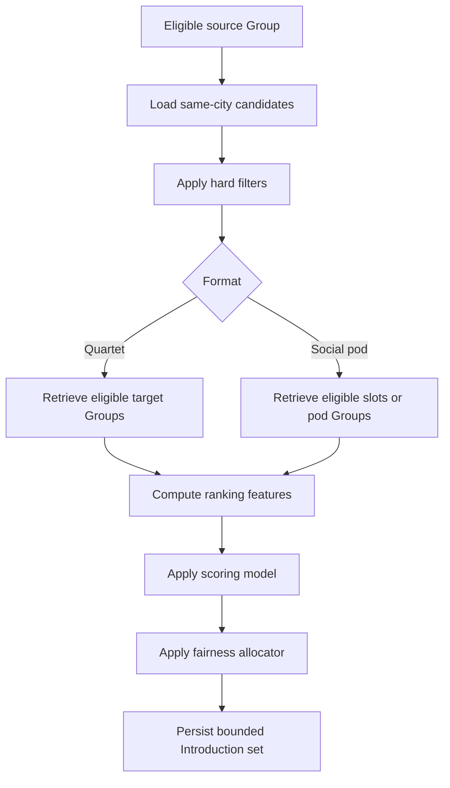
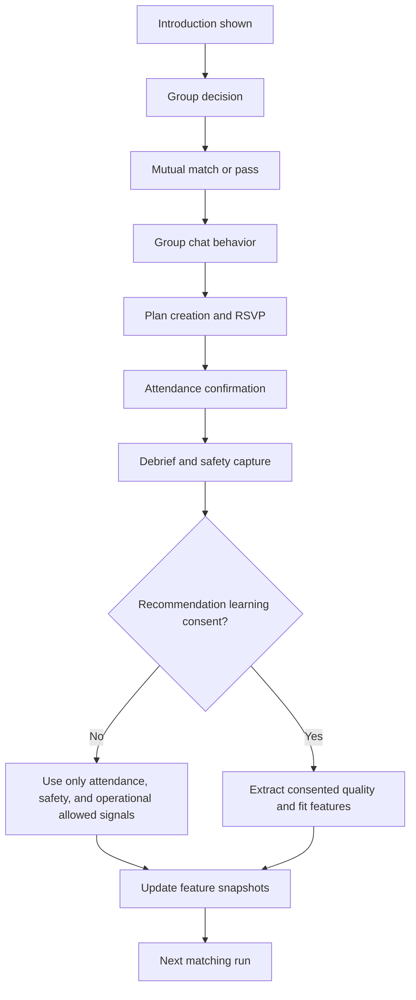

# Matching And Recommendation Algorithm Design

## Objective

The Nine should rank complete verified Groups by likelihood of producing safe, high-quality, real-world meetups. The recommendation system must remain bounded, explainable, auditable, and group-owned. It must never create solo discovery, suppress free baseline distribution, or display compatibility scores to users.

## Current Signals

The existing architecture supports these production-ready signals:

| Signal | Source | Current use | Constraints |
|---|---|---|---|
| Group format | `groups.format` | Separates quartet and social-pod matching | Quartet Groups require exactly two active verified members. |
| Eligibility status | `groups.eligibility_status` | Hard matching gate | Only eligible Groups receive Introductions. |
| City and neighborhoods | `groups.city_id`, `groups.neighborhood_ids` | Candidate retrieval and logistics fit | No precise member location for ranking. |
| Availability | `groups.availability_windows` | Time overlap and Plan likelihood | Group-level only. |
| Intent | `groups.intent` | Compatibility and reason code | Must be explicit and editable. |
| Profile moderation | `group_profiles.moderation_status` | Hard filter | Held or rejected profiles do not distribute. |
| Safety standing | `safety_actions`, `blocks`, reports | Hard filter and risk penalty | Report narratives are not ranking features. |
| Plan behavior | RSVP, attendance, debrief completion | Reliability and quality | Must avoid public reputation labels. |
| Entitlements | `entitlement_grants` | Extra stack size only | Paid state is not a ranking weight. |
| Exposure history | `introductions`, `introduction_sets` | Recent exposure penalty and fairness | Avoid repeated stale cards. |

## Proposed New Signals

| Signal | Feature family | Source | Use | User-visible reason allowed? |
|---|---|---|---|---|
| Group Availability Mesh overlap | Logistics | Member-entered windows aggregated to Group overlap | Ranking, Fast Track, Tonight Tables | Yes: shared availability |
| Plan-fit confidence | Logistics | Availability, venue type, neighborhood, RSVP deadline fit | Ranking and Plan suggestions | Yes: similar plan preference |
| Reply reliability | Behavior | Persisted message events and first response timing | Reliability feature | Yes only as broad strong responsiveness history |
| Balanced group participation | Behavior | Conversation participation by active members | Predicts healthy group chat | No direct reason in P1 |
| Planner engagement | Behavior | Planner opens, poll creation, votes | Predicts match-to-Plan conversion | No direct reason in P1 |
| RSVP timeliness | Behavior | RSVP event timing relative to deadline | Reliability feature | No direct reason in P1 |
| Attendance follow-through | Behavior | Attendance confirmations and debrief corroboration | Reliability and quality | Yes: strong attendance history |
| On-time cancellation pattern | Behavior | Plan cancellation reason and timing | Reliability adjustment | No direct reason |
| Debrief learning consent features | Outcome | Consented quality, Plan fit, mutual outcome patterns | Recommendation quality | Not as score; only broad preference fit |
| Vouch structured tags | Trust and compatibility | Approved vouch tags | Cold-start vibe and compatibility | Yes: complementary group vibe |
| Venue fit preference | Logistics | Consented debrief quality and Plan outcomes by venue type | Plan and pod ranking | Yes: similar plan preference |
| Host reliability | Social pod | Host checklist and attendance outcomes | Pod assembly and host assignment | No direct reason |
| Thin-city demand | Liquidity | Empty state actions, waitlists, saves | Operations and exploration allocation | No |
| Safety suppression context | Safety | Active safety actions and severe patterns | Hard filter or penalty | No |

## Explicitly Excluded Signals

The ranking system must not use:

1. Raw attractiveness, beauty, body, or photo-quality scoring.
2. Payment amount, subscription tier name, purchaser identity, or paid priority.
3. Protected class traits or inferred sensitive traits.
4. Raw government ID, liveness media, or verification document content.
5. Raw safety report narratives as positive or negative ranking features.
6. One-sided debrief interest without explicit recommendation-learning consent.
7. Any debrief interest as a public label, score, or reason.
8. Broad contact graph, address book membership, or hidden friend relationships.
9. Exact member location traces.
10. Device fingerprint, IP hash, or fraud metadata except for trust and safety exclusion.
11. Message text semantics for compatibility unless separately privacy-reviewed; P1 uses behavioral timing and Plan actions only.
12. Social media popularity, follower count, income, employer prestige, or other status proxies.

## Candidate Retrieval

Candidate retrieval remains a hard-filter-first process.



Hard filters:

1. Source or candidate Group is not eligible.
2. Any active member is not verification-approved.
3. Group format rules fail.
4. Required profile fields, publication approvals, or moderation approvals are missing.
5. Blocks exist in either direction.
6. Active safety action pauses distribution or contact.
7. City or format is paused.
8. Candidate was recently shown inside the active freshness window.
9. Plan or venue safety status is suppressed.
10. Social-pod slot lacks required host or venue state.

## Scoring Model

P1 should use an auditable deterministic model. A learned ranker can be evaluated later only if it preserves the same feature permissions, reason-code contract, and guardrail tests.

```typescript
export type MatchFormat = "quartet" | "social_pod";

export interface CandidatePairContext {
  sourceGroupId: string;
  targetGroupId?: string;
  targetPlanId?: string;
  format: MatchFormat;
  cityId: string;
  generatedAt: string;
}

export interface RecommendationFeatures {
  eligibilityPass: true;
  neighborhoodOverlap: number;
  availabilityOverlap: number;
  intentCompatibility: number;
  groupVibeCompatibility: number;
  planFitConfidence: number;
  profileCompleteness: number;
  replyReliability: number;
  planningReliability: number;
  attendanceReliability: number;
  debriefQualityFit: number;
  reciprocalGroupInterestPrior: number;
  coldStartExplorationBoost: number;
  fairnessExposureAdjustment: number;
  recentExposurePenalty: number;
  safetyRiskPenalty: number;
}

export interface RecommendationScore {
  score: number;
  reasonCodes: RecommendationReasonCode[];
  audit: {
    modelVersion: string;
    featureSnapshotId: string;
    freeBaselineProtected: true;
    paidRankingInputUsed: false;
  };
}

export type RecommendationReasonCode =
  | "shared_availability"
  | "nearby_neighborhoods"
  | "compatible_intent"
  | "similar_plan_preference"
  | "complementary_group_vibe"
  | "strong_attendance_history"
  | "strong_responsiveness_history";
```

Default P1 weights:

| Feature | Weight | Rationale |
|---|---:|---|
| Availability overlap | 0.18 | Meeting is the north star. |
| Neighborhood overlap | 0.14 | Lower logistics friction improves Plan confirmation. |
| Intent compatibility | 0.14 | Reduces mismatch and emotional waste. |
| Group vibe compatibility | 0.10 | Uses profile and vouch signals for group-level fit. |
| Plan-fit confidence | 0.10 | Predicts whether the match can become a concrete Plan. |
| Reply reliability | 0.07 | Helps prevent dead chats. |
| Planning reliability | 0.07 | Rewards Groups that move from chat to Plan. |
| Attendance reliability | 0.08 | Rewards real-world follow-through. |
| Debrief quality fit | 0.05 | Uses consented post-meetup fit patterns. |
| Profile completeness | 0.03 | Improves trust and decision quality. |
| Reciprocal group interest prior | 0.02 | Uses group-level historical compatibility. |
| Cold-start exploration boost | 0.02 | Protects new Groups from being invisible. |
| Fairness exposure adjustment | variable | Prevents exposure concentration. |
| Recent exposure penalty | negative | Prevents stale repeated cards. |
| Safety risk penalty | negative or hard exclusion | Protects users and venues. |

Score calculation:

```typescript
export function computeRecommendationScore(features: RecommendationFeatures): number {
  const positive =
    features.availabilityOverlap * 0.18 +
    features.neighborhoodOverlap * 0.14 +
    features.intentCompatibility * 0.14 +
    features.groupVibeCompatibility * 0.10 +
    features.planFitConfidence * 0.10 +
    features.replyReliability * 0.07 +
    features.planningReliability * 0.07 +
    features.attendanceReliability * 0.08 +
    features.debriefQualityFit * 0.05 +
    features.profileCompleteness * 0.03 +
    features.reciprocalGroupInterestPrior * 0.02 +
    features.coldStartExplorationBoost * 0.02;

  const adjusted =
    positive +
    features.fairnessExposureAdjustment -
    features.recentExposurePenalty -
    features.safetyRiskPenalty;

  return Math.max(0, Math.min(1, adjusted));
}
```

Reason-code rules:

1. A reason code can be shown only if its source features cross a documented threshold.
2. Do not show more than three reasons on a card.
3. Do not show safety, paid, debrief, or exposure-budget reasons.
4. Do not imply certainty, destiny, or attraction.
5. Reasons must map to user-editable inputs where practical.

## Feedback Loop



Feedback source rules:

| Source | Allowed use | Consent needed? | Notes |
|---|---|---|---|
| Introduction pass | Candidate fatigue and reason-category calibration | No, if pass reason is optional and non-sensitive | Do not infer attractiveness. |
| Interest approval | Group-level reciprocal prior | No | Group-owned signal. |
| Reply timing | Reliability | No | Use metadata, not message content. |
| Planner use | Planning reliability | No | Persisted Plan events only. |
| RSVP timing | Reliability | No | Neutralize valid cancellations. |
| Attendance confirmation | Reliability and north-star measurement | No | Use corroborated signals. |
| Quality rating | Fit and venue quality | Yes for recommendation learning | Can be used operationally in aggregate. |
| Private interest | Compatibility learning | Yes, and never public | Mutual-edge reveal remains separate. |
| Safety report | Hard filter, risk review, venue suppression | No | Do not use report narratives for positive ranking. |
| Payment | None for ranking | Not applicable | Extra stack size only. |

## Bias Mitigations

1. Separate hard safety filters from ranking penalties; severe safety risks should not be softened by high engagement.
2. Audit feature distributions by city, neighborhood, age band, format, acquisition cohort, and verification outcome where lawful and privacy-safe.
3. Cap behavioral reliability weights so early high-activity Groups do not monopolize exposure.
4. Use exploration budgets for new Groups, Groups from under-supplied neighborhoods, and Groups without debrief history.
5. Do not use protected or sensitive traits, inferred socioeconomic status, or image-derived attractiveness.
6. Do not penalize safety exits, credible reports, venue cancellations, provider outages, or accessibility-related changes.
7. Keep reason codes plain and editable; users should understand and change relevant inputs.
8. Run paid/free guardrail tests proving paid adoption does not reduce free baseline distribution or meetup conversion.
9. Require privacy review before adding any text-semantics or ML-derived compatibility features.
10. Keep model version, feature snapshot ID, and reason codes auditable per Introduction.

## Cold-Start Handling

Cold start applies when a Group has no prior Introduction, Plan, attendance, or debrief history.

Allowed cold-start inputs:

- Group format.
- Verified eligibility state.
- City and approved neighborhoods.
- Group Availability Mesh.
- Group intent.
- Profile completeness.
- Approved vouch structured tags.
- Shared vibe prompt categories.
- Launch cohort and source channel at aggregate level.
- Explicit pod or Plan preferences.

Cold-start strategy:

1. Preserve hard filters.
2. Allocate baseline exposure through fairness allocator.
3. Use availability, neighborhood, intent, vouch tags, and profile completeness as primary signals.
4. Add exploration boost for new eligible Groups within exposure caps.
5. Avoid overfitting to acquisition channel or creator source.
6. Show honest no-inventory states in thin-city mode.
7. Collect early Plan and debrief data with explicit learning consent.

Cold-start TypeScript contract:

```typescript
export interface ColdStartGroupFeatures {
  groupId: string;
  cityId: string;
  format: MatchFormat;
  approvedNeighborhoodCount: number;
  availableWindowCountNext14Days: number;
  intentCode: string;
  approvedVouchTags: string[];
  profileCompleteness: number;
  hasPriorMeetup: false;
}

export interface ColdStartPolicy {
  explorationBoostMax: number;
  exposureCapPerFreshnessWindow: number;
  minimumAvailabilityWindows: number;
  requireApprovedVouches: false;
}
```

## A/B Experiment Plan

### Experiment 1: Availability Mesh Ranking Lift

| Field | Plan |
|---|---|
| Hypothesis | Higher availability-overlap weighting increases Plan confirmation without reducing interest rate. |
| Population | Eligible quartet Groups in seeded-city beta. |
| Randomization | Group-level assignment at daily run; all members in a Group share treatment. |
| Control | Current deterministic scoring weights. |
| Treatment | Increased availability and Plan-fit weights with capped reliability weights. |
| Primary metric | Match-to-confirmed-Plan rate. |
| Secondary metrics | Introduction-to-interest, match-to-first-message, confirmed Plan-to-attended. |
| Guardrails | Safety reports per 1,000 meetups, no-show rate, free baseline distribution, notification opt-out. |
| Stop criteria | Significant safety harm, free distribution harm, or no Plan lift after agreed sample size. |

### Experiment 2: Reliability Ledger

| Field | Plan |
|---|---|
| Hypothesis | Internal reliability features reduce dead chats and no-shows. |
| Population | Groups with at least one prior matched chat or Plan. |
| Randomization | Candidate pair ranking within daily run. |
| Control | Baseline response and attendance signals only. |
| Treatment | Reply, planning, RSVP, and attendance reliability snapshot. |
| Primary metric | Confirmed Plan-to-attended meetup rate. |
| Secondary metrics | First response within 24 hours, RSVP completion, no-show rate. |
| Guardrails | Report rates, cancellation fairness review, exposure concentration. |

### Experiment 3: Debrief Learning Consent Features

| Field | Plan |
|---|---|
| Hypothesis | Consented post-meetup fit features improve repeat meetup quality. |
| Population | Members who explicitly consent to recommendation learning. |
| Randomization | Consent cohort split by Group after consent. |
| Control | Debrief quality excluded from ranking. |
| Treatment | Consented quality, Plan-fit, and mutual-outcome features included. |
| Primary metric | Post-meetup quality rating on next verified meetup. |
| Secondary metrics | Repeat meetup rate, mutual edge rate, debrief completion. |
| Guardrails | Consent revocation, privacy complaints, one-sided interest leakage incidents. |

### Experiment 4: Tonight Tables

| Field | Plan |
|---|---|
| Hypothesis | Explicit tonight availability creates more attended meetups without increasing no-shows. |
| Population | Eligible Groups with both members available in next 36 hours. |
| Randomization | City neighborhood cluster or Group cohort. |
| Control | Standard daily Introduction set. |
| Treatment | Tonight Tables entry and bounded opportunities. |
| Primary metric | Confirmed Plan-to-attended meetup within 72 hours. |
| Secondary metrics | Availability confirmation, RSVP completion, debrief completion. |
| Guardrails | No-show rate, safety incidents, notification opt-out, user pressure rating. |

## Implementation Notes

Required new or extended technical artifacts:

1. `group_availability_snapshots` or equivalent derived feature store.
2. `group_reliability_snapshots` for internal reliability features.
3. `recommendation_feature_snapshots` with model version and consent metadata.
4. `debrief_learning_consents` or consent fields tied to debrief-derived feature eligibility.
5. `matching_experiment_assignments` keyed by Group and model version.
6. Expanded matching tests proving no member-level discovery, no paid ranking input, free baseline protection, debrief privacy, and safety exclusions.

These are architecture deltas. If implemented, update `11-technical-architecture/02-data-models.md`, `03-api-spec.md`, `05-matching-engine-design.md`, `09-push-notification-service.md`, `11-security-model.md`, and `13-ci-cd-pipeline.md` in the same change.

---
<!-- doc-version: 1.0 -->
