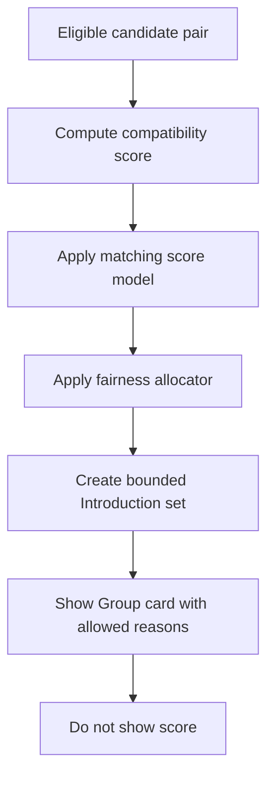

# Compatibility Scoring Model

## Purpose

The Nine needs a compatibility model that predicts whether two complete verified Groups are likely to create a safe, enjoyable, real-world meetup. The model is group-level. It is not an individual attractiveness score, desirability tier, or public reputation system.

Compatibility scores are internal ranking inputs only. Users never see a score, label, badge, percentile, tier, or "best match" claim. User-facing explanations are limited to plain reason categories such as shared availability, compatible intent, nearby neighborhoods, similar plan preference, complementary group vibe, and strong attendance history.

## What Is Scored

Compatibility is scored at the candidate pair level:

```typescript
export interface CompatibilityPair {
  sourceGroupId: string;
  targetGroupId: string;
  cityId: string;
  format: "quartet";
  computedAt: string;
}
```

For social pods, compatibility is scored between a source Group and a Plan slot or candidate pod mix:

```typescript
export interface PodCompatibilityTarget {
  sourceGroupId: string;
  targetPlanId: string;
  cityId: string;
  format: "social_pod";
  computedAt: string;
}
```

The score estimates fit across seven dimensions:

| Dimension | Description | Example inputs | User-facing reason allowed? |
|---|---|---|---|
| Logistics fit | Can the Groups realistically meet soon? | Availability overlap, neighborhood overlap, venue access, Plan windows | Yes |
| Intent fit | Are expectations compatible? | Relationship intent, pod vibe, Plan type preference | Yes |
| Group vibe fit | Do the Groups describe complementary social energy? | Shared vibe prompts, approved vouch tags, activity preferences | Yes |
| Activity and venue fit | Are preferred plan types compatible? | Venue type, cost tier, noise level, accessibility, activity tags | Yes |
| Trust and completeness fit | Is there enough context to make a confident decision? | Profile completeness, approved vouches, verification freshness | Limited, not as rank |
| Reliability fit | Are the Groups likely to reply, plan, RSVP, and attend? | Reply timing, planner use, RSVP timeliness, attendance history | Yes only in broad terms |
| Consented outcome fit | Did prior real-world outcomes suggest similar plans or Groups work well? | Consented quality feedback, mutual outcomes, repeat Plan outcomes | No direct score; broad preference fit only |

## What Is Never Scored

The compatibility model must never score:

1. Individual physical attractiveness.
2. Photo aesthetics, body type, face symmetry, or image-derived desirability.
3. Public popularity, follower count, social status, income, school prestige, or employer prestige.
4. Protected class membership or inferred sensitive traits.
5. Raw verification documents, liveness media, or government ID data.
6. Raw safety report narratives as compatibility inputs.
7. One-sided debrief interest without explicit recommendation-learning consent.
8. Any debrief interest for public display.
9. Payment status, subscription tier, product spend, or purchaser identity.
10. Broad contact graph relationships or address book overlap.
11. Exact member location traces.
12. Private messages' semantic content unless a future privacy review explicitly approves a constrained feature.
13. Safety action use by a reporter as a negative compatibility signal against the reporter.

## Computation Model

### Feature Contract

```typescript
export interface CompatibilityFeatures {
  logisticsFit: number;
  intentFit: number;
  groupVibeFit: number;
  activityVenueFit: number;
  trustCompletenessFit: number;
  reliabilityFit: number;
  consentedOutcomeFit: number;
  safetyExclusion: boolean;
  blockExclusion: boolean;
  recentExposurePenalty: number;
  thinCityExplorationAdjustment: number;
}

export interface CompatibilityResult {
  internalScore: number;
  reasonCodes: CompatibilityReasonCode[];
  modelVersion: string;
  featureSnapshotId: string;
  displayScoreToUsers: false;
}

export type CompatibilityReasonCode =
  | "shared_availability"
  | "nearby_neighborhoods"
  | "compatible_intent"
  | "similar_plan_preference"
  | "complementary_group_vibe"
  | "strong_attendance_history";
```

### Default Weighting

| Dimension | Weight | Why |
|---|---:|---|
| Logistics fit | 0.24 | The north star is verified real-world meetup, not browsing. |
| Intent fit | 0.18 | Clear intent reduces mismatch and emotional waste. |
| Group vibe fit | 0.16 | Group-level chemistry is the product differentiator. |
| Activity and venue fit | 0.12 | Better Plan fit increases confirmation and attendance. |
| Reliability fit | 0.12 | Follow-through reduces dead chats and no-shows. |
| Trust and completeness fit | 0.08 | Better context improves safe decision-making. |
| Consented outcome fit | 0.10 | Real-world feedback should improve future ranking when consented. |

```typescript
export function computeCompatibility(features: CompatibilityFeatures): CompatibilityResult {
  if (features.safetyExclusion || features.blockExclusion) {
    return {
      internalScore: 0,
      reasonCodes: [],
      modelVersion: "compatibility-v1",
      featureSnapshotId: "excluded",
      displayScoreToUsers: false,
    };
  }

  const baseScore =
    features.logisticsFit * 0.24 +
    features.intentFit * 0.18 +
    features.groupVibeFit * 0.16 +
    features.activityVenueFit * 0.12 +
    features.reliabilityFit * 0.12 +
    features.trustCompletenessFit * 0.08 +
    features.consentedOutcomeFit * 0.10;

  const adjustedScore =
    baseScore +
    features.thinCityExplorationAdjustment -
    features.recentExposurePenalty;

  return {
    internalScore: Math.max(0, Math.min(1, adjustedScore)),
    reasonCodes: deriveCompatibilityReasons(features),
    modelVersion: "compatibility-v1",
    featureSnapshotId: "runtime-snapshot-id",
    displayScoreToUsers: false,
  };
}

function deriveCompatibilityReasons(features: CompatibilityFeatures): CompatibilityReasonCode[] {
  const reasons: CompatibilityReasonCode[] = [];

  if (features.logisticsFit >= 0.7) reasons.push("shared_availability");
  if (features.intentFit >= 0.7) reasons.push("compatible_intent");
  if (features.groupVibeFit >= 0.7) reasons.push("complementary_group_vibe");
  if (features.activityVenueFit >= 0.7) reasons.push("similar_plan_preference");
  if (features.reliabilityFit >= 0.75) reasons.push("strong_attendance_history");

  return reasons.slice(0, 3);
}
```

## Dimension Details

### Logistics Fit

Inputs:

- Group Availability Mesh overlap for next 14 days.
- Approved neighborhood overlap.
- Venue travel fit by coarse neighborhood.
- Plan start time compatibility.
- Time-to-meet likelihood for Tonight Tables and City Rhythm Calendar.

Rules:

- Use Group-level overlap only.
- Do not store or rank by precise member location.
- Late-night windows should factor venue safety and transportation fit.
- If no overlap exists, the pair can still appear only when manual Plan creation is plausible and inventory is thin.

### Intent Fit

Inputs:

- Group relationship intent.
- Social-pod vibe codes.
- Plan format preference.
- Explicit boundaries and comfort preferences where productized.

Rules:

- Intent must be user-declared and editable.
- Do not infer intent from message content.
- Do not rank Groups into hidden "seriousness" classes beyond declared intent compatibility.

### Group Vibe Fit

Inputs:

- Shared vibe prompt categories.
- Approved structured vouch tags.
- Activity style preferences.
- Group prompt answers after moderation.

Rules:

- Vouch tags describe social behavior, not attractiveness.
- Free-text vouch content is not used for opaque scoring in P1.
- User-visible reasons can say complementary group vibe but not "higher quality Group."

### Activity And Venue Fit

Inputs:

- Venue type preference.
- Noise level fit.
- Cost tier comfort.
- Accessibility needs and venue suitability.
- Prior consented quality by venue type.

Rules:

- Accessibility needs can filter or boost appropriate venues only when explicitly provided for that purpose.
- Cost tier should avoid ranking by wealth; use declared comfort and venue fit.
- Venue safety suppression is a hard filter.

### Trust And Completeness Fit

Inputs:

- Profile completeness.
- Approved vouch presence.
- Verification approval state and risk-neutral freshness.
- Publish approval freshness after profile edits.

Rules:

- Verification is a hard gate, not a desirability score.
- Trust completeness cannot compensate for safety risk.
- No raw verification data is used.

### Reliability Fit

Inputs:

- Reply timing after mutual match.
- Balanced chat participation.
- Planner open and poll creation.
- Vote and RSVP timeliness.
- On-time cancellation versus late cancellation.
- Attendance corroboration.
- Debrief completion.

Rules:

- Safety exits and credible reports are neutralized or excluded.
- Venue cancellations and provider outages are excluded.
- Reliability score is never shown publicly.
- Reliability weights are capped to prevent early power users from monopolizing exposure.

### Consented Outcome Fit

Inputs only when explicit recommendation-learning consent exists:

- Debrief quality rating by Plan type.
- Consented friend/crush/both/no-interest pattern in aggregate-safe form.
- Mutual edge outcomes.
- Repeat Plan outcome.
- Venue and activity fit.

Rules:

- One-sided interest is never exposed.
- One-sided interest is never used for ranking without explicit consent.
- Mutual edge reveal remains separate from ranking consent.
- If consent is revoked, future ranking use stops and derived features become inactive.

## How Compatibility Feeds Ranking



Compatibility is one ranking input, not the whole matching decision. The final recommendation rank also considers:

- Hard filters.
- Exposure fairness.
- Introduction freshness.
- Thin-city liquidity mode.
- Entitlement extra stack size only after free baseline slots are filled.
- Safety and block exclusions.

The ranker stores compatibility output for audit:

```typescript
export interface CompatibilityAuditRecord {
  introductionId: string;
  sourceGroupId: string;
  targetGroupId: string | null;
  targetPlanId: string | null;
  compatibilityModelVersion: string;
  internalScore: number;
  reasonCodes: CompatibilityReasonCode[];
  featureSnapshotId: string;
  paidRankingInputUsed: false;
  displayedToUsers: false;
  createdAt: string;
}
```

## Consent Model

| Data type | Default | Consent needed for ranking? | Can be revoked? | User-facing explanation |
|---|---|---|---|---|
| Group profile fields | Used after publish approval | Publish approval | Yes, by editing or withdrawing approval | "Other Groups see your approved profile." |
| Availability | Used for matching and planning | Group setup consent | Yes, by editing availability | "Availability helps us suggest realistic Plans." |
| Vouch tags | Used after subject approval | Subject approval | Yes, hide or edit vouch | "Approved vouches help explain Group vibe." |
| Reply and planning metadata | Used for reliability | No separate consent beyond product use | Not individually revocable, subject to deletion policy | "We use follow-through to improve Plan quality." |
| Attendance confirmation | Used for north-star and reliability | No separate consent beyond debrief/attendance flow | Subject to policy | "Attendance helps keep meetups real." |
| Quality rating | Operational aggregate by default | Yes for recommendation learning | Yes | "Use this to improve your recommendations." |
| One-sided interest | Private by default | Yes for recommendation learning | Yes | "Private unless mutual; optional for future fit." |
| Safety reports | Used for safety only | No | Subject to safety/legal retention | "Safety reports protect users and are restricted." |
| Payment state | Not used for ranking | Not applicable | Not applicable | "Paid features do not change baseline visibility." |

Consent requirements:

1. Consent copy must be specific: "Use this debrief to improve future recommendations" rather than broad data consent.
2. Declining consent must not block debrief submission, mutual reveal, safety reporting, or future free distribution.
3. Revocation stops future ranking use of derived debrief features.
4. Revocation does not delete safety, payment, audit, or attendance records required by policy.
5. Consent state must be stored with timestamp, version, surface, and member ID.

## Data Retention Rules

| Data | Retention default | Ranking use window | Deletion or revocation behavior |
|---|---|---|---|
| Compatibility feature snapshots | 12 months | 180 days unless model requires shorter | Delete or anonymize after retention; preserve audit where required. |
| Availability snapshots | Current plus 90 days history | Current and next 14 days primary | User edits replace current; history retained for audit briefly. |
| Reliability snapshots | 12 months | Last 180 days, last 60 days weighted higher | Safety/legal records retained separately. |
| Vouch tags | While vouch approved | Current only | Hide removes from future ranking. |
| Debrief-derived ranking features | 12 months or until revocation | Last 180 days | Revocation marks inactive for future ranking. |
| Raw debrief interest | Policy-defined private retention | Not read directly by ranker | Remains private; deletion follows privacy/safety policy. |
| Safety exclusions | Policy-defined | Active while action or risk state applies | Preserved as needed for trust and safety. |
| Audit records | Environment compliance policy | Not a ranking feature | Append-only where required. |

## Gaming And Abuse Controls

1. Cap effect size for reply speed and planning activity to prevent spammy behavior.
2. Require attendance corroboration before rewarding real-world follow-through.
3. Separate on-time cancellation from no-show behavior.
4. Exclude self-reported quality from public display and avoid immediate visible reward.
5. Detect coordinated false debrief patterns through trust review, not automatic public penalties.
6. Do not let Groups reset negative safety context by dissolving and reforming.
7. Do not let paid templates, host tools, or subscriptions modify compatibility weights.
8. Use exposure budgets so highly active Groups do not absorb all candidate visibility.

## Transparency Requirements

User-facing surfaces may say:

- "Recommended because your Groups overlap on Saturday availability and neighborhood."
- "Recommended because both Groups prefer low-key evening Plans."
- "Recommended because your Group vibes look complementary."
- "Recommended because this Group has strong attendance history."

User-facing surfaces must not say:

- "Compatibility score: 92%."
- "Top-tier Group."
- "More attractive Group."
- "You are less compatible because they did not mark crush."
- "Upgrade to improve compatibility."
- "People like you usually do better with..."

## Review And Governance

Before launch of any compatibility model update:

1. Product reviews reason-code clarity.
2. Trust and safety reviews excluded signals and safety suppression.
3. Legal/privacy reviews debrief consent and retention.
4. Engineering adds paid guardrail, no-member-discovery, and debrief privacy tests.
5. Data reviews fairness and exposure distribution.
6. Launch owner defines rollback: disable model version and reuse previous daily set generation.

Minimum tests:

```typescript
export interface CompatibilityGuardrailTest {
  name: string;
  mustPass: boolean;
  assertion:
    | "no_member_level_discovery"
    | "paid_state_not_used"
    | "one_sided_interest_not_displayed"
    | "one_sided_interest_requires_consent_for_ranking"
    | "safety_exclusion_overrides_score"
    | "free_baseline_distribution_preserved"
    | "compatibility_score_not_serialized_to_client";
}
```

---
<!-- doc-version: 1.0 -->
