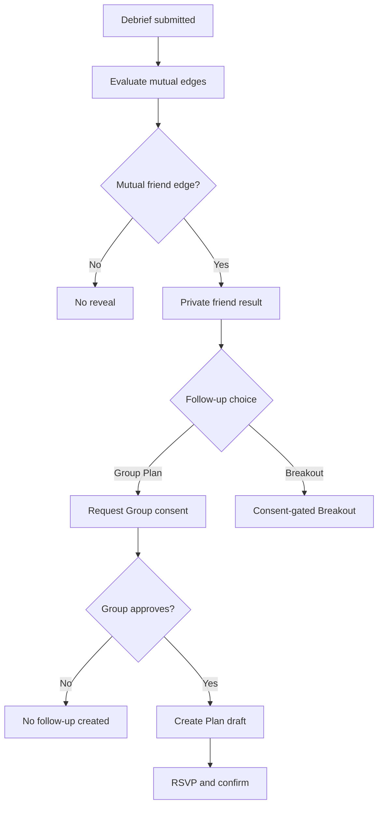
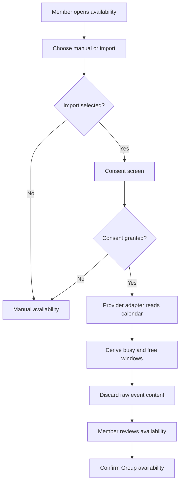
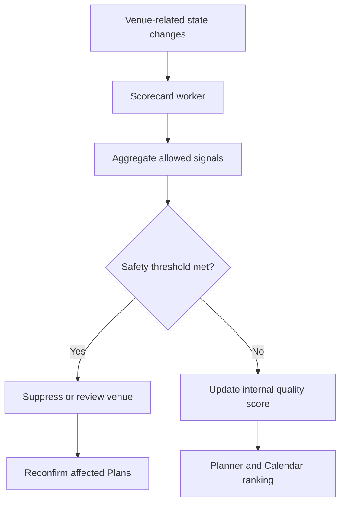
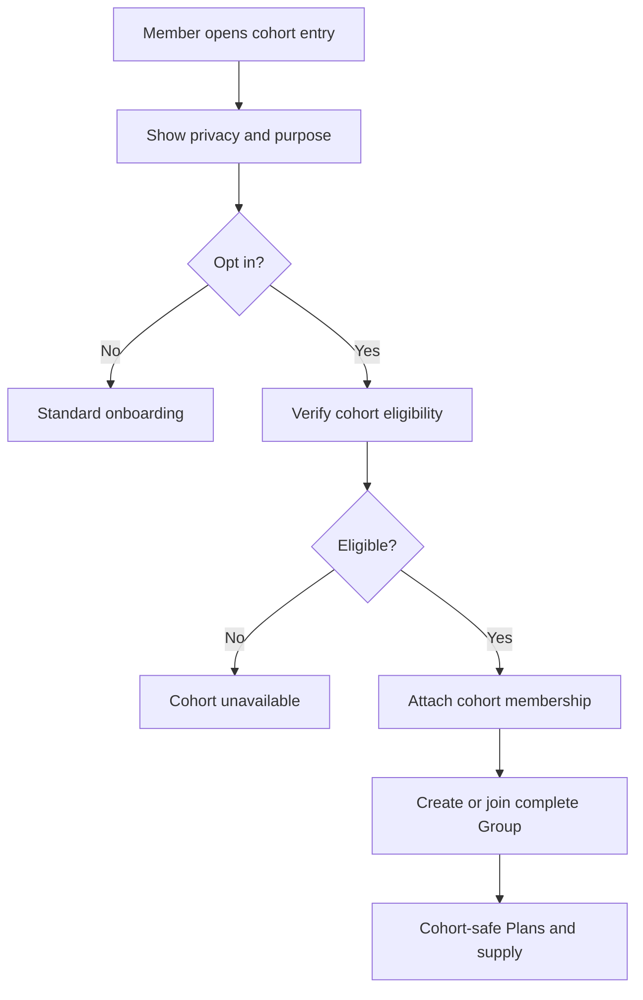
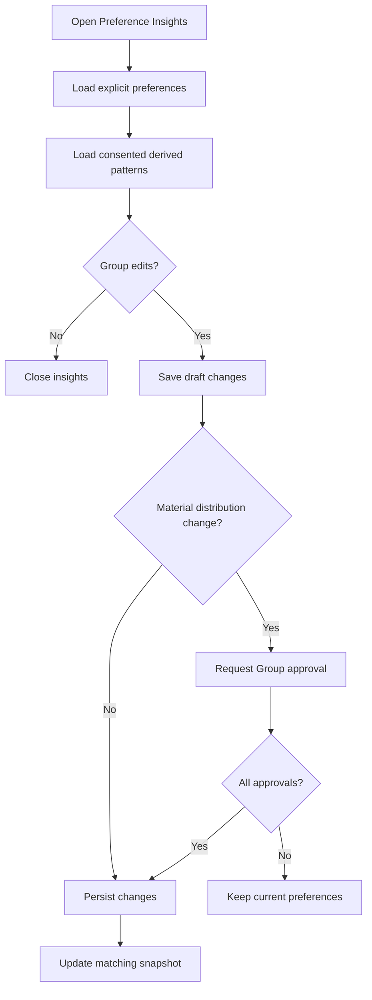
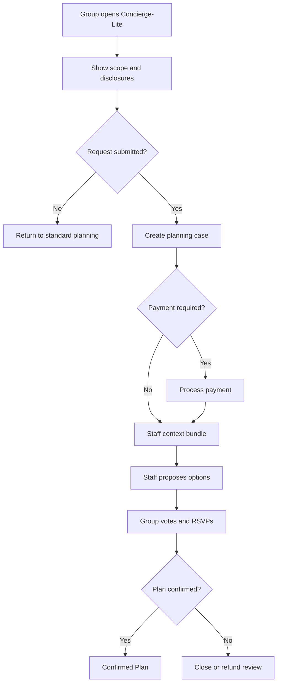
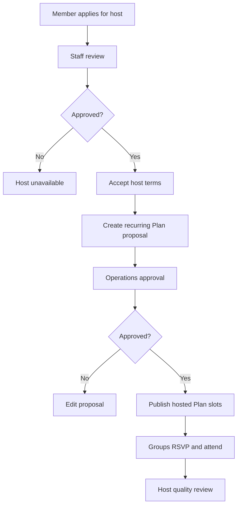
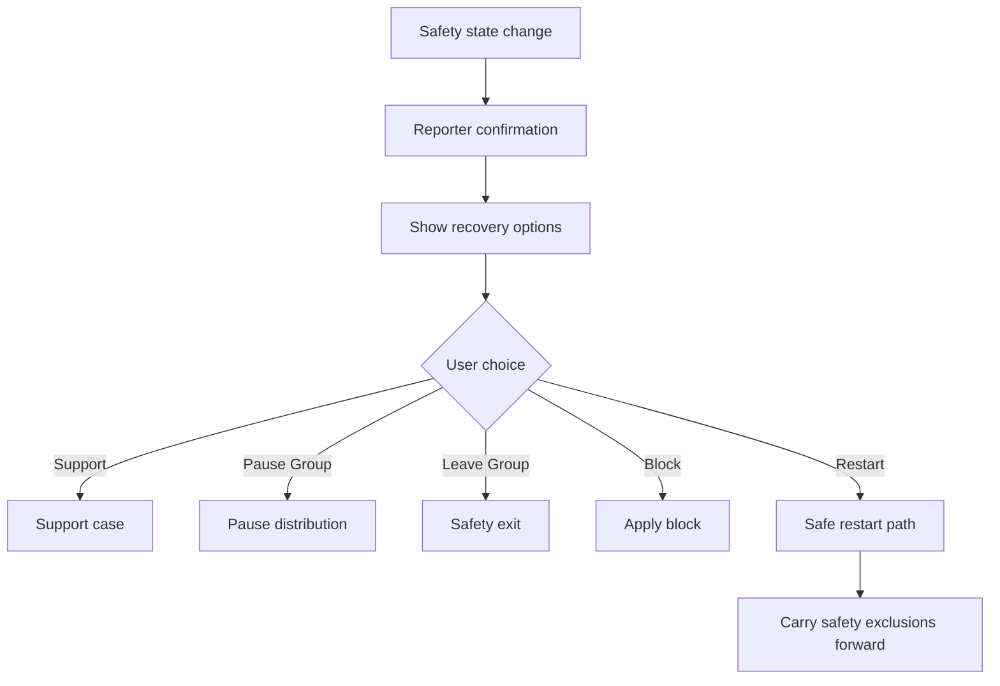

# P2 Feature Specs

## 17. Mutual Friend Follow-Up

### Problem Statement

The Nine can produce successful social outcomes even when no romantic edge emerges. The current post-meetup flow recognizes friend outcomes, but it does not fully specify a follow-up path that converts mutual friend signals into another group-safe Plan without making romance feel like the only success case.

### Research Rationale

R2, R7, R8, and R10 support outcome-led retention beyond app sessions. Larger groups should defer vulnerable preference until after meeting, and friend outcomes can create repeat social trust, new group supply, and lower-pressure future romantic contexts.

### User Stories With Acceptance Criteria

**Story 1: Follow up on mutual friend interest**

As a member with a mutual friend edge, I want a low-pressure path to reconnect without implying romantic interest.

Acceptance criteria:

- Mutual friend edge is revealed only to the two involved members.
- Follow-up CTA defaults to a group-friendly Plan, not a romantic Breakout.
- The source Group context remains visible for safety and consent.
- One-sided friend signals are never revealed.

**Story 2: Convert social success into more real-world Plans**

As a Group, we want a way to plan again with people we enjoyed meeting.

Acceptance criteria:

- Group-friendly follow-up requires current active Group consent where a Group Plan is created.
- Follow-up Plan uses Plan Fast Track, RSVP, and safety sharing rules.
- Existing blocks, leaves, or safety actions suppress follow-up.
- Follow-up notifications originate from persisted mutual edge or Plan state changes.

### Detailed User Flow

1. Debrief evaluates private interest signals.
2. A mutual friend edge is created for two members.
3. Each involved member sees a private result screen.
4. Member selects Plan again with Group or request Breakout as friends where eligible.
5. If Group Plan is selected, current Group members approve the follow-up context.
6. Plan Fast Track proposes time and venue options.
7. Required RSVPs confirm the follow-up Plan.
8. Attendance and debrief flow repeat after the Plan.

### Mermaid Diagram

### Screen List With All UI States

| Screen | Empty | Loading | Error | Populated | Safety state |
|---|---|---|---|---|---|
| Mutual Friend Result | No mutual friend edges | Loading result | Result unavailable | Friend result and follow-up options | Report or block |
| Group Follow-Up Consent | No follow-up request | Loading request | Request expired or unavailable | Approve, decline, context | Leave Group or report |
| Follow-Up Plan Draft | No draft | Creating Plan | Plan creation failed | Time, venue, participants, RSVP | Share plan and urgent help |
| Friend Breakout Entry | Not eligible | Checking eligibility | Request blocked | Consent explanation and request | Block recipient |

### Edge Cases

- One involved member left their Group: allow member-private friend result, but block Group Plan until current Group context exists.
- Safety report filed after meetup: suppress friend follow-up until review.
- Mutual friend and mutual crush both exist: show user choice without ranking one path.
- Recipient declines Breakout: requester sees neutral unavailable state.
- A follow-up Plan includes people outside the original meetup: require explicit invite and verification.

### Success Metrics

- Mutual friend edge reveal rate.
- Friend result-to-follow-up action rate.
- Follow-up Plan confirmation rate.
- Follow-up Plan attendance rate.
- Friend Breakout acceptance rate.
- Safety reports from friend follow-ups.
- Repeat weekly activated Group rate after friend outcome.

### Open Questions

- Should friend follow-up be available before all debriefs close? Recommended default: only after the debrief window closes or all involved members submit.
- Should mutual friend edges expire? Recommended default: keep result in private history but expire direct follow-up CTA after 30 days.

## 18. Calendar Import With Narrow Consent

### Problem Statement

Busy users struggle to maintain accurate availability, and poor availability reduces match quality and Plan confirmation. Calendar import can reduce friction, but broad calendar access creates privacy and trust risk that is inconsistent with The Nine's group-first model.

### Research Rationale

R2 and R11 support reducing scheduling effort to improve real-world conversion. R12 and R14 require strict consent, minimization, and transparency before any sensitive integration.

### User Stories With Acceptance Criteria

**Story 1: Import only availability windows**

As a member, I want The Nine to read only when I am available, not what is on my calendar.

Acceptance criteria:

- Calendar import is optional and off by default.
- Consent explains provider, scope, retention, and revocation.
- The Nine stores derived busy/free windows only, not event titles, attendees, notes, locations, or meeting links.
- Imported windows are converted into editable Group availability.

**Story 2: Revoke access safely**

As a member, I want to disconnect calendar access without breaking safety or current Plans.

Acceptance criteria:

- Revocation stops future sync immediately.
- Existing confirmed Plans remain visible and require manual updates if affected.
- Derived future availability is removed or marked stale according to privacy policy.
- No matching inventory is member-scoped because of calendar import.

### Detailed User Flow

1. Member opens Availability Setup.
2. The Nine explains narrow calendar import and manual alternative.
3. Member grants provider access through adapter.
4. Provider returns calendar data to adapter.
5. Adapter derives busy/free windows and discards raw event data.
6. Member reviews editable availability summary.
7. Group Availability Mesh recomputes after member confirms.
8. Member can pause or revoke sync from privacy settings.

### Mermaid Diagram

### Screen List With All UI States

| Screen | Empty | Loading | Error | Populated | Safety state |
|---|---|---|---|---|---|
| Calendar Consent | Import not connected | Connecting provider | Provider unavailable or denied | Scope, retention, revoke, connect CTA | Privacy and Safety Center |
| Availability Review | No imported windows | Deriving windows | Sync failed | Editable windows and stale markers | Report privacy issue |
| Calendar Settings | No connected provider | Loading status | Disconnect failed | Provider, last sync, revoke CTA | Safety Center |
| Sync Conflict | No conflicts | Resolving conflicts | Save failed | Manual edits versus imported windows | Leave Group if needed |

### Edge Cases

- Provider returns private event metadata: adapter discards before persistence.
- Calendar has all-day busy events: mark as unavailable unless user edits.
- Different members connect different providers: normalize into Group Availability Mesh.
- Sync fails before a Plan: do not cancel automatically; ask for manual confirmation.
- User revokes consent after ranking snapshot: mark derived features inactive for future runs.

### Success Metrics

- Calendar consent opt-in rate.
- Availability completion lift for import users.
- Plan suggestion acceptance lift.
- Match-to-confirmed-Plan lift.
- Revocation rate.
- Privacy complaint rate.
- Sync failure rate by provider.

### Open Questions

- Which provider launches first? Recommended default: device calendar read through platform APIs before server-side Google or Microsoft OAuth.
- How long can derived windows persist after revocation? Recommended default: remove future imported windows immediately unless the user explicitly converts them to manual windows.

## 19. Venue Quality Scorecard

### Problem Statement

Venue quality directly affects safety, comfort, no-shows, and post-meetup satisfaction. The current venue model includes safety status and attributes, but it needs a production-grade internal scorecard that guides Plan suggestions and venue suppression without exposing sensitive ratings publicly.

### Research Rationale

R3, R9, and R10 make venue context central to safety and real-world conversion. The scorecard should improve operations and ranking while avoiding public venue shaming based on sparse or sensitive data.

### User Stories With Acceptance Criteria

**Story 1: Recommend better venues**

As a Group creating a Plan, we want venue suggestions that fit conversation, cost, accessibility, and safety needs.

Acceptance criteria:

- Venue recommendations use approved venue attributes, safety status, attendance outcomes, and consented quality signals.
- Suppressed venues are excluded from user surfaces.
- Venue score is internal only.
- Manual venue entry remains available with safety checks.

**Story 2: Detect venue risk**

As operations, we want venue patterns that require review.

Acceptance criteria:

- Repeated safety reports, cancellations, no-shows, or low quality route venues to review.
- Safety reports are restricted and not exposed in public venue detail.
- Venue suppression immediately affects active Calendar and Plan suggestion surfaces.
- Affected confirmed Plans enter reconfirmation or replacement flow.

### Detailed User Flow

1. Venue receives Plan, RSVP, attendance, debrief, and safety outcomes.
2. Venue scorecard worker aggregates allowed signals.
3. Safety thresholds route venue to review or suppression.
4. Planner and Calendar read scorecard status before suggesting venue.
5. If venue is suppressed, active affected Plans trigger reconfirmation.
6. Operations reviews context and updates venue status.

### Mermaid Diagram

### Screen List With All UI States

| Screen | Empty | Loading | Error | Populated | Safety state |
|---|---|---|---|---|---|
| Venue Detail | No venue selected | Loading venue | Venue unavailable | Address, cost, noise, accessibility, safety notes | Report venue |
| Venue Replacement | No replacement needed | Loading alternatives | Alternatives unavailable | Replacement options and RSVP impact | Urgent help |
| Operations Scorecard | No venue signals | Loading scorecard | Access denied | Internal score, reports, outcomes, status | Staff safety actions |
| Plan Reconfirmation | No reconfirmation | Loading Plan | Reconfirmation failed | Reason, alternatives, RSVP | Share plan and report |

### Edge Cases

- Low signal venue: use conservative default and operations review, not low public confidence.
- Safety report is severe: suppress immediately before full review if policy threshold met.
- Venue improves after remediation: operations can restore status with audit log.
- Partner venue is paid: paid status does not override safety suppression.
- Manual venue lacks catalog record: create provisional review record before repeated suggestions.

### Success Metrics

- Venue suggestion-to-Plan selection rate.
- Venue Plan confirmation rate.
- Venue confirmed Plan-to-attended rate.
- Venue safety report rate.
- Venue suppression rate.
- Replacement flow completion rate.
- Satisfaction by venue type.

### Open Questions

- Should venue scorecards be shared with partners? Recommended default: only aggregate operational feedback, no private reports or debrief interest.
- Should low-quality venues be hidden or deprioritized? Recommended default: safety-suppressed venues hidden; low-quality venues deprioritized internally.

## 20. Community Cohorts

### Problem Statement

City launches need dense trusted supply. Community cohorts can seed Groups through graduate programs, alumni networks, creator communities, run clubs, social sports, and venue partner audiences, but they must not expose social graph membership or create closed-class ranking.

### Research Rationale

R5 and R13 support dense friend-network growth. R14 warns against hidden social graph exposure. Cohorts should help verified Groups form and meet, not become solo browsing filters.

### User Stories With Acceptance Criteria

**Story 1: Join a cohort with consent**

As a member from a trusted community, I want to join a cohort only if I understand how it affects my experience.

Acceptance criteria:

- Cohort membership is opt-in and verified through approved partner, code, or staff review.
- Cohort membership is not shown publicly unless explicitly designed and consented.
- Cohort can affect launch access, events, or supply seeding, but not solo discovery.
- Members can leave a cohort without losing core free matching.

**Story 2: Seed group-safe cohort Plans**

As operations, we want cohorts to improve density and trust in a city.

Acceptance criteria:

- Cohort events still require complete verified Groups or social-pod Groups.
- Cohort targeting is aggregate and privacy-reviewed.
- Safety reports by cohort route to standard safety systems.
- Cohort performance is measured by verified meetups, not signups alone.

### Detailed User Flow

1. Member receives cohort invite or enters code at `thenine.com`.
2. The Nine explains cohort purpose, privacy, and limits.
3. Member opts in and verifies eligibility.
4. Cohort can unlock city access, Calendar items, founding host opportunities, or supply events.
5. Group formation and matching still require complete verified Group.
6. Operations sees aggregate cohort funnel and safety metrics.
7. Member can leave cohort in privacy settings.

### Mermaid Diagram

### Screen List With All UI States

| Screen | Empty | Loading | Error | Populated | Safety state |
|---|---|---|---|---|---|
| Cohort Entry | No code or invite | Validating code | Invalid, expired, ineligible | Cohort purpose, privacy, opt-in | Report invite |
| Cohort Settings | No cohorts | Loading cohorts | Leave failed | Joined cohorts and leave CTA | Safety Center |
| Cohort Calendar | No cohort items | Loading items | Items unavailable | Group-safe cohort Plans | Report item |
| Operations Cohort Dashboard | No cohort data | Loading aggregates | Access denied | Funnel, meetup, safety metrics | Staff safety view |

### Edge Cases

- Code is leaked publicly: rate-limit, revoke, and require staff review.
- Cohort has very small membership: suppress dashboards below privacy thresholds.
- Member leaves cohort with active Plan: Plan remains if already confirmed and safe.
- Cohort partner requests private member list: deny unless consent and policy allow.
- Cohort becomes unsafe: pause cohort items and review active Plans.

### Success Metrics

- Cohort invite-to-opt-in rate.
- Cohort opt-in-to-verification rate.
- Cohort verified member-to-complete-Group rate.
- Cohort Group-to-verified-meetup rate.
- Cohort safety incident rate.
- Cohort retention after first meetup.
- Cohort K-factor.

### Open Questions

- Should cohort membership be visible to matched Groups? Recommended default: no, except explicit cohort-branded events where all participants consent.
- Should cohorts affect matching? Recommended default: only for cohort-specific events or supply seeding, not general desirability ranking.

## 21. Group Preference Insights

### Problem Statement

The Nine can improve recommendations if Groups understand and edit their own high-level preferences. The risk is showing scores, labels, or sensitive post-meetup inferences. Preference Insights should give users control without exposing compatibility math or one-sided interest.

### Research Rationale

R4, R11, R12, and R14 support legible controls, preference transparency, and avoidance of hidden or manipulative ranking. Users should be able to correct the system without seeing private debrief signals.

### User Stories With Acceptance Criteria

**Story 1: See editable preference patterns**

As a Group, we want to understand the broad inputs shaping our Introductions.

Acceptance criteria:

- Insights show editable categories: availability, neighborhoods, intent, Plan style, venue type, social energy.
- Insights never show compatibility scores, attractiveness labels, or private interest data.
- Derived insights from debrief require learning consent.
- Editing preferences updates future matching snapshots.

**Story 2: Correct recommendations**

As a Group member, I want to tell The Nine when recommendations feel off.

Acceptance criteria:

- Pass reasons and preference edits are optional and non-punitive.
- Preference changes require Group-level visibility where they affect Group matching.
- Safety reports remain separate from preference feedback.
- Thin-city limitations are explained honestly.

### Detailed User Flow

1. Group opens Preference Insights from Group settings or no-inventory state.
2. The Nine shows current explicit preferences and broad inferred patterns where consent allows.
3. Group edits availability, neighborhoods, intent, Plan style, or venue comfort.
4. All active Group members approve changes that materially affect distribution.
5. Matching feature snapshot updates after persistence.
6. Future Introduction reasons reflect updated preferences.

### Mermaid Diagram

### Screen List With All UI States

| Screen | Empty | Loading | Error | Populated | Safety state |
|---|---|---|---|---|---|
| Preference Insights | No preferences yet | Loading insights | Insights unavailable | Editable categories and explanations | Safety Center |
| Preference Edit | No edit started | Saving changes | Validation failed | Draft changes and impact note | Leave Group |
| Group Approval | No approval needed | Loading approval | Approval expired | Approve or decline preference changes | Report concern |
| Recommendation Feedback | No feedback | Saving feedback | Save failed | Pass reason and preference shortcuts | Report Group separately |

### Edge Cases

- Derived preference conflicts with explicit preference: explicit user setting wins.
- One member disagrees with distribution change: keep old preference until resolved.
- User revokes debrief learning consent: remove derived debrief insight.
- Thin-city supply is too sparse: show supply limitation rather than overfitting preferences.
- Preference could infer sensitive trait: block and route to privacy review.

### Success Metrics

- Insight open rate.
- Preference edit completion rate.
- Recommendation feedback submission rate.
- Introduction interest lift after preference edits.
- Pass reason rate and distribution.
- Consent revocation after insights.
- User trust rating for recommendation clarity.

### Open Questions

- Should insights be member-specific or Group-specific? Recommended default: Group-specific for distribution, member-specific only for private debrief history.
- Should The Nine auto-apply inferred preferences? Recommended default: no; use suggestions that require user confirmation.

## 22. Concierge-Lite Planning

### Problem Statement

High-intent Groups may pay for human-assisted planning, venue changes, special occasions, or premium hosted experiences. This can increase monetisation and Plan quality, but it introduces staff access, payments, refund handling, and safety boundaries.

### Research Rationale

R2, R10, and R12 support monetizing execution rather than visibility. The service should be narrow, auditable, and optional after first value.

### User Stories With Acceptance Criteria

**Story 1: Request planning help**

As a Group, we want optional help turning a high-intent match into a confirmed Plan.

Acceptance criteria:

- Concierge-lite is available only from Group, chat, Plan, or premium Calendar surfaces.
- Request includes desired time, area, venue type, budget, accessibility needs, and safety constraints.
- Staff cannot see private debrief interest unless a safety case grants audited access.
- Free planning remains available.

**Story 2: Pay for execution clearly**

As a payer, I want clear terms before paying for planning support.

Acceptance criteria:

- Offer discloses price, included service, exclusions, refund policy, and cancellation path.
- Payment state is separate from matching rank.
- Safety withdrawal triggers support and refund review.
- Staff actions persist to audit logs and Plan events.

### Detailed User Flow

1. Group selects Concierge-Lite from eligible surface.
2. The Nine shows scope, price, and disclosure.
3. Group submits request and payment if required.
4. Staff receives limited context bundle.
5. Staff proposes time and venue options.
6. Group participants vote and RSVP through standard Plan flow.
7. Plan confirms or request closes with refund or credit handling.
8. Post-Plan debrief and safety flow remain standard.

### Mermaid Diagram

### Screen List With All UI States

| Screen | Empty | Loading | Error | Populated | Safety state |
|---|---|---|---|---|---|
| Concierge Offer | Not eligible | Loading offer | Offer unavailable | Scope, price, terms, request CTA | Safety Center |
| Concierge Request | No request | Submitting request | Request failed | Preferences, constraints, payment state | Report concern |
| Staff Planning Case | No assigned case | Loading case | Access denied | Limited context, options, audit controls | Staff safety escalation |
| Concierge Plan Detail | No Plan | Loading Plan | Plan unavailable | Proposed options, votes, RSVPs | Share plan and urgent help |

### Edge Cases

- Staff proposes unsafe or inaccessible venue: Group can reject and report; operations reviews.
- Payment succeeds but no suitable Plan can be created: refund or credit per terms.
- Safety report occurs during concierge case: pause planning and route to safety.
- Staff tries to access private debrief: deny unless audited safety case scope exists.
- Group becomes ineligible: close request or hold until resolved.

### Success Metrics

- Concierge offer view-to-request rate.
- Request-to-confirmed-Plan rate.
- Confirmed Plan attendance rate.
- Refund and credit rate.
- Planning case response time.
- Safety reports from concierge Plans.
- Paid conversion after first verified meetup.

### Open Questions

- Should Concierge-Lite be subscription or per-request? Recommended default: per-request or premium Plan add-on before subscription value is proven.
- Should staff directly message participants? Recommended default: no direct freeform chat; use structured Plan proposals and support case messages.

## 23. Founder Host Network

### Problem Statement

City-scale growth needs trusted recurring hosts who can run high-quality pods and venue-led Plans. Host tools exist directionally, but a production host network needs recruitment, verification, permissions, quality review, safety escalation, and fraud controls.

### Research Rationale

R9, R10, and R13 support host roles, venue operations, and dense city seeding. Host power must not expose private user data or create unsafe influence over matching.

### User Stories With Acceptance Criteria

**Story 1: Become a founder host**

As an organizer, I want to apply to host recurring Plans on The Nine.

Acceptance criteria:

- Host applicants must be verified members and pass staff review.
- Host role has explicit expectations, safety obligations, and removal policy.
- Host tools are scoped to hosted Plans and aggregate quality metrics.
- Host status does not improve personal dating ranking.

**Story 2: Operate recurring hosted Plans**

As a founder host, I want tools to create reliable pods and venue windows.

Acceptance criteria:

- Hosts can propose recurring Plan templates, subject to operations approval.
- Participants remain complete verified Groups or social-pod Groups.
- Hosts cannot see private debrief interest.
- Safety reports against hosts trigger priority review and possible host suspension.

### Detailed User Flow

1. Member applies for Founder Host from profile or operations invite.
2. Staff reviews verification, conduct, community fit, and venue context.
3. Approved host accepts role terms.
4. Host creates recurring Plan proposal.
5. Operations approves schedule, venue, capacity, pricing, and safety context.
6. Eligible Groups sign up and RSVP.
7. Host runs Plan with accountability checklist.
8. Quality and safety outcomes feed host review.

### Mermaid Diagram

### Screen List With All UI States

| Screen | Empty | Loading | Error | Populated | Safety state |
|---|---|---|---|---|---|
| Host Application | Not started | Submitting application | Submission failed | Application form and expectations | Safety policy link |
| Host Terms | No terms | Loading terms | Acceptance failed | Role terms, safety obligations | Report issue |
| Host Plan Builder | No proposal | Saving proposal | Validation failed | Recurring slot, venue, capacity, terms | Staff safety review |
| Host Dashboard | No active Plans | Loading dashboard | Access denied | RSVP, checklist, quality aggregates | Safety escalation |

### Edge Cases

- Host is reported by attendee: suspend host tools pending severity review.
- Host cancels repeatedly: remove recurring slots and review status.
- Host tries to favor their own Group: prohibit using host status as dating rank.
- Venue partner changes terms: require operations reapproval.
- Host leaves The Nine: reassign or cancel active hosted Plans.

### Success Metrics

- Host application approval rate.
- Hosted Plan slot creation rate.
- Hosted Plan fill rate.
- Hosted Plan RSVP-to-show rate.
- Host safety report rate.
- Host retention and recurring slot quality.
- Operations intervention rate.

### Open Questions

- Should founder hosts be paid? Recommended default: no direct payout in beta; use credits or partner benefits after legal and tax review.
- Should hosts be allowed to participate romantically in their own hosted Plans? Recommended default: no for hosted pods unless explicitly designed and disclosed.

## 24. Post-Safety Recovery Path

### Problem Statement

Safety actions protect users, but a report, cancellation, group exit, or unsafe Plan can also end the user's trust in the product. The Nine needs a recovery path that preserves agency, offers support, and helps users restart safely when appropriate without minimizing the incident.

### Research Rationale

R3, R9, and R14 make safety response central to adoption and retention. Recovery must never pressure a reporter back into engagement or expose them to retaliation.

### User Stories With Acceptance Criteria

**Story 1: Recover after safety action**

As a reporter or affected user, I want clear next steps after a safety event.

Acceptance criteria:

- Recovery path appears after report receipt, protective action, canceled Plan, safety exit, or case resolution.
- User can choose support, block review, Group pause, new Group path, or no further action.
- The reported party cannot see recovery choices.
- Emergency guidance remains available.

**Story 2: Restart without unsafe exposure**

As a user who wants to continue, I want a safe way to form or resume a Group.

Acceptance criteria:

- Existing blocks and safety suppressions carry into future matching.
- New Group creation cannot bypass active safety restrictions.
- Recovery recommendations do not use paid prompts.
- Notification is state-change-only and privacy-safe.

### Detailed User Flow

1. Safety report or protective action commits.
2. Reporter receives confirmation and protective action details where safe.
3. Recovery path appears with support, pause, block, leave, share, and restart options.
4. User selects preferred next step.
5. System persists recovery action and updates Group, Plan, or safety state.
6. If user restarts, matching excludes blocked or unsafe parties.
7. Case resolution updates recovery path with outcome category where policy allows.

### Mermaid Diagram

### Screen List With All UI States

| Screen | Empty | Loading | Error | Populated | Safety state |
|---|---|---|---|---|---|
| Recovery Hub | No safety event | Loading safety state | Recovery unavailable | Support, pause, leave, block, restart | Urgent help |
| Safety Exit | No active Group | Applying exit | Exit failed | Impact explanation and confirmation | Emergency guidance |
| Safe Restart | No restart path | Checking restrictions | Restart blocked | Create Group, join waitlist, support | Safety Center |
| Case Resolution | No resolution | Loading outcome | Outcome unavailable | Outcome category and next steps | Appeal or support |

### Edge Cases

- User is both reporter and active Plan participant: Plan is paused or reconfirmed without exposing reporter.
- User wants no further contact: suppress future prompts except safety case updates.
- Report is found unsupported: still preserve blocks chosen by reporter where policy allows.
- Reporter deletes account: retain safety evidence under policy and remove public profile surfaces.
- Safety action affects paid Plan: start refund review without delaying protection.

### Success Metrics

- Recovery Hub open rate.
- Recovery action completion rate.
- Reporter support satisfaction.
- Churn after safety event.
- Repeat incident rate after recovery.
- Time to protective action.
- Safety-related refund review completion time.

### Open Questions

- Should recovery path include proactive check-ins? Recommended default: only as case or protective-action state changes, not generic wellness pings.
- Should support offer manual matching restart? Recommended default: no manual matching; support can help with safety and Group state, not override matching rules.

---
<!-- doc-version: 1.0 -->
