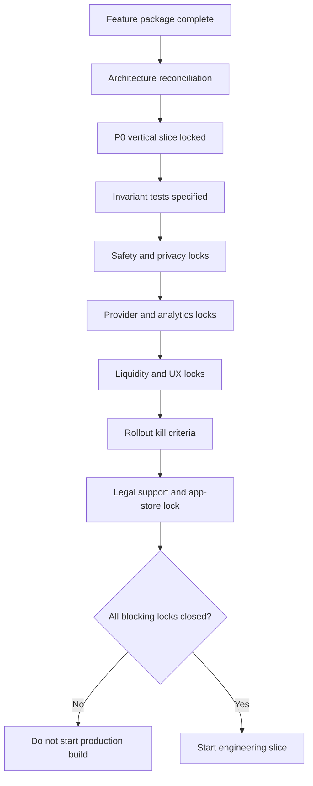

# Engineering Start Locks

## Purpose

This is the pre-build control plane for The Nine. It defines the main things that must be locked before production engineering starts and the evidence required to prove each lock is ready.

## Authoritative Sources Reviewed

| Source | Use |
|---|---|
| `AGENTS.md` | Non-negotiable product and implementation invariants. |
| `README.md` | Product documentation tree and strategy framing. |
| `11-technical-architecture/01-system-architecture-overview.md` | Domain module ownership and lifecycle boundaries. |
| `11-technical-architecture/03-api-spec.md` | Current API contract shape and route conventions. |
| `11-technical-architecture/05-matching-engine-design.md` | Current matching hard filters, scoring, fairness, and thin-city behavior. |
| `11-technical-architecture/13-ci-cd-pipeline.md` | Required CI/CD workflows, test gates, migration strategy, and rollback rules. |
| `12-product-growth-expansion/README.md` | New feature package reading order and build rule. |
| `12-product-growth-expansion/06-production-build-readiness.md` | Feature ownership, schema/API/event/test implications. |

## Lock Map

| Lock | Required before | Blocking if missing | Evidence artifact |
|---|---|---|---|
| Architecture reconciliation | Any schema, API, event, matching, notification, payment, staff, provider, or infra work | Yes | Updated `11-technical-architecture` docs and reviewed delta matrix. |
| P0 vertical slice sequence | First production implementation ticket | Yes | Approved vertical slice scope and dependency map. |
| Invariant test suite | First domain service implementation | Yes | Test inventory with assertions and fixtures. |
| Safety operations | First real user meetup | Yes | Coverage model, escalation runbook, moderator scope, SLA proof. |
| Privacy, consent, and data governance | Any sensitive data implementation | Yes | Consent matrix, retention rules, access model, deletion behavior. |
| Liquidity launch supply | First beta cohort opening | Yes | City supply targets, founding Group pipeline, venue and pod inventory plan. |
| Provider environment readiness | First provider-backed build path | Yes | Sandbox credentials, webhook tests, failure-mode checklist. |
| Analytics instrumentation | First external user cohort | Yes | Event taxonomy, dashboard plan, guardrail definitions. |
| Design and UX QA | First mobile implementation acceptance | Yes | Screen state checklist, copy approval, safety entry audit. |
| Rollout and kill criteria | First production or beta release | Yes | Launch thresholds, stop rules, owner escalation paths. |
| Legal, support, and app-store readiness | First production release path | Yes | `thenine.com`, legal entity, age gate, policies, support SLAs, app-store disclosures. |

## Decision Flow

## Lock State Definitions

| State | Meaning |
|---|---|
| `open` | Required decision or evidence is missing. |
| `drafted` | Decision exists but evidence or cross-doc reconciliation is incomplete. |
| `reviewed` | Owner and reviewers have approved direction, but implementation artifacts are not ready. |
| `locked` | Evidence is present, cross-doc updates are complete, and no blocker remains for the target build slice. |
| `deferred` | Not required for the selected build slice; deferral is explicit and safe. |

## Production Engineering Start Criteria

Engineering can start the first production slice only when:

1. Architecture reconciliation is locked for the selected P0 slice.
2. P0 vertical slice sequence is locked.
3. Invariant test suite is locked.
4. Safety operations are at least locked for the first real meetup path.
5. Privacy and consent rules are locked for all touched data.
6. Provider readiness is locked for touched providers.
7. Analytics events and guardrails are locked for touched funnels.
8. UX QA checklist is locked for touched screens.
9. Rollout and kill criteria are locked for the target environment.
10. Legal, support, app-store, billing, age-gate, and `thenine.com` ownership are locked for the target release path.

---
<!-- doc-version: 1.0 -->
