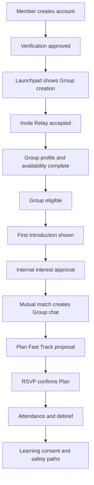

# P0 Vertical Slice Build Sequence

## Purpose

Engineering should not start by building all 24 expansion features. The first production build must be one narrow end-to-end vertical slice that proves the core loop under real architecture constraints: verified member to complete Group to Introduction to chat to Plan to RSVP to debrief to safety.

## Authoritative Sources Reviewed

| Source | Relevance |
|---|---|
| `00-strategy/PRD.md` | P0 launch loop and success metrics. |
| `02-experience/onboarding-flow.md` | Current account to Group eligibility path. |
| `02-experience/chat-to-meetup-flow.md` | Current match to Plan flow. |
| `02-experience/post-meetup-flow.md` | Current attendance, debrief, mutual edge, and safety path. |
| `03-feature-specs/*` | Current launch feature behavior. |
| `12-product-growth-expansion/01-p0-feature-specs.md` | Expansion P0 feature specs. |
| `12-product-growth-expansion/06-production-build-readiness.md` | Build sequence and required data/API/event additions. |

## Locked First Slice

The first engineering slice should include:

1. First Introduction Launchpad.
2. Warm Group Invite Relay.
3. Group Availability Mesh.
4. Plan Fast Track.
5. Meetup Momentum Hub.
6. Debrief Learning Consent.
7. Existing safety report, block, leave, and share-plan paths on all touched surfaces.

The first slice should not include:

- Tonight Tables.
- Shareable Meetup Moments.
- Premium Plan Templates.
- Calendar import.
- Cohorts.
- Concierge.
- Founder Hosts.
- Any paid matching change.

## Build Flow

## Scope Requirements

| Step | Required behavior | Evidence |
|---|---|---|
| Verification | Member can complete non-distribution setup while pending; distribution blocked until approved. | Verification state tests and Group eligibility recompute tests. |
| Launchpad | Shows one primary next action and exact blockers. | Mobile screen state and API readiness response. |
| Invite Relay | Invitee previews, verifies, consents, and joins without public exposure. | Invite token tests, privacy tests, and acceptance funnel events. |
| Availability Mesh | Group overlap is computed from active member windows. | Snapshot tests and matching feature tests. |
| Eligibility | Group becomes eligible only after verification, profile, availability, moderation, and publish approvals. | Domain invariant tests. |
| Introduction | Group receives bounded Introduction set; no member-level inventory exists. | API contract and no-member-discovery tests. |
| Chat | Mutual match creates group-owned conversation. | Conversation ownership tests and realtime event tests. |
| Plan Fast Track | Plan proposal persists before events and confirms only after RSVP rules pass. | Plan service integration tests. |
| Momentum Hub | Shows persisted pending actions only. | Notification/action queue tests. |
| Debrief Consent | Attendance, safety, mutual reveal, and learning consent are separated. | Debrief privacy and consent tests. |
| Safety | Report, block, leave, urgent help, and share plan are one tap where relevant. | UX QA checklist and API safety route tests. |

## Acceptance Evidence

This lock is complete when:

1. First-slice scope is approved by product, engineering, safety, privacy, and data.
2. Every selected feature has a route, data, event, and test mapping.
3. Deferred features are listed with explicit non-dependency rationale.
4. A single end-to-end smoke path is defined from account creation through debrief.
5. Rollback for the slice is defined by feature flag and data migration strategy.

## Engineering Blockers

- Attempting to start paid, cohort, host, concierge, or Moment work before P0 loop is stable.
- Missing Launchpad readiness contract.
- Missing Debrief Learning Consent model.
- Plan Fast Track not tied to RSVP confirmation.
- Safety paths not available from touched screens.

---
<!-- doc-version: 1.0 -->
